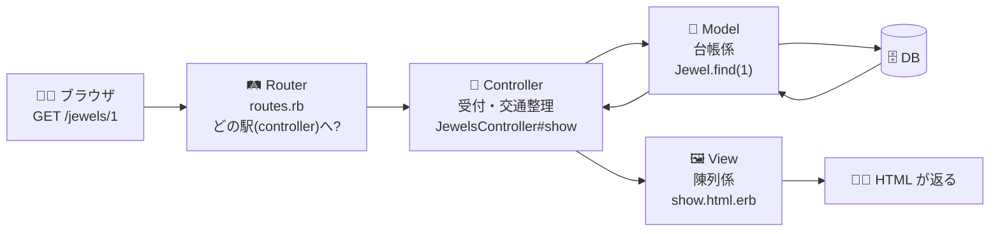

# 第6章 鉄道開通 — rails new と MVC

## 🚂 今日のお話

町に鉄道が開通しました。これまで峠を越えて来られるお客さんにしか売れなかった
紅玉堂の宝石が、**全国に届けられる** ようになります。

「通販システムを作るぞ」と親方。「一から作る気か? いや、**Rails に乗る**。
線路の敷き方・駅の作り方・時刻表の書き方——先人が全部決めてくれている。
わしらは **商売のことだけ** 考えればいい」

## Ruby on Rails とは何か

Rails は 2004 年に **DHH(David Heinemeier Hansson)** が公開した
**フルスタック Web フレームワーク** です。データベース、ルーティング、HTML 生成、
メール送信、ジョブキュー、WebSocket——Web アプリに必要なものが
**最初から全部入り** で、しかも互いに統合されています。

Rails の思想は 2 つの言葉に凝縮されています:

- **CoC(Convention over Configuration / 設定より規約)** — 「モデルが `Jewel` なら
  テーブルは `jewels`、ファイルは `app/models/jewel.rb`」のように、
  **決めごとに従う限り、設定ファイルを一切書かなくても全部つながる**。
- **DRY(Don't Repeat Yourself)** — 同じ情報を 2 箇所に書かない。
  テーブル定義を書けばモデルの属性は自動で生える(第9章)。

> 🐹 **Go との違い①: 自分で選ぶ vs おまかせ(Omakase)**
> Go の文化は「標準ライブラリ + 小さな部品を自分で組む」でした。`net/http` に
> ルーター、DB ドライバ、マイグレーションツール……を **自分の判断で** 足していく。
> Rails は逆で、DHH 自身が「**The Rails Doctrine**」で寿司屋になぞらえて
> **Omakase(おまかせ)** と呼ぶ思想です——「メニュー選びに悩む時間で
> 商品を作れ。選定は板前(Rails チーム)に任せろ」。
> 部品の自由と引き換えに、**意思決定ゼロで本番品質のフルコース** が出てくる。
> 1 人で Web サービスを立ち上げるなら、これほど速い道具はありません。

> 🐍 **Python との違い①: Django は Rails の同期生**
> Python の Django(2005)は Rails(2004)とほぼ同期の「全部入り」フレームワークで、
> 思想もよく似ています(Django を知っていれば Rails の 7 割は地続きです)。
> 違いは言語の性格が出る部分で、Django が設定ファイルと明示的な記述を好むのに対し、
> Rails は第5章で学んだ **DSL とクラスマクロで「書かない」方向に振り切ります**。
> FastAPI/Flask のようなマイクロフレームワーク文化との対比なら、
> Rails は明確に「大きい方」の代表です。

## rails new — 工房の敷地に線路を引く

```bash
gem install rails          # Rails 本体(gem = Ruby のパッケージ)
rails -v                   # 8.x であることを確認

rails new kogyokudo        # アプリの雛形を一式生成!
cd kogyokudo
bin/rails server           # 開発サーバー起動
```

ブラウザで `http://localhost:3000` を開くと、Rails のウェルカム画面が出ます。
**まだ 1 行もコードを書いていないのに、Web サーバーが動いています。**

> 💡 `gem` は Ruby のパッケージ(Go の module、Python の pip パッケージに相当)。
> プロジェクトの依存は `Gemfile` に書き、`bundle install` で入れます
> (`go.mod` / `requirements.txt` に相当)。`rails new` が生成した Gemfile には
> 最初から本番相当の構成が書かれています。

## ディレクトリ地図 — どこに何を置くかは決まっている

```
kogyokudo/
├── app/                 ← あなたのコードの 9 割はここ
│   ├── models/          ← モデル(データとビジネスロジック)
│   ├── views/           ← ビュー(HTML テンプレート)
│   ├── controllers/     ← コントローラ(受付と交通整理)
│   ├── helpers/         ← ビュー用の補助メソッド
│   ├── jobs/            ← 非同期ジョブ(第15章)
│   └── javascript/      ← フロントエンドJS(第15章)
├── config/
│   ├── routes.rb        ← ルーティング(第7章の主役)
│   └── database.yml     ← DB接続設定(開発は SQLite で設定不要)
├── db/
│   ├── migrate/         ← マイグレーション(第9章)
│   └── schema.rb        ← 現在のテーブル定義(自動生成)
├── test/                ← テスト(第14章)
├── Gemfile              ← 依存パッケージ一覧
└── bin/rails            ← 万能コマンドの入口
```

Go では「ディレクトリ構成は自由(標準なし)」で毎回悩みました。Rails では
**置き場所に悩む時間がゼロ** です。どの Rails プロジェクトに転職しても、
モデルは `app/models` にあります。これが CoC の第一の恩恵——
**他人のプロジェクトが初日から読める** ことです。

## MVC — 注文が届いてから返事をするまで

Rails は **MVC(Model-View-Controller)** アーキテクチャです。
注文(リクエスト)の旅はこう流れます:



- **Model** — データとルール(台帳係)。「ルビーの価格は?」「在庫はある?」
- **View** — 見せ方(陳列係)。データを HTML に整形する
- **Controller** — 受付。リクエストを受け、Model に問い合わせ、View に渡す

この流れは第7〜9章で 1 つずつ主役にして掘っていきます。まずは全体を一周しましょう。

## 最初のページを作る — generate コマンド

```bash
bin/rails generate controller Welcome index
```

このコマンド 1 つで、コントローラ・ビュー・ルートが連携した形で生成されます:

```ruby
# config/routes.rb(自動で追記されている)
Rails.application.routes.draw do
  get "welcome/index"
end
```

```ruby
# app/controllers/welcome_controller.rb
class WelcomeController < ApplicationController
  def index
  end
end
```

ビューを紅玉堂仕様に書き換えます:

```erb
<%# app/views/welcome/index.html.erb %>
<h1>💎 紅玉堂オンライン(準備中)</h1>
<p>創業以来の宝石を、鉄道に乗せて全国へ。</p>
<p>ただいまの時刻: <%= Time.now.strftime("%H:%M") %></p>
```

トップページ(`/`)にするにはルートを 1 行足します:

```ruby
# config/routes.rb
Rails.application.routes.draw do
  root "welcome#index"        # / へのアクセスは WelcomeController#index へ
end
```

`http://localhost:3000` を再読み込み——紅玉堂のトップページが表示されました。

ここで **CoC が働いた場所** を数えてみましょう。`WelcomeController` の `index` が
`app/views/welcome/index.html.erb` を描画することは、**どこにも書いていません**。
「コントローラ名/アクション名.html.erb を探す」という規約が働いたのです。
`render` を書かなければ規約どおりのビューが選ばれる——設定より規約、の実物です。

## bin/rails — 工房の万能スイッチ

```bash
bin/rails server      # 開発サーバー(s と略せる)
bin/rails console     # アプリのコードを読み込んだ irb(c と略せる)★超重要
bin/rails routes      # ルート一覧
bin/rails generate    # 雛形生成(g と略せる)
bin/rails db:migrate  # DBマイグレーション(第9章)
bin/rails test        # テスト実行(第14章)
```

中でも `bin/rails console` は **Rails 開発の心臓** です。アプリの全クラスが
読み込まれた irb が立ち上がり、モデルを対話的に操作できます。
「コードを書く前にコンソールで試す」のが Rails 職人の日常です(第9章から多用します)。

> 🔍 **なぜそうなっているの? — Rails が Web 開発を変えた 15 分**
> 2005 年、DHH は「**15 分でブログを作る**」という動画を公開しました。
> 当時の Java/Struts では設定 XML を何百行も書いてやっと Hello World という時代に、
> scaffold コマンド一発で CRUD が動く衝撃は本物でした。この動画が
> GitHub・Shopify・Airbnb・Twitter(初期)を生む Rails ブームの起点です。
> 重要なのは、Rails の速さが「言語が速い」からではなく **「決断を先人に
> 委ねられる」から** だという点です。ディレクトリ構成、命名、DB 設計の対応——
> 無数の小さな決断をフレームワークが肩代わりする。Go を学んだあなたなら、
> この思想が `gofmt`(フォーマットの決断を委ねる)の大規模版だと気づくはずです。
> **Rails と Go は、実は「決めごとで人間を自由にする」という同じ発明を、
> 違う層でやった仲間** なのです。

## 💎 今日のまとめコード

今日はコマンドが主役でした。手元に残るのはこの 3 つです:

```bash
rails new kogyokudo
bin/rails generate controller Welcome index
# config/routes.rb に root "welcome#index"
# app/views/welcome/index.html.erb を編集
bin/rails server
```

## 📝 今日の研磨(演習)

1. `bin/rails routes` を実行し、`root` と `welcome/index` の行を見つけてください。
   `Prefix`(root_path などの名前)列は第7章で意味が分かります。
2. **壊す実験:** `app/views/welcome/index.html.erb` を
   `index2.html.erb` にリネームしてページを再読み込みし、
   `Missing template` エラーを観察してください。エラーページに
   「どこを探したか」が表示されます——規約の実体が見える瞬間です。確認したら戻すこと。
3. `bin/rails console` を起動し、第1〜5章で学んだ Ruby がそのまま動くことを
   確認してください(`3.times { puts "汽笛" }`)。さらに Rails が Integer に
   生やしたメソッド `3.days.ago` も試しましょう(第4章のオープンクラスの実物!)。

---

トップページはできましたが、駅(URL)が 1 つだけの鉄道では商売になりません。
商品一覧、商品詳細、注文——URL の設計と、それを捌く受付係。
次章はルーティングとコントローラです。
→ [第7章 駅と改札](07_routes_controllers.md)
