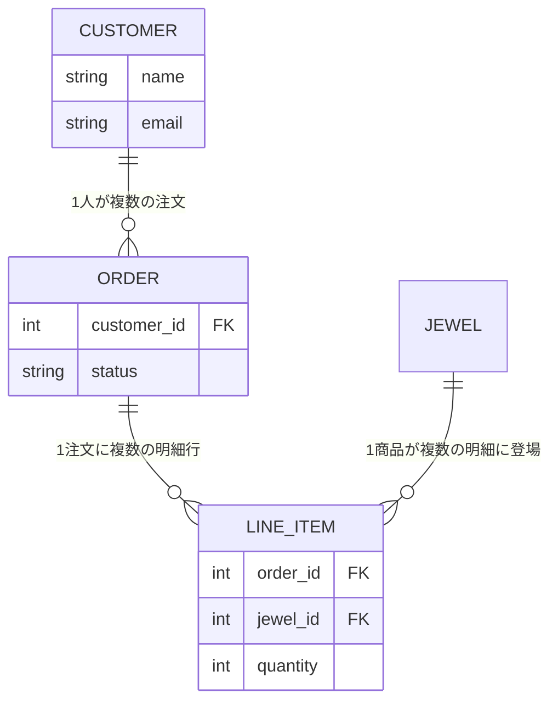

# 第11章 台帳をつなぐ — アソシエーション

## 🚂 今日のお話

通販の初注文が入りました!ところが台帳は商品のものしかありません。
「誰が」「いつ」「どの石を」買ったのか——お客様台帳と注文台帳を作り、
**3 冊の台帳を紐でつなぐ** 必要があります。

リレーショナルデータベースの「リレーション」を、Rails がどう Ruby の言葉に
訳すのか。今日はその翻訳術、アソシエーションです。

## 台帳の設計図



- 顧客 1 人は注文をたくさん持つ(1 対 多)
- 注文と商品は「明細行(LineItem)」を挟んだ 多 対 多

```bash
bin/rails generate model Customer name:string email:string
bin/rails generate model Order customer:references status:string
bin/rails generate model LineItem order:references jewel:references quantity:integer
bin/rails db:migrate
```

`customer:references` に注目してください。これだけで
「`customer_id` カラム + 外部キー制約 + インデックス」が揃います。

## belongs_to と has_many — 紐の両端

外部キーはテーブルに張られました。それを **Ruby のメソッドとして** 使えるように
するのがアソシエーションの宣言です:

```ruby
# app/models/customer.rb
class Customer < ApplicationRecord
  has_many :orders, dependent: :destroy   # 顧客を消すとき注文も消す
end

# app/models/order.rb
class Order < ApplicationRecord
  belongs_to :customer
  has_many :line_items, dependent: :destroy
  has_many :jewels, through: :line_items   # 明細を貫通して商品まで届く!
end

# app/models/line_item.rb
class LineItem < ApplicationRecord
  belongs_to :order
  belongs_to :jewel
end

# app/models/jewel.rb(追記)
class Jewel < ApplicationRecord
  has_many :line_items
  has_many :orders, through: :line_items
end
```

覚え方は 1 つだけ——**外部キーを持っている側が belongs_to** です
(`orders` テーブルに `customer_id` がある → Order が `belongs_to :customer`)。

## つないだ台帳で会話する

コンソールで威力を確かめましょう:

```ruby
customer = Customer.create!(name: "山根 玲", email: "rei@example.com")

order = customer.orders.create!(status: "pending")   # 顧客にぶら下げて注文を作る
ruby_ring = Jewel.find_by(stone: "ruby")
order.line_items.create!(jewel: ruby_ring, quantity: 1)

# 紐をたどる — JOIN を書いた覚えはないのに
customer.orders.count            # => 1
order.customer.name              # => "山根 玲"
order.jewels.map(&:name)         # => ["紅玉の指輪"](through が明細を貫通)
ruby_ring.orders.count           # この商品は何回注文された?
```

`customer.orders` は SQL の `WHERE customer_id = ?` に、
`order.jewels` は 2 段 JOIN に翻訳されています。コンソールのログで確認してください。

## has_many の正体 — 第5章の伏線、最大の回収

`has_many :orders` と書いた瞬間、Customer には **十数個のメソッドが生えます**:

```ruby
customer.orders            # 関連レコードの取得
customer.orders << order   # 追加
customer.orders.create!(...)  # ぶら下げて作成
customer.orders.empty?     # 有無の確認
customer.order_ids         # ID のリスト
```

これはまさに第5章で自作した `my_attr_accessor` の構造です——
`has_many` はクラスマクロで、引数のシンボル `:orders` から
`define_method` でメソッド群を **動的に生成** しています。
`:orders` という複数形から `Order` クラスと `order_id` カラムを推測するのは、
第9章で見た命名規約の変換辞書です。

**魔法に見えていたものが、すべて既習の部品(クラスマクロ + define_method +
命名規約)の組み合わせだと分かる**——Ruby 基礎編を先にやった配当が、
この章で最大になります。

> 🐹 **Go との違い①: JOIN を手書きする世界から来たあなたへ**
> Go で同じことをするなら、`JOIN` 入りの SQL を書き、結果を struct に
> スキャンする関数を書き、それをリポジトリ層に並べたはずです。
> 行数は数倍ですが、**発行される SQL は 1 文字残らず見えていました**。
> ActiveRecord は逆に、SQL を意識の外に追いやります。快適ですが、
> 「見えない SQL」は次章末の N+1 問題という形で必ず請求書を送ってきます。
> **抽象化は SQL を消すのではなく、見えなくするだけ**——Go で SQL の
> 手触りを知っているあなたは、この請求書に気づける側の人間です。

## dependent — 消すときの約束

`dependent: :destroy` は「親を消すとき、子をどうするか」の指定です:

| 指定 | 挙動 |
|---|---|
| `:destroy` | 子も 1 件ずつ destroy(子のコールバックも動く) |
| `:delete_all` | 子を SQL 一発で削除(速いがコールバック無視) |
| `:nullify` | 子の外部キーを NULL に |
| 指定なし | 子が残る(孤児レコード!) |

指定を忘れると「顧客は消えたのに注文だけ残っている」データが生まれます。
DB 側にも `foreign_key: true`(references が自動で張ります)があるため、
その場合は削除自体が外部キー制約違反で止まります——ここでも
**アプリの宣言と DB の制約は二段構え** です。

## belongs_to は必須がデフォルト

Rails 5 以降、`belongs_to :customer` は **相手が存在しないと保存できません**
(presence 検証が自動で付きます)。「顧客のいない注文」を防ぐ健全な既定値です。
本当に任意にしたい場合だけ明示します:

```ruby
belongs_to :gift_wrapper, optional: true
```

> 🐍 **Python との違い①: Django との対照**
> Django では `models.ForeignKey(Customer, on_delete=models.CASCADE)` と
> 「消すときの挙動」を **必須引数** で書かされました(書き忘れ不可)。
> Rails は dependent 未指定を許します(自由と自己責任、いつもの Ruby です)。
> また Django の逆参照は `customer.order_set` という機械的な名前が自動で
> 生えるのに対し、Rails は `has_many :orders` と **宣言した名前だけ** が生えます。
> 「明示 vs 規約」の好対照です。

## enum — status を Ruby の言葉に

注文の状態 `"pending"` のような文字列は typo の温床です。enum 宣言で語彙を固定します:

```ruby
class Order < ApplicationRecord
  enum :status, { pending: 0, paid: 1, shipped: 2, cancelled: 3 }, default: :pending
end
```

これもクラスマクロで、大量のメソッドが生えます:

```ruby
order.pending?      # 状態の問い合わせ
order.paid!         # 状態の変更(保存まで行う)
Order.shipped       # 発送済みだけを取得する scope(第13章)
```

(このために `status` カラムは integer で作り直すマイグレーションを
演習で書きます。)

## 💎 完成コード: モデル 4 兄弟

本文のとおり `Customer` / `Order` / `LineItem` / `Jewel` を宣言し、
seeds に注文データを足します:

```ruby
# db/seeds.rb(追記)
customer = Customer.create!(name: "山根 玲", email: "rei@example.com")
order = customer.orders.create!
order.line_items.create!(jewel: Jewel.find_by(stone: "ruby"),   quantity: 1)
order.line_items.create!(jewel: Jewel.find_by(stone: "garnet"), quantity: 2)
puts "🧾 注文 #{Order.count} 件(明細 #{LineItem.count} 行)"
```

Order に合計金額メソッドも足しておきましょう(第16章で使います):

```ruby
# app/models/order.rb
def total_price
  line_items.includes(:jewel).sum { |item| item.jewel.price * item.quantity }
end
```

## 📝 今日の研磨(演習)

1. コンソールで `order.jewels.map(&:name)` を実行し、発行された SQL
   (INNER JOIN が 2 つ)を書き写してください。`through:` の翻訳結果を
   目で確認するのが目的です。
2. **壊す実験:** `Order.create!` を **customer なしで** 呼び、
   belongs_to の自動 presence 検証で失敗することを確認してください。
   次に `optional: true` を付けて通ることも確認し、元に戻しましょう。
3. `status` を integer カラムに変えるマイグレーション
   (`remove_column` + `add_column`、または `change_column`)を書き、
   enum 宣言を追加して `order.paid!` → `order.status` → `Order.paid.count` を
   試してください。

---

台帳はつながりました。しかしお客さんはまだコンソールから注文するしかありません
(そんな通販はありません)。Web フォームから注文を受け付ける——
CRUD の完成と、Rails 史に残るセキュリティ事件の話です。
→ [第12章 注文受付](12_forms_crud.md)
