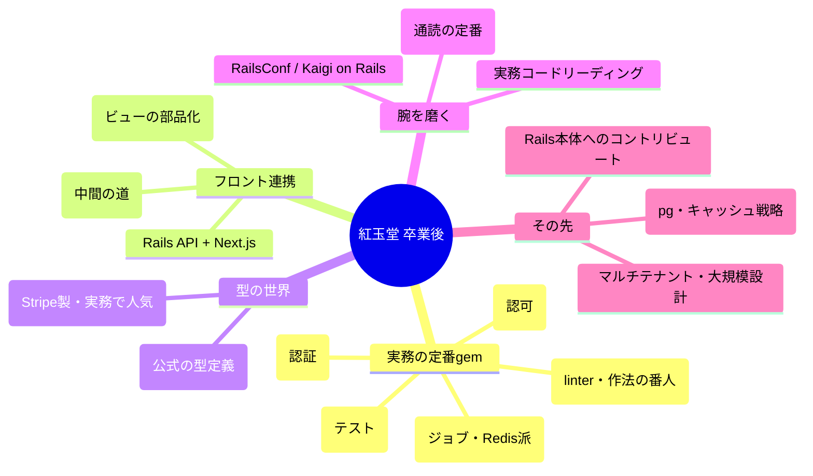

# 第16章 卒業制作 — 紅玉堂オンライン、グランドオープン

## 🚂 今日のお話

開店準備の最終日です。残る仕事は 3 つ——**店主だけが入れる帳場(認証)**、
**本番への出荷(デプロイ)**、そして親方からの **卒業後の地図**。

この章は新しい概念の詰め込みではなく、15 章分の総仕上げです。

## 1. 認証 — Rails 8 の authentication generator

商品の登録・編集は店主(管理者)だけができるべきです。
Rails 8 には認証の雛形ジェネレータが標準搭載されました:

```bash
bin/rails generate authentication
bin/rails db:migrate
```

これで生成されるもの:

- `User` モデル(`has_secure_password` — bcrypt によるパスワードハッシュ化)
- `Session` モデルと `SessionsController`(ログイン・ログアウト)
- `Authentication` concern(`before_action :require_authentication` の仕組み一式)
- ログイン画面・パスワードリセットの雛形

生成された `app/models/user.rb` を覗いてください:

```ruby
class User < ApplicationRecord
  has_secure_password
  has_many :sessions, dependent: :destroy

  normalizes :email_address, with: ->(e) { e.strip.downcase }
end
```

`has_secure_password` はクラスマクロ、`normalizes` + ラムダは第10章の道具、
`has_many` は第11章——**生成されたコードが全部読める** ことを確認してください。
これが 15 章分の成果です。

閲覧は誰でも・変更は店主だけ、はこう書けます:

```ruby
class JewelsController < ApplicationController
  allow_unauthenticated_access only: [:index, :show]   # 一覧と詳細は公開
  # new/create/edit/update/destroy は自動的にログイン必須になる
end
```

コンソールで店主を登録すれば、帳場の完成です:

```ruby
User.create!(email_address: "master@kogyokudo.example", password: "秘密の合言葉")
```

> 🔍 **なぜ Devise を最初に教えないの?**
> 実務の Rails では **Devise** という認証 gem が長年の定番で、
> 転職先のコードにも高確率で入っています。しかし Devise は
> 「設定より規約」を極めた巨大な魔法の箱で、中で何が起きているか
> 分からないまま使うと事故ります。Rails 8 のジェネレータは
> **「読めるコードを生成して、あとは自分で育てろ」** という思想で、
> 学習の入口として適切です。ジェネレータ版でセッション・Cookie・
> パスワードハッシュの流れを掴んでから Devise を見ると、
> 「あの規約の裏はこれか」と読めるようになります。

## 2. 卒業制作の要件 — 紅玉堂オンライン full版

これまでの章の部品を組み合わせ、次の要件を満たすアプリを完成させてください:

**公開側(誰でも)**
- [ ] トップページ: おすすめ商品 3 点(在庫あり・高額順)を表示(第7・13章)
- [ ] 商品一覧: 石の種類で絞り込み(Turbo Frame 対応)(第13・15章)
- [ ] 商品詳細: 在庫バッジ・税込価格表示(第8章のヘルパー)

**帳場側(ログイン必須)**
- [ ] 商品の登録・編集・削除(第12章の型 + 本章の認証)
- [ ] 注文一覧: 顧客名・合計金額・状態(enum)を表示、**N+1 なし**(第11・13章)
- [ ] 注文の状態変更(pending → paid → shipped)

**品質**
- [ ] モデルテスト: バリデーションと total_price(第14章)
- [ ] リクエストテスト: 未ログインで new に来たらログイン画面へリダイレクト
- [ ] `bin/rails test` が全部緑

ヒントが必要になったら、各章の完成コードに戻ってください。
**すべての部品は既に持っています。**

## 3. 出荷 — 本番デプロイの地図

開発サーバー(`bin/rails server`)は開発専用です。本番への道は複数あります:

| 方法 | 特徴 |
|---|---|
| **Kamal**(Rails 8 標準) | 自前 VPS に Docker でデプロイ。`kamal setup` 一発。37signals が自社運用から生んだツール |
| PaaS(Render / Fly.io / Heroku) | git push するだけ。最初はこれが楽 |
| 従来型(自前でサーバー構築) | nginx + Puma を手で並べる。仕組みの学習には最良 |

Rails 8 の既定構成は意欲的です——**SQLite を本番でも使い**(Solid Queue/Cache も
SQLite に載る)、Kamal で VPS に置く。「月 5 ドルのサーバーで、Redis も
PostgreSQL もなしに本番サービスを始められる」構成です。トラフィックが
育ったら PostgreSQL へ移行すればよい(`config/database.yml` の書き換えと
データ移行で済むのが、ActiveRecord に DB を抽象化させてきた配当です)。

最低限の本番チェックリスト:

```bash
RAILS_ENV=production bin/rails assets:precompile   # アセットのビルド
bin/rails db:prepare                                # DB 作成+マイグレーション
# config/credentials.yml.enc — 秘密情報は暗号化して管理(master.key は別送)
```

> 🐹 **Go との違い①: デプロイの重さは正直に伝えます**
> Go は単一バイナリを scp すれば終わりでした。Rails は Ruby 処理系 +
> gem 一式 + アセットビルドが必要で、**デプロイの複雑さは Go の比では
> ありません**(だから Kamal のような道具が要るのです)。起動時間もメモリも
> Go より重い。これは Rails の弱点で、隠しても仕方がありません。
> 引き換えに得たものは、この 16 章で体験した **開発速度そのもの** です。
> 「1 人で 2 週間で作って月 5 ドルで運用」という土俵なら、
> Rails は今も世界最強クラスの道具です。

## 4. 親方からの卒業後の地図



**次の一歩のおすすめ順:**

1. **RSpec + factory_bot に書き換えてみる** — 転職先のテストはほぼこの構成です。
   卒業制作のテストを移植すると、翻訳表が頭にできます。
2. **Devise を入れてみる** — 自作認証を Devise に置き換えると、
   「gem の規約を読む」訓練になります。
3. **RuboCop を入れる** — Ruby の「自由」に、チーム開発の「規律」を足す道具。
   最初は指摘の多さに驚きますが、Ruby らしい書き方の家庭教師になります。
4. **型に触れる** — Ruby にも型定義(RBS)と型検査(Steep / Sorbet)があります。
   TypeScript を知るあなたなら「漸進的型付け」の感覚はすぐ掴めます。
   ただし現在も「型なし + テスト厚め」が多数派で、コミュニティは議論の最中です。

**実務の Rails を読むときの心得** も置いていきます:

- 分からないメソッドに会ったら、まず「**これはどの gem のクラスマクロか?**」と
  疑う(`bundle open gem名` でソースが読めます。全部 Ruby です)
- `bin/rails console` で **触って** 確かめる。source_location で定義元も引けます:
  ```ruby
  Jewel.method(:in_stock).source_location   # => ["app/models/jewel.rb", 3]
  ```
- ログの SQL を読む習慣を、どうか失わずに

## 🎓 修了 — 3 つの言語、3 つの答え

あなたは Python・Go・Ruby という 3 つの言語で、同じ問い——
「良いソフトウェアはどう書くべきか」——への異なる答えを見てきました。

- **Python** は「誰が書いても同じになる、読みやすい 1 つの正解」に賭けた
- **Go** は「機能を削り、退屈さで大規模チームを守る」ことに賭けた
- **Ruby** は「書き手を信頼し、表現力と快適さを最大化する」ことに賭けた

そして Rails は、Ruby の賭けの上に「規約が決断を肩代わりする」を積み上げ、
**1 人の職人が Web サービスを丸ごと作れる** 道具になりました。

どれが正しいのではありません。**問題と組織に合わせて、賭け方を選べる**——
それが複数言語を修めた職人の力です。

親方は言いました。「もう教えることはない。……いや、最後に 1 つ。
[language-overview](../language-overview/README.md) に、Ruby という言語の
来し方行く末をまとめておいた。汽車の中で読みなさい」

**紅玉堂オンライン、グランドオープン。おめでとうございます!💎🚂**

## 📝 最後の研磨(卒業演習)

1. 卒業制作の要件をすべて満たし、`bin/rails test` を緑にしてください。
2. 完成したアプリに **あなた自身の機能を 1 つ** 足してください
   (お気に入り機能、レビュー、在庫アラート……)。要件を自分で決め、
   モデル → ルート → コントローラ → ビュー → テストの順で作る。
   誰にも指示されずに一巡できたら、本当の卒業です。
3. 第5章の「ミニ validates」を今もう一度読み返してください。
   初読のときとは、まったく違う景色が見えるはずです。
