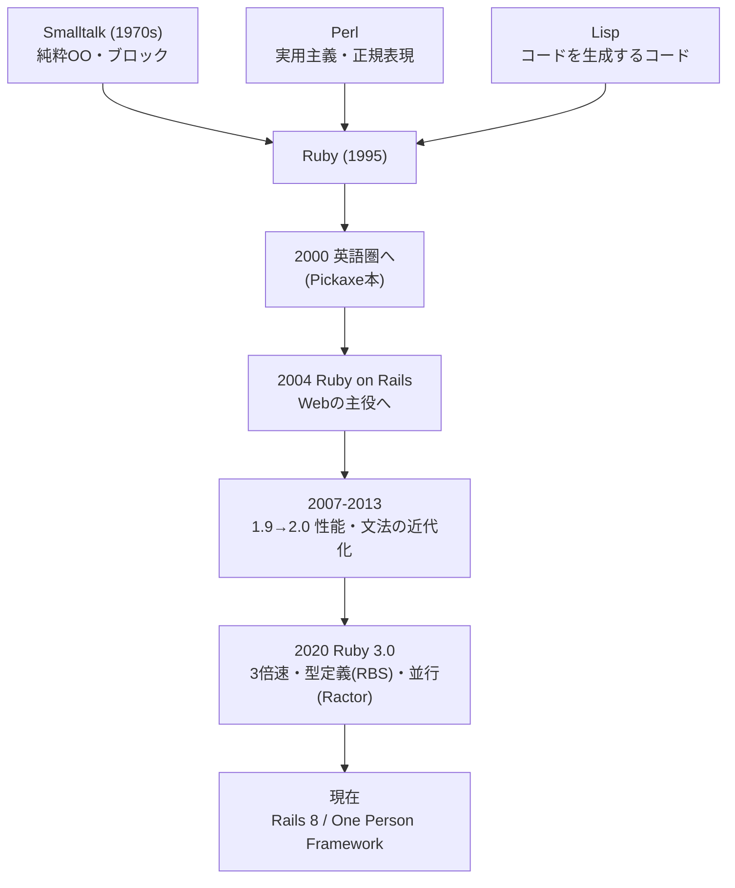
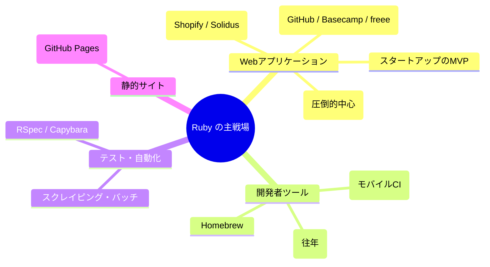

# 💎 Ruby と Rails — 系譜・思想・強み・弱みの全体像

この章は文法の解説ではなく、**「Ruby とはどういう言語で、Rails はなぜ世界を変え、そして今どこに立っているのか」** を俯瞰するための読み物です。教材本編(chapters)に入る前でも、一通り学び終えた後でも読めます。

---

## 1. 生い立ちと系譜

Ruby は 1995 年に日本人の **まつもとゆきひろ(Matz)** 氏が公開した言語です。主要言語の中で唯一、日本から生まれて世界標準になった言語であり、設計の出発点は徹底して個人的なものでした——「**自分が使っていて楽しい言語が欲しい**」。

Matz 氏が混ぜ合わせたのは、Smalltalk の **純粋オブジェクト指向**(すべてがオブジェクト、計算はメッセージ送信)、Perl の **実用性とテキスト処理**、Lisp の **柔軟なメタプログラミング** です。

### 歴史の転換点

| 年 | 出来事 | 意味 |
|---|---|---|
| 1995 | Ruby 公開 | 国内でひっそり人気に |
| 2000 | 英語の解説書(通称 Pickaxe)出版 | 世界に発見される |
| 2004 | **Ruby on Rails 公開** | 言語の運命が変わる。「Rails の言語」に |
| 2006-08 | Rails ブーム絶頂 | Twitter、GitHub、Shopify、Airbnb が Rails で誕生 |
| 2013 | Ruby 2.0 | 性能・機能の近代化が進む |
| 2020 | Ruby 3.0 | 「Ruby 3x3」(3 倍高速化)達成、型定義 RBS 導入 |
| 2021 | Rails 7 + Hotwire | 「One Person Framework」宣言、SPA 全盛への反撃 |
| 2024 | Rails 8 | Kamal・Solid 三兄弟で「Redis 不要・VPS で完結」へ |

**Ruby を語ることは、半分以上 Rails を語ること** です。2004 年以降、Ruby 利用の大半は Rails であり、言語の進化(性能改善、型、並行処理)も Rails アプリの需要に強く駆動されてきました。この一心同体ぶりは、Python(Web・データ・自動化・教育に分散)や Go(インフラ・CLI・サーバーに分散)にはない特徴で、**強みでも弱みでもあります**(後述)。

---

## 2. 設計思想 — 「プログラマの幸福」は機能である

Ruby の思想は一言でいえば **「機械ではなく人間に、チームではなく書き手に最適化する」** です。Matz 氏の言葉:

> 「Ruby は、プログラマが楽しくプログラミングできること、幸福であることを言語設計の中心に据えた」

Python の「誰が書いても同じ 1 つの正解」、Go の「大規模組織のための退屈さ」と並べると、三者三様がくっきりします:

| | Python | Go | Ruby |
|---|---|---|---|
| 最適化の対象 | 読み手・教育 | チーム・機械 | **書き手の快適さ** |
| 同じ処理の書き方 | 1 つであるべき | 1 つしかない | **何通りもあってよい**(TMTOWTDI) |
| メタプログラミング | 裏芸 | ほぼ不可能 | **表芸・文化の中心** |
| 規律の担い手 | 言語仕様と PEP8 | コンパイラと gofmt | **テストと RuboCop(後付けの規律)** |

「同じことを書く方法が複数ある」——`if not` と `unless`、`{}` と `do end`、省略可能な括弧——は、Python の Zen(There should be one obvious way)への明確な対立軸です。Ruby は **表現の自由がコードを文章に近づける** と信じ、その自由が生む乱れは文化と道具(RuboCop)で御する道を選びました。

---

## 3. 言語としての特徴

### 3.1 ブロック — Ruby 最大の発明品

`items.map { |x| x * 2 }` の「処理のかたまりをメソッドに渡す」構文。イテレーション、リソース管理(`File.open do ... end`)、DSL 構築のすべてを 1 つの仕組みが支えます。Python の with 文・デコレータ・内包表記が担う役割を、Ruby は **ブロック 1 本** でこなします(教材第3章)。

### 3.2 メタプログラミングと DSL — 「言語内言語」を作る力

クラス定義の中身が実行可能なコードであること、`define_method`、`method_missing`、オープンクラス——これらの合わせ技で、Ruby は **問題領域ごとの小さな言語(DSL)** を作る能力が全主要言語中もっとも高い部類です(教材第5章)。`validates :name, presence: true`(Rails)、`expect(x).to eq(y)`(RSpec)、Homebrew の Formula、かつての Chef/Vagrant——「設定ファイルに見えて実は Ruby」という道具が量産されたのは偶然ではありません。

### 3.3 一貫した「すべてがオブジェクト」

`1.even?`、`nil.to_s`、`3.times { }`。プリミティブ型と参照型の区別がなく、`len()` のような関数とメソッドの二重体系もない。**学んだルールに例外が少ない** ことは、言語仕様の大きさ(Ruby は小さい言語ではありません)を体感的に相殺しています。

### 3.4 例外ベース + 命名規約(`?` と `!`)

エラー処理は例外(`begin/rescue/ensure`)。真偽を返すメソッドは `empty?`、破壊的・危険な操作は `save!`。**メソッド名自体が仕様を語る** 命名文化が徹底しています。

### 3.5 性能 — 「遅い」は昔話になりつつある、が

長年「Ruby は遅い」が定番批判でした。Ruby 3.0 の「3x3」(Ruby 2.0 比 3 倍)、JIT コンパイラ(YJIT)の成熟で、**体感を左右する Web 用途では十分速く** なっています。ただし計算集約処理で Go や C に並ぶわけではなく、並行処理も GVL(グローバル VM ロック)の制約が残ります(Ractor という並列機構は導入されたものの、エコシステムの対応は道半ばです)。立ち位置としては「Python と同等〜やや速い、Go には遠い」が実感に近いでしょう。

### 3.6 型 — 意図して「書かない」を選び続けている

Ruby 3.0 で公式の型定義言語 **RBS** と型検査器(Steep、Stripe 製の Sorbet)が揃いましたが、**Python の型ヒントほど普及していません**。Matz 氏自身が「型注釈をコードに書きたくない」という立場を明確にしており(型情報はコードの外の .rbs ファイルに置く設計はそのため)、コミュニティは「型なし + テスト厚め」が今も主流です。TypeScript や Python の型ヒントの浸透を知る人には、ここが最大のカルチャーギャップになります。

---

## 4. Ruby / Rails の特異な点(他言語経験者が驚くところ)

| 特異な点 | 説明 |
|---|---|
| **偽は nil と false だけ** | `0` も `""` も `[]` も真。Python 経験者が最初に踏む罠 |
| **メソッド呼び出しの括弧が省略可能** | `validates :name, presence: true` が成立する土台 |
| **クラスを後から開いて書き換えられる** | オープンクラス/モンキーパッチ。`3.days.ago` の正体 |
| **`?` `!` がメソッド名に使える** | `empty?` `save!` — 命名が仕様を語る |
| **最後の式が戻り値(return 不要)** | ほぼすべてが式。`x = if cond ... end` も書ける |
| **多重継承なし・mixin(module)文化** | `include Comparable` で能力を注入 |
| **存在しないメソッドも捕まえられる** | `method_missing` — DSL と黒魔術の源泉 |
| **Rails: 規約がコードを書く** | モデル名 → テーブル名 → ファイル名がすべて命名規約で連動 |
| **Rails: 空のクラスにメソッドが生えている** | ActiveRecord がスキーマから実行時に生成 |

---

## 5. どういうシステムでよく使われるか

### 得意な領域

- **Web アプリの高速開発** — スタートアップの MVP、業務システム、SaaS。「1〜5 人のチームで DB 付きの Web サービスを最速で形にする」なら今も第一級の選択肢。
- **大規模な実績も十分** — GitHub、Shopify、Airbnb、クックパッド、freee、マネーフォワード。特に **Shopify は世界最大級の Rails アプリを運用しつつ YJIT や Sorbet を開発して言語に還元** しており、「Rails はスケールしない」への最強の反例です。
- **日本での特殊な立ち位置** — 作者が日本人であることから日本語情報・コミュニティ(RubyKaigi は世界最大級の言語カンファレンス)が厚く、**日本の Web 系企業での採用率は世界平均より明確に高い** です。日本で Web 系に転職するなら、Rails 案件に当たる確率は無視できません。

### 不得意な領域

- **機械学習・データ分析** — エコシステムが Python に遠く及ばない。
- **インフラ・CLI 配布** — ランタイム同梱の単一バイナリが作れず、この領域は Go に完敗(かつて Ruby 製だった Chef/Vagrant の後継争いも Go/HCL 系が制した)。
- **モバイル・フロントエンド・組み込み** — ほぼ出番なし。
- **計算集約・超低レイテンシ** — GVL と GC の制約。ここは Go/Rust の縄張り。

---

## 6. 課題と「嫌われている点」

### 6.1 「魔法が多すぎる」— Rails 最大の批判

`空のクラスなのにメソッドが生えている`、`どこにも定義がないのに動く`、`規約を知らないと何も追えない`。便利さの源泉である CoC とメタプログラミングは、そのまま **「コードを grep しても挙動が分からない」** という批判になります。定義ジャンプが確実に効く Go とは対極です。この教材が Ruby 基礎編(特に第5章)を先に置いたのは、魔法を **種の割れた手品** に変えるためでした。

### 6.2 実行時までエラーが分からない

typo も型違いも `nil` への `NoMethodError` も、実行するまで発覚しません。「`undefined method 'name' for nil` を本番ログで見る」のは Rails 運用者の共通体験です。対策(テスト文化、Sorbet/RBS)はあるものの、静的型言語の安心感には届きません。**大規模・長期運用のコードベースで最も批判が集中する点** です。

### 6.3 モンキーパッチの負の遺産

gem が組み込みクラスを書き換え、gem 同士が衝突し、Rails のアップグレードで壊れる——2010 年代に痛みが集中しました。現在は「むやみにパッチしない」規範と refinements で改善しましたが、「Ruby はスパゲッティになりやすい」という印象の出どころです。

### 6.4 Rails モノリスの成長痛

「全部入り・規約駆動」は初速を最大化しますが、数十万行・数十人規模になると、モデルの肥大化(Fat Model)、コールバック地獄、暗黙の依存が牙をむきます。「Rails は 2 年で作り直したくなる」という揶揄と、「それは設計の問題で Rails のせいではない」という反論が、10 年以上続く定番の論争です(Shopify のような反例が存在する以上、後者に分がありますが、**規律を強制しないフレームワーク** であることは事実です)。

### 6.5 「Ruby は死んだ」論と人気の低下

2010 年代後半から、スタートアップの新規採用言語としては TypeScript/Go/Python に押され、言語ランキングでも順位を落としました。「Rails の言語」であることは、**Web フレームワーク競争の趨勢が言語人気に直結する** リスクでもあります。一方で、求人市場では既存 Rails 資産の保守・成長需要が厚く(特に日本)、Rails 7/8 の Hotwire・One Person Framework 路線は明確な支持層を再獲得しています。「王座からは降りたが、死んでもいない」が公平な現状認識でしょう。

### 6.6 その他よく聞く不満

- **デプロイ・起動が重い** — Ruby 処理系 + gem + アセットビルド。Go の単一バイナリと比べると別世界(Kamal はこの痛みへの答え)
- **GVL による並行性の制約** — マルチコアを 1 プロセスで使い切れない。Puma のマルチプロセス構成でカバーするのが実務の定番
- **バージョンアップ追従の負担** — Rails のメジャーアップグレードは大仕事。放置された「Rails 4 のまま動く塩漬けアプリ」が世界中にある
- **DHH の存在感** — Rails の方向性が強烈なリーダー 1 人の思想に駆動される(TypeScript 削除騒動など論争も多い)。一貫性の源でもあり、リスクでもある

---

## 7. まとめ — Ruby はどういう言語か

一言でいえば、**「書き手の幸福と表現力に最適化し、その力で Web 開発の常識を一度塗り替えた言語」** です。

- ブロックとメタプログラミングによる **DSL 構築力は全言語トップクラス**。Rails はその最高傑作
- 「規約が決断を肩代わりする」ことで、**少人数での Web 開発速度は今も世界最強クラス**
- 代償は実行時エラー・魔法の不透明さ・性能とデプロイの重さ。**規律(テスト・RuboCop)を自分で持ち込める人** が使うと真価が出る
- Python が「読み手」、Go が「チームと機械」に最適化したのに対し、Ruby は「**書き手**」に最適化した——3 言語を並べたとき、これほど綺麗に思想が分かれる組み合わせは珍しい

実務では「探索・分析は Python、インフラと高負荷サービスは Go、**DB 付き Web アプリを最速で立ち上げて育てるのは Rails**」という分業がよく見られます。隣のフォルダの [Python](../../02-python-fable-101/language-overview/README.md) / [Go](../../03-go-fable-101/language-overview/README.md) / [TypeScript](../../04-typescript-fable-101/language-overview/README.md) の overview と読み比べると、それぞれの設計判断が立体的に見えてきます。
