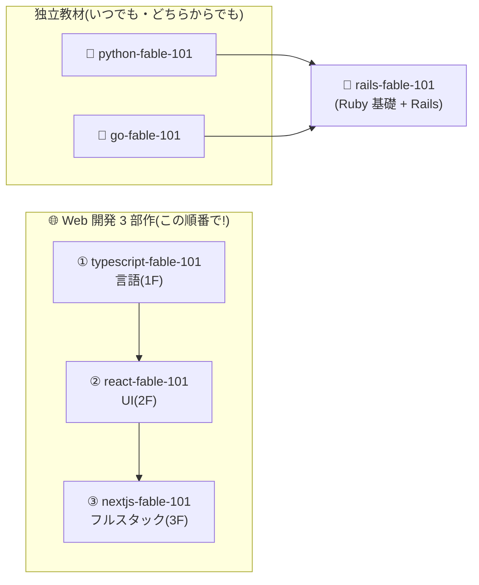

# 📚 tech-self-study — 物語で学ぶプログラミング自習教材集

物語仕立てで手を動かしながら学ぶ、自習用教材(**fable-101 シリーズ**)のリポジトリです。
各教材は「小さなお店・組織の運営システムを章ごとに育てていく」形式で、
文法の暗記ではなく **「なぜそうなっているのか」という背景と設計思想の理解** を重視しています。

## 🗂️ 教材一覧

| 番号 | 教材 | 題材 | 学ぶもの | 位置づけ |
|---|---|---|---|---|
| 01 | [tech-stack-2026](01-tech-stack-2026/README.md) | 🧭 技術選定の地図 | 2026年版デファクト・流派対立・選定の原則 | 横断の読み物(最初に読むと以降の見通しがよくなる) |
| 02 | [python-fable-101](02-python-fable-101/README.md) | 🧪 魔法薬店「Pythonic Potions」 | Python 基礎〜上級(メタクラスまで) | 独立(単体で完結) |
| 03 | [go-fable-101](03-go-fable-101/README.md) | 🚇 運送会社「Gopher Express」 | Go 基礎〜並行処理・テスト | 独立(単体で完結) |
| 04 | [typescript-fable-101](04-typescript-fable-101/README.md) | ⚔️ 冒険者ギルド「Typed Tavern」 | TypeScript + JS ランタイムの理解 | **Web 3 部作の 1 作目** |
| 05 | [react-fable-101](05-react-fable-101/README.md) | 🎭 劇場「Reactive Theater」 | React(宣言的 UI・Hooks) | **Web 3 部作の 2 作目** |
| 06 | [nextjs-fable-101](06-nextjs-fable-101/README.md) | 🍽️ 食堂「Bistro Next」 | Next.js(フルスタック開発) | **Web 3 部作の 3 作目** |
| 07 | [rails-fable-101](07-rails-fable-101/README.md) | 💎 宝石工房「紅玉堂」 | Ruby 基礎 + Ruby on Rails | Python / Go の後に(比較コーナー前提) |

フォルダ名の先頭の数字は、上から順に学習する場合のおすすめ順序です
(tech-stack-2026 で地図を掴む → python / go を独立に → Web 3 部作へ)。

各教材は共通の構成です:

- **README** — 学習マップと目次
- **chapters/01〜16** — 物語+コード+背景コラム(💡ポイント / 📜歴史の背景 / ⚙️内部の仕組み)+章末演習
- **language-overview/** — その技術の系譜・思想・主戦場・**課題や嫌われている点** までを俯瞰する読み物

## 🧭 おすすめの学習順

### 大原則: Web 3 部作は順番厳守、Python / Go は独立



**TypeScript → React → Next.js の順番だけは崩さないでください。** この 3 つは
「言語 → UI ライブラリ → フレームワーク」という 3 階建てで、後の教材は前の教材の
概念(参照、クロージャ、イベントループ、イミュータビリティ、判別可能 union、
実行時検証…)を **伏線として回収しながら** 進みます。逆順や飛ばし読みをすると、
本来「原理の応用」として理解できるものが、すべて暗記になってしまいます。

- React 教材から始めたくなったら → まず [TS 教材の第 3・4・9・10・12 章](04-typescript-fable-101/README.md)だけでも先に
- Next.js 教材から始めたくなったら → 我慢して 3 部作の順で(遠回りに見えて最短です)

### 目的別ルート

**🌐 Web 開発者になりたい(フロントエンド/フルスタック)**

```
typescript-fable-101 → react-fable-101 → nextjs-fable-101
```

王道の 3 部作。卒業後は DB(Prisma / Drizzle)・認証(Auth.js)・CSS(Tailwind)へ。
各教材の最終章に「卒業後の地図」があります。

**🤖 AI・データ分析・自動化をやりたい**

```
python-fable-101(→ 必要になったら pandas / PyTorch などの専門領域へ)
```

Python 単体で完結します。Web アプリの顔も付けたくなったら、その時に Web 3 部作へ。

**⚙️ バックエンド・インフラに興味がある**

```
go-fable-101(→ Web のフロントも知りたければ TS 3 部作を追加)
```

クラウドネイティブ時代のサーバー・CLI 開発は Go の主戦場です。

**💎 Rails の現場に行く・Web アプリを 1 人で最速で作りたい**

```
python-fable-101 → go-fable-101 → rails-fable-101
```

rails-fable-101 は「Ruby 基礎編(5 章)+ Rails 本編(11 章)」の 2 部構成で、
各章に Python / Go との比較コーナーがあります。両教材を先に終えてから読むと、
3 言語の設計思想の対比(読み手の Python・チームの Go・書き手の Ruby)まで学べます。

**🎓 プログラミング自体が初めて**

```
python-fable-101(基礎編だけでも)→ 興味の方向で上のルートへ
```

構文ノイズが最も少ない Python で「プログラミングの概念」に慣れてから
進路を選ぶのが、挫折の少ない道です。

### 2 言語目・3 言語目のすすめ — overview の読み比べ

すでにどれかの言語を学び終えた人は、**各教材の `language-overview/` を読み比べる** のが
おすすめです。同じ構成(系譜 / 思想 / 特異な点 / 主戦場 / 嫌われている点)で書かれて
いるので、並べて読むと設計判断の対比が立体的に見えます:

- [Python](02-python-fable-101/language-overview/README.md) — 「人間の時間」に最適化
- [Go](03-go-fable-101/language-overview/README.md) — 「チームと機械の時間」に最適化
- [TypeScript](04-typescript-fable-101/language-overview/README.md) — 「JS と共存する現実」に最適化
- [React](05-react-fable-101/language-overview/README.md) — 「UI の状態管理」に最適化
- [Next.js](06-nextjs-fable-101/language-overview/README.md) — 「配信までの時間と開発速度」に最適化
- [Ruby / Rails](07-rails-fable-101/language-overview/README.md) — 「書き手の幸福と表現力」に最適化

言語間の相互参照も本文に張ってあります(例: Go の goroutine ↔ JS のイベントループ、
Python の型ヒント ↔ TS の型消去、Go の nil ↔ TS の null 安全)。

## 📖 学習の進め方(全教材共通)

1. **必ず手を動かす。** 各章の「完成コード」は写経して実行し、演習まで解いてから次章へ
2. **演習の「壊す実験」を飛ばさない。** エラーを自分の目で見ることが最大の予防接種です
3. **1 日 1 章ペースが目安。** 16 章 × 6 教材 = 約 4 か月で全課程(Web 3 部作だけなら約 2 か月)
4. **詰まったら背景コラム(📜 / ⚙️)に戻る。** 「なぜ」が分かれば「どう書くか」は思い出せます
5. 図は [Mermaid](https://mermaid.js.org/) 記法です。GitHub 上か、VS Code +
   *Markdown Preview Mermaid Support* 拡張でプレビューしてください

## 🛠️ 必要な環境

| 教材 | 必要なもの |
|---|---|
| tech-stack-2026 | 不要(読み物のみ) |
| python-fable-101 | Python 3.10+ |
| go-fable-101 | Go(最新の安定版) |
| typescript-fable-101 | Node.js 22+(npm で typescript / tsx を導入) |
| react-fable-101 | Node.js 22+(Vite でプロジェクト生成) |
| nextjs-fable-101 | Node.js 22+(create-next-app でプロジェクト生成) |
| rails-fable-101 | Ruby 3.4+ / Rails 8 系(rbenv / mise などでの導入を推奨) |

---

それでは、良い旅を!🧙‍♂️⚔️🎭🍽️
