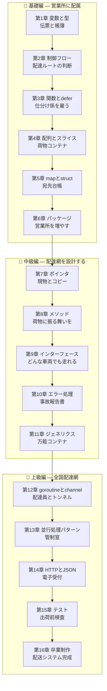

# 🚇 Go Fable 101 — 地下トンネル運送会社で学ぶ Go 基礎から上級まで

ようこそ!この教材では、あなたはホリネズミ(ゴーファー)たちが働く地下トンネル運送会社
**「Gopher Express」** の新米所長になります。

最初は伝票を 1 枚書くことしかできませんが、章を進めるごとに Go の新しい概念を学び、
配達網を拡張していきます。最終章では、テスト付き・並行配達対応の本格的な
配送管理システムが完成します。

> 🐍 **この教材は [Python Fable 101](../python-fable-101/README.md) の続編です。**
> Python を学んだ人が Go を学ぶ前提で書かれており、各章に
> 「🐍 Python との違い」コーナーがあります。Python 未経験でも読めますが、
> 比較部分はスキップしてもかまいません。

## 📖 この教材の読み方

- 各章は **前の章のコードを土台に** 進みます。順番に読むのがおすすめです。
- コードは実際に手を動かして実行してください(Go 1.23 以上を推奨。
  第2章で触れるとおり Go は 1.22 でループ変数の仕様が変わったため、それ以前の版は不可)。
- 各章の最後に「今日の配達訓練(演習)」があります。
- **🐍 Python との違い** — Python 経験者がつまずきやすい違いを比較解説します。
- **🔍 なぜそうなっているの?** — Go の一見奇妙な仕様の背景(設計思想・歴史)を解説します。
  Go は「なぜ?」を知ると急に腑に落ちる言語です。
- 図は [Mermaid](https://mermaid.js.org/) 記法で書かれています。GitHub や VS Code の
  Markdown プレビューでそのまま表示できます。

## 🗺️ 学習マップ



## 📚 目次

| 章 | タイトル | 学ぶ Go の概念 | 会社に起きること |
|---|---|---|---|
| [第1章](chapters/01_variables.md) | 伝票と帳簿 | 変数、型、ゼロ値、定数と iota | 入社!最初の伝票を書く |
| [第2章](chapters/02_control_flow.md) | 配達ルートの判断 | if / for / switch | 荷物を仕分けできるようになる |
| [第3章](chapters/03_functions.md) | 仕分け係を雇う | 関数、多値返却、defer、クロージャ | 作業が自動化される |
| [第4章](chapters/04_slices.md) | 荷物コンテナ | 配列、スライス、append の仕組み | 荷物をまとめて運べる |
| [第5章](chapters/05_maps_structs.md) | 宛先台帳と荷物カルテ | map、struct | 宛先検索と荷物情報の管理 |
| [第6章](chapters/06_packages.md) | 営業所を増やす | パッケージ、go mod、公開/非公開 | コードがファイルに整理される |
| [第7章](chapters/07_pointers.md) | 現物とコピー | ポインタ、値渡し | 「荷物のコピーに宛先を書いた」事故が防げる |
| [第8章](chapters/08_methods.md) | 荷物に振る舞いを | メソッド、レシーバ、埋め込み | 荷物が自分で状態を管理する |
| [第9章](chapters/09_interfaces.md) | どんな車両でも走れる免許 | インターフェース、型アサーション | トラックも船もドローンも使える |
| [第10章](chapters/10_errors.md) | 事故報告書の書き方 | error、wrap、errors.Is/As、panic | 配達失敗に強い会社になる |
| [第11章](chapters/11_generics.md) | 万能コンテナ | ジェネリクス、型制約 | どんな荷物用の設備も一度書けば済む |
| [第12章](chapters/12_goroutines.md) | 配達員とトンネル | goroutine、channel、WaitGroup | 配達が並行化され超高速に |
| [第13章](chapters/13_concurrency_patterns.md) | 管制室 | select、context、sync、race 検出 | 並行配達が事故らなくなる |
| [第14章](chapters/14_http_json.md) | 電子受付を開く | net/http、encoding/json、構造体タグ | Web から集荷依頼を受けられる |
| [第15章](chapters/15_testing.md) | 出荷前検査 | go test、テーブル駆動テスト、ベンチマーク | 品質保証体制が整う |
| [第16章](chapters/16_final.md) | 卒業制作 | プロジェクト構成、ビルド、配布 | 配送管理システムが完成・出荷される |

## 🎯 対象読者

- Python の基礎〜中級(関数・クラス・例外あたり)を理解していて、2 言語目に Go を選んだ人
- Go を書いたことはあるが、スライスの挙動・インターフェースの nil・goroutine の落とし穴などを
  「なんとなく」で済ませてきた人

## 🛠️ 準備

```bash
# Go 1.23 以上を確認
go version

# 教材用の作業ディレクトリ(この教材では express/ 以下にコードを育てていきます)
mkdir -p express
cd express
go mod init gopher.example/express
```

> 💡 1 ファイルだけサッと試したいときは `go run ファイル名.go`、
> ブラウザで試したいときは [Go Playground](https://go.dev/play/) が便利です。

それでは、[第1章](chapters/01_variables.md) から初出社です!🚇
