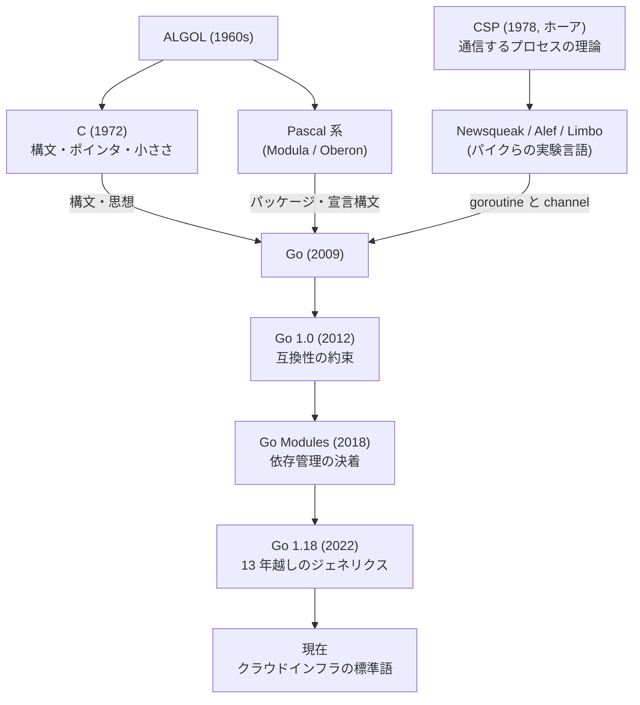
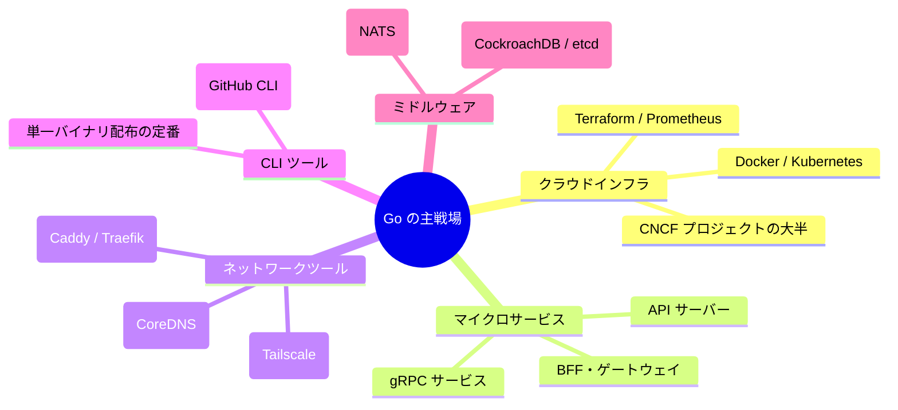

# 🐹 Go という言語 — 系譜・思想・強み・弱みの全体像

この章は文法の解説ではなく、**「Go とはどういう言語で、なぜクラウド時代の主役になり、どこで嫌われているのか」** を俯瞰するための読み物です。教材本編(chapters)に入る前でも、一通り学び終えた後でも読めます。

---

## 1. 生い立ちと系譜

Go は 2009 年に **Google** が公開した言語です。設計者は計算機科学の伝説級の 3 人 — **ロブ・パイク**(UNIX, UTF-8)、**ケン・トンプソン**(UNIX, C の前身 B 言語)、**ロバート・グリースマー**(V8, HotSpot JVM)です。

誕生のきっかけは有名な逸話があります。Google 社内の巨大な C++ プログラムの**ビルドに 45 分待たされている間に**、3 人が「もっとましな言語が作れるはずだ」と構想を始めたのです。つまり Go は最初から、

- **巨大なコードベース**(数百万行)
- **巨大な組織**(数千人のエンジニア、新人も多い)
- **巨大なマルチコア・分散環境**(データセンター)

という「Google スケールの問題」を解くために設計されました。



系譜のポイントは 2 本の血統が合流していることです:

1. **C の血統** — 小さな言語仕様、速いコンパイル、機械に近い性能
2. **CSP の血統** — 「メモリを共有して通信するな、**通信してメモリを共有せよ**」という並行性の理論(教材第 12〜13 章の goroutine / channel の源流)

### 歴史の転換点

| 年 | 出来事 | 意味 |
|---|---|---|
| 2007 | Google 社内で設計開始 | C++ のビルド待ちへの反乱 |
| 2009 | 一般公開 | 当初は「ジェネリクスもないのか」と冷笑も |
| 2012 | Go 1.0 | **互換性の約束** — Go 1 で書いたコードは今も動く |
| 2013〜 | Docker / Kubernetes が Go を採用 | クラウドネイティブ時代の言語に |
| 2018 | Go Modules | 長年の依存管理問題に決着 |
| 2022 | Go 1.18 でジェネリクス導入 | 最大の批判ポイントが 13 年越しに解消 |

---

## 2. 設計思想 — 「退屈さ」は機能である

Go の思想は Python の「美しさ」とは対照的で、一言でいえば **「大規模組織でのソフトウェア工学的な問題を、言語を単純にすることで解く」** です。

- **機能を足すのではなく、削る。** 継承なし、例外なし、三項演算子なし、(長らく)ジェネリクスなし。
- **書き方の自由を与えない。** `gofmt` がフォーマットを強制し、未使用の変数や import は**コンパイルエラー**。
- **誰が書いても同じようなコードになる。** 天才の書いたコードも新卒の書いたコードも同じに見える — これは組織にとっては長所。

ロブ・パイクは率直にこう語っています:

> 「Go は、Google の若いプログラマー(卒業したての新人たち)が、**優れた言語を理解できなくても**、優れたソフトウェアを作れるように設計した」

この割り切りが、Go が愛される理由と嫌われる理由の**両方の根源**です。

---

## 3. 言語としての特徴

### 3.1 goroutine と channel — 並行処理が言語機能

Go 最大の武器です。`go` キーワード 1 つで軽量スレッド(goroutine)を起動でき、1 つあたり数 KB のスタックで済むため **数十万個を同時に**動かせます。OS スレッドより 3 桁軽い並行性です。

```go
go handleRequest(conn)   // これだけで並行実行が始まる
ch := make(chan Result)  // channel で goroutine 間の通信
```

「1 接続 = 1 goroutine」という素朴なコードが、そのまま数万接続を捌くサーバーになります。Python の async/await のような「色付き関数」(async 関数と普通の関数の分断)問題がないのも特徴です。

### 3.2 単一バイナリへのコンパイル

`go build` 一発で、依存をすべて含んだ**静的リンクの実行ファイル**が生まれます。クロスコンパイルも `GOOS=linux go build` のように環境変数だけ。ランタイムのインストール不要でファイルを置けば動く — この配布の簡単さが Docker、Kubernetes、Terraform など**インフラツールが軒並み Go で書かれる**最大の理由です。

### 3.3 コンパイルが異常に速い

「C++ のビルド 45 分」への反乱として生まれただけあり、巨大プロジェクトでも数秒〜数十秒でビルドが終わります。依存関係の設計(不要な再コンパイルが起きない import 構造)が言語レベルで強制されています。

### 3.4 GC がありつつ性能は C に近い

ガベージコレクション付きの言語としては最速クラスで、GC の停止時間(STW)はサブミリ秒に抑えられています。「C の性能 ≧ Go >> Python」くらいの感覚です(用途によりますが、素の計算で Python の数十倍速いことは普通です)。

### 3.5 構造的型付けのインターフェース

Java のような `implements` 宣言が不要で、**メソッドを持っていれば自動的にインターフェースを満たします**(教材第 9 章)。「静的型検査される duck typing」とも呼ばれ、疎結合な設計を自然に導きます。

### 3.6 エラーは値である

例外機構がなく、エラーは戻り値として明示的に受け取り、その場で処理します(教材第 10 章)。

```go
result, err := doSomething()
if err != nil {
    return fmt.Errorf("doSomething failed: %w", err)
}
```

エラーの流れがコードにすべて可視化される、というのが設計意図です(不満も多い — 後述)。

---

## 4. Go の特異な点(他言語経験者が驚くところ)

| 特異な点 | 説明 |
|---|---|
| **未使用変数・import はコンパイルエラー** | 警告ではなくエラー。「後で使うかも」は許されない |
| **例外がない** | `if err != nil` を延々と書く。`panic` はあるが本当の異常時のみ |
| **クラスも継承もない** | struct + メソッド + インターフェース + 埋め込み(composition)で設計する |
| **`gofmt` が絶対** | インデント論争・スタイル論争が存在しない。全世界の Go コードが同じ見た目 |
| **大文字/小文字が可視性を決める** | `Name` は公開、`name` は非公開。`public` キーワードすらない |
| **三項演算子がない** | `x = cond ? a : b` は書けない。if 文で書く |
| **`nil` の interface が罠** | 「nil を入れた interface は nil ではない」という有名な落とし穴 |
| **標準ライブラリだけで本番 Web サーバーが書ける** | `net/http` が本番品質。フレームワーク必須ではない文化 |
| **後方互換の徹底** | 2012 年の Go 1 コードが 2026 年でもそのままコンパイルできる |

---

## 5. どういうシステムでよく使われるか



### 得意な領域

- **クラウドインフラ・コンテナ基盤** — Docker、Kubernetes、Terraform、Prometheus…現代のクラウドは Go の上に建っています。
- **マイクロサービス / API サーバー** — 軽量・高並行・デプロイ容易・起動が一瞬。コンテナとの相性が抜群。
- **CLI ツール** — 単一バイナリ配布のおかげでこの領域を Python から奪いました。
- **ネットワークプログラミング** — goroutine モデルがプロキシ・サーバー類に最適。

### 不得意な領域

- **GUI・モバイル・フロントエンド** — ほぼ出番なし。
- **データサイエンス・機械学習** — ライブラリ生態系が Python に遠く及ばない。
- **素早い試行錯誤・探索的プログラミング** — REPL がなく、型と冗長さが「雑に試す」用途には重い。
- **極限の低レイテンシ・組み込み** — GC がある以上、その領域は C/C++/Rust の縄張り。

---

## 6. 課題と「嫌われている点」

Go は「シンプルさ」を売りにしますが、それは **「複雑さを言語からユーザーのコードへ移した」** だけだ、という批判が常につきまといます。

### 6.1 `if err != nil` の洪水

**最も有名な不満**です。関数を 3 つ呼べば同じ 3 行のエラー処理が 3 回現れます。大きなファイルではコードの 3 割がエラー処理の定型文、ということも。改善提案(`try` 提案など)は何度も出ましたが、すべて却下されました。2024〜2025 年には Go チームが「**エラー処理構文の変更はもう検討しない**」と公式に宣言し、この議論には終止符が打たれています。

### 6.2 表現力の低さ・冗長さ

map / filter / reduce のような高階関数のチェーンは書けず(書けても慣用ではなく)、素朴な for ループを繰り返し書きます。関数型やモダン言語(Rust, Kotlin, TypeScript)から来た人ほど「**同じことを書くのに 3 倍の行数がかかる**」「知的な面白さがない」と感じます。「退屈さは仕様」なのですが、それを苦痛と感じる層は確実に存在します。

### 6.3 ジェネリクス導入まで 13 年かかった

2009〜2022 年、「型安全な汎用コンテナが書けない」「`interface{}` と型アサーションでお茶を濁す」状態が続き、最大の批判ポイントでした。1.18 でようやく導入されましたが、意図的に控えめな設計(メソッドに型パラメータを持てない等)で、他言語のジェネリクスに慣れた人には物足りなさが残ります。

### 6.4 `nil` の存在

「10 億ドルの過ち」(null 参照)をそのまま受け継いでいます。Rust の `Option` や Kotlin の null 安全のような仕組みはなく、nil ポインタの実行時 panic は Go プログラムの定番障害です。さらに「nil を代入した interface は nil 比較で false になる」という Go 固有の罠が追い打ちをかけます。

### 6.5 ゼロ値の功罪

変数は宣言だけで「ゼロ値」(0, "", nil)に初期化されます。便利な反面、**「初期化し忘れ」がエラーにならず、黙って 0 や空文字で動き続ける**バグの温床にもなります。「必須フィールドの設定漏れ」をコンパイラが検出できません。

### 6.6 依存管理の迷走(過去)

2018 年まで公式の依存管理がなく、`GOPATH` の強制、`dep` や `glide` の乱立と、コミュニティは長く混乱しました。Go Modules で解決済みですが、当時の悪印象を今も引きずる人はいます。

### 6.7 その他よく聞く不満

- **エラーにスタックトレースが付かない** — `fmt.Errorf` のラップ文脈だけが頼り。例外文化圏から来ると不便
- **enum(列挙型)がない** — `iota` と定数による擬似 enum は網羅性チェックが効かない
- **バイナリサイズが大きい** — ランタイム込みなので Hello World でも数 MB
- **言語チームの「頑固さ」** — コミュニティの改善提案が却下され続ける統治スタイルへの不満(裏返せば、それが言語の一貫性を守ってきた)
- **`context.Context` の伝播** — キャンセル処理のため、ほぼ全関数の第 1 引数に `ctx` を引き回す様式美

---

## 7. まとめ — Go はどういう言語か

一言でいえば、**「チームと機械の時間を最適化する言語」** です。

- 個人の表現力・書き心地より、**チームの誰もが読める・保守できる**ことを優先する
- コンパイル・実行・デプロイ・起動、あらゆる「待ち時間」が短い
- 並行処理と単一バイナリ配布という 2 つの武器で、**クラウドインフラの共通語**の座を獲得した
- 「退屈で冗長」という批判は正当だが、それは意図された設計であり、10 年後も同じコードが動く安定性とのトレードオフ

隣のフォルダの Python(`python-fable-101/language-overview/`)は、Go の弱点(試行錯誤の速さ・表現力・ライブラリ生態系)をちょうど裏返したような言語です。実務では「探索・分析は Python、本番サービスとツールは Go」のような使い分けもよく見られます。読み比べると、それぞれの設計判断がより立体的に見えてきます。
