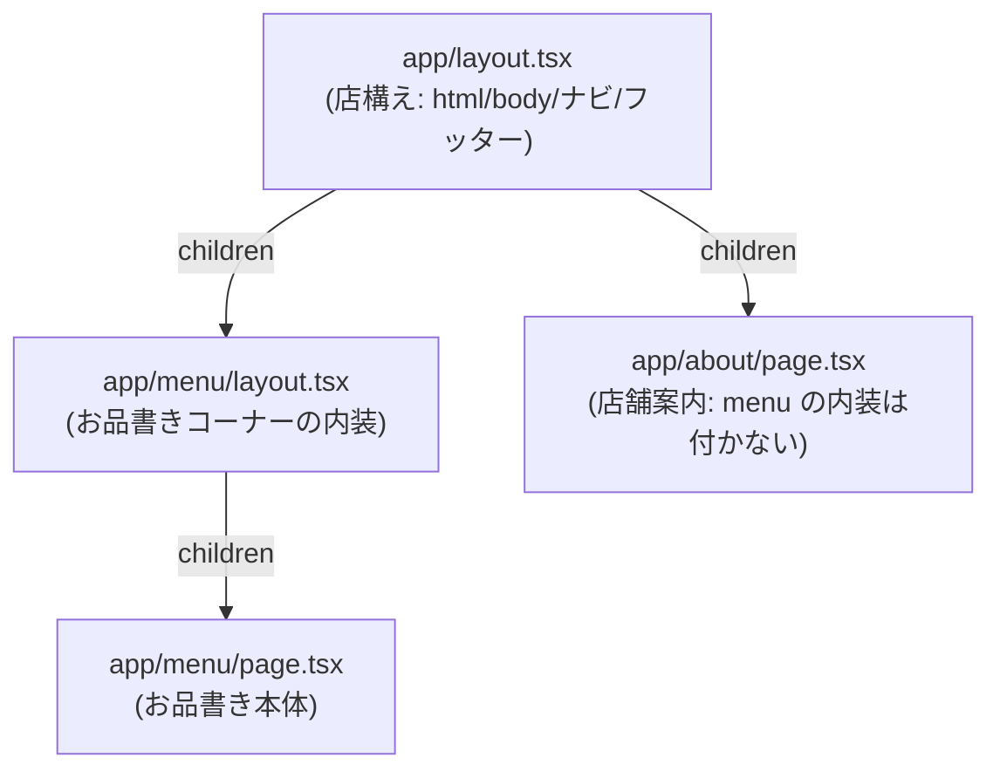

# 第3章 店構えは一度だけ描く — layout と metadata

## 🍽️ 今日のお話

のれん・ナビ・フッター(営業時間と住所)は、どの部屋にいても見えていてほしいものです。
各 `page.tsx` に `<NavBar />` をコピペする——のは、[React 第 2 章で学んだ合成](../../react-fable-101/chapters/02_props.md)の
精神に反します。共通の枠は一度だけ書きたい。

Next.js の答えもまたファイル規約です: **`layout.tsx`**。同じフォルダ以下の全ページを
包む「額縁」です。

## layout.tsx — children に page が流れ込む

プロジェクト生成時から `app/layout.tsx` が存在しています。整理して書き直します:

```tsx
// app/layout.tsx — 店全体の構え(ルートレイアウト)
import type { Metadata } from "next";
import { NavBar } from "../components/NavBar";

export const metadata: Metadata = {
  title: "Bistro Next",
  description: "その場で調理してお届けする、心づくしの食堂",
};

export default function RootLayout({ children }: { children: React.ReactNode }) {
  return (
    <html lang="ja">
      <body>
        <header>
          <p>🍽️ Bistro Next — 本日も営業中</p>
          <NavBar />
        </header>
        {children}   {/* ← ここに各 page.tsx の中身が流れ込む */}
        <footer>
          <small>営業 11:00–21:00 / 月曜定休 / App Router 線ルート駅 0 分</small>
        </footer>
      </body>
    </html>
  );
}
```

仕組みは [React 第 2 章の children](../../react-fable-101/chapters/02_props.md) **そのもの** です。
`StageFrame` が children を受け取って額縁を提供したのと同じ——違いは、
**「どの page が children に入るか」を Next.js が URL に応じて差し込んでくれる** ことだけ。
2F の合成パターンに、3F がルーティングを接続した形です。

- ルートレイアウト(`app/layout.tsx`)だけは `<html>` と `<body>` を書く義務があります
- これで全ページからナビの重複を消せます。`/menu` を開いても `/about` を開いても、
  ヘッダーとフッターは常に表示されます

## 入れ子のレイアウト — 「お品書きコーナー」の内装

layout はフォルダごとに置けて、**入れ子になります**。お品書き関連ページ
(`/menu` と、第 4 章で作る `/menu/[id]`)にだけ共通の内装を足しましょう:

```tsx
// app/menu/layout.tsx — お品書きコーナー専用の内装
export default function MenuLayout({ children }: { children: React.ReactNode }) {
  return (
    <div style={{ borderLeft: "4px solid darkred", paddingLeft: 16 }}>
      <p>📖 お品書きコーナー — 全品、消費税込み表示です</p>
      {children}
    </div>
  );
}
```



URL `/menu` の画面は「店構え → コーナー内装 → ページ本体」の三重の入れ子として
レンダリングされます。**コンポーネントの合成の木(React 2F)を、フォルダ構造(Next 3F)で
表現している**——App Router の設計の核はこの一致です。

> ⚙️ **厨房の真実 — layout は「再上演されない」**
>
> `/menu` から `/about` へ移動するとき、Next.js は **変わった部分(page)だけを
> 差し替え、layout は残します**。layout の中のコンポーネントは再マウントされず、
> **state も維持されます**([React 第 10 章の「同じ位置・同じ type なら同一人物」](../../react-fable-101/chapters/10_rendering.md)が、
> ページ遷移をまたいで働くということです)。
>
> ヘッダーに入力欄や再生中の動画があってもページ遷移で消えない——CSR の SPA が
> 持っていた利点を、サーバーレンダリングの世界に持ち込んだ仕組みです。逆に
> 「ページごとに状態をリセットしたい」ものを layout に置いてはいけない、という
> 注意も裏返しで生まれます。

## metadata — グルメサイトに載るための看板情報

第 1 章で「CSR は検索エンジンに中身が見えにくい」と学びました。せっかくサーバーで
HTML を作れるのだから、**ページの看板情報(title、description)** もきちんと出しましょう。
App Router では `metadata` を export するだけです:

```tsx
// app/menu/page.tsx に追記
import type { Metadata } from "next";

export const metadata: Metadata = {
  title: "お品書き | Bistro Next",
  description: "カルボナーラ、オムライス、欧風カレー。全品税込のお品書きです。",
};
```

- ブラウザのタブ表示が変わります(「ページのソースを表示」で `<title>` と
  `<meta name="description">` が HTML に焼き込まれていることも確認を)
- layout の metadata と page の metadata は **マージ** されます(page が優先)
- [React 第 9 章では `document.title` を useEffect で書き換えました](../../react-fable-101/chapters/09_effects.md)が、
  あれは「ブラウザで JS が動いてから」の変更でした。`metadata` は **最初の HTML の
  時点で** 入っています。検索エンジン対応としては格が違います——「effect でやっていた
  ことがサーバーの仕事に移る」は、この教材で繰り返し見る構図です

💡 `export const metadata` は **型注釈 `Metadata` を付ける**([TS 第 1 章](../../typescript-fable-101/chapters/01_variables.md))ことで、
プロパティ名の typo(`titel` など)がコンパイル時に検出されます。設定オブジェクトにも
型の守りを効かせる——1F の恩恵です。

## ⚔️ 完成コード: 今日の間取り

```
app/
├── layout.tsx            # 店構え(metadata + header/footer + NavBar)
├── page.tsx              # のれん(NavBar は layout に引っ越したので削除)
├── not-found.tsx         # 404(前章の演習)
├── menu/
│   ├── layout.tsx        # お品書きコーナーの内装
│   └── page.tsx          # お品書き(専用 metadata 付き)
└── about/
    ├── page.tsx
    └── access/page.tsx
```

各 page.tsx から `<NavBar />` や共通フッターの記述を削除して、layout に一本化して
あることを確認してください。**page は「その部屋の中身」だけに集中する**——
関心の分離が間取りのレベルで実現されました。

## 📝 今日の仕込み(演習)

1. `/about` 系ページに「🏠 店舗案内コーナー」と表示する `app/about/layout.tsx` を作り、`/about` と `/about/access` の両方に効くこと、`/menu` には効かないことを確認してください。
2. layout の state 維持を体感する実験: `NavBar` に [useState のカウンタ](../../react-fable-101/chapters/05_state.md)(押すと増えるだけのボタン)を仮置きし、ページを行き来してもカウントが消えないことを確認してください(確認後は削除)。`<a>` タグ遷移だとどうなるかも比較を。
3. 全ページに `metadata` を設定してください。`title` を毎回フルで書く代わりに、ルート layout で `title: { template: "%s | Bistro Next", default: "Bistro Next" }` を設定し、各ページは `title: "お品書き"` だけ書く方式に整理してみましょう。
4. (考察)「ページごとに変わるお知らせバナー」は layout と page のどちらに置くべきでしょう?「再上演されない」の観点から理由も述べてください。

---

次章、お品書きの各料理に **専用ページ**(`/menu/carbonara` など)を作ります。
料理が 100 品に増えてもフォルダを 100 個掘らずに済む仕組み——動的ルートです。
→ [第4章 メニューの個室](04_dynamic_routes.md)
