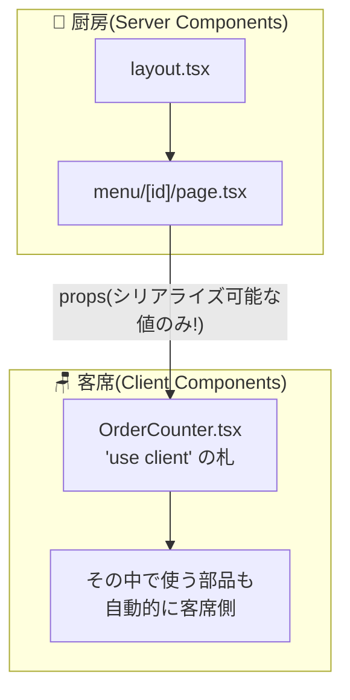

# 第6章 客席との境界線 — "use client" とシリアライズの掟

## 🍽️ 今日のお話

お品書きの個室ページに「数量を選んでカートに入れる」ボタンを付けたくなりました。
数量は [state](../../react-fable-101/chapters/05_state.md)、ボタンは
[onClick](../../react-fable-101/chapters/04_events.md)——2F でさんざん作った UI です。

しかし前章で学んだとおり、厨房(Server Component)には客がいないので useState も
onClick も使えません。**触れる UI は客席(ブラウザ)に置く必要があります。**
今日はその置き方——`"use client"` という境界線の引き方を学びます。

## "use client" — 「ここから先は客席です」の札

ファイルの先頭に文字列を 1 行置くだけです:

```tsx
// components/OrderCounter.tsx
"use client";                    // ← この札から先は Client Component の世界

import { useState } from "react";

export function OrderCounter({ itemName, price }: { itemName: string; price: number }) {
  const [count, setCount] = useState(1);

  return (
    <div>
      <button onClick={() => setCount((c) => Math.max(1, c - 1))}>−</button>
      <span> {count} 皿 </span>
      <button onClick={() => setCount((c) => c + 1)}>＋</button>
      <p>
        小計: {(price * count).toLocaleString()} 円
      </p>
      <button onClick={() => alert(`${itemName} × ${count} をカートに入れました(仮)`)}>
        🛒 カートに入れる
      </button>
    </div>
  );
}
```

中身は **react-fable-101 の知識だけ** で書かれています。useState、更新関数、
イベントハンドラ——1 行も新しいことはありません。新しいのは冒頭の札だけです。

これを厨房のページ(Server Component)から普通に使います:

```tsx
// app/menu/[id]/page.tsx(Server Component のまま)
import { OrderCounter } from "../../../components/OrderCounter";

export default async function MenuItemPage({ params }: { params: Promise<{ id: string }> }) {
  const { id } = await params;
  const item = findMenuItem(id);
  if (!item) notFound();

  return (
    <main>
      <h1>{item.name}</h1>
      <p>{item.description}</p>
      <OrderCounter itemName={item.name} price={item.price} />   {/* 厨房から客席の部品を配置 */}
    </main>
  );
}
```

ページの説明文はサーバーで HTML になり(即表示・検索エンジンに見える)、
カウンタ部分だけがブラウザで動く部品として届く——**1 つの画面の中で厨房製と客席製が
混在** しています。これが RSC アーキテクチャの日常風景です。

## ⚙️ 厨房の真実 — "use client" は「境界の宣言」であって「実行場所の切替スイッチ」ではない

正確に理解しておくべきことが 2 つあります。

**1. 札は「入口」に 1 枚でいい。** `"use client"` を置いたファイルから
import されるものは、**芋づる式に全部クライアント側** になります。全ファイルに
書くものではなく、**厨房と客席の境界をまたぐ入口** に立てる札です。



**2. Client Component も「初回はサーバーで描かれる」。** 札を立てても、初回アクセス時の
HTML には `count = 1` の状態で **描画済みの姿が含まれます**(だから白い画面になりません)。
その後ブラウザで JS が読み込まれ、同じコンポーネントをもう一度実行して DOM と
接続し、**触れる状態にする**——この儀式を **ハイドレーション(水分補給)** と呼びます。
乾燥した HTML に JS という水を注いで、生きた React に戻すイメージです。
つまり Client Component とは「クライアント **でだけ** 動く部品」ではなく
「クライアント **でも** 動く(= JS が客に送られる)部品」です。

> 💡 だから命名は「Client Component = 客席にレシピ(JS)を渡す部品」と覚えるのが
> 正確です。前章の演習 4 の答え合わせ: 原価データは、**Client Component が import
> しない限り** 客に届きません。逆に `"use client"` なファイルが import した瞬間、
> バンドルに載って全世界に公開されます。境界の意識はセキュリティの意識です。

## シリアライズの掟 — 境界を越えられる props、越えられない props

厨房から客席へ props を渡すとき、その値は **ネットワークを越えて直列化
(シリアライズ)** されます。[JSON にできる値](../../typescript-fable-101/chapters/03_objects_arrays.md)は
渡せますが、**関数は渡せません**:

```tsx
// ❌ Server Component から Client Component に関数は渡せない
<OrderCounter
  itemName={item.name}
  onAdded={() => console.log("追加!")}   // 実行時エラー: 関数はシリアライズ不能
/>
```

[React 教材では「props down, events up」のためにコールバックを渡し放題](../../react-fable-101/chapters/04_events.md)でした。
あれは全部品が同じ場所(ブラウザ)にいたからです。厨房と客席は **別のマシン** ——
関数(コードとクロージャ)を JSON にして送ることはできません
([TS 第 14 章: JSON に載るのはデータだけ](../../typescript-fable-101/chapters/14_runtime_validation.md))。

| 境界を越えられる | 越えられない |
|---|---|
| string / number / boolean / null | **関数**(イベントハンドラ) |
| 配列・プレーンなオブジェクト | クラスのインスタンス([Adventurer](../../typescript-fable-101/chapters/07_classes.md) のような) |
| Date、Map、Set(React が特別対応) | Symbol、クロージャを含むもの |
| **JSX(children)** ← 重要! | |

「じゃあ客席の出来事を厨房に伝えるには?」——その答えが第 8 章の Server Actions です
(実は「特別に境界を越えられる関数」が存在します。お楽しみに)。

## 合成の奥義 — 客席の枠に、厨房の料理を差し込む

表の最後の行「JSX は越えられる」が、RSC 設計の最重要テクニックを生みます。

「開閉できるアコーディオンの中に、お客さまの声(サーバーでファイルから読む)を
入れたい」という要件を考えます。アコーディオンは state が要るので客席、
レビュー読み込みは厨房の仕事。矛盾するようですが——
[React 第 2 章の children](../../react-fable-101/chapters/02_props.md) で解決できます:

```tsx
// components/Accordion.tsx — 客席の「枠」
"use client";
import { useState } from "react";

export function Accordion({ title, children }: { title: string; children: React.ReactNode }) {
  const [open, setOpen] = useState(false);
  return (
    <section>
      <button onClick={() => setOpen((v) => !v)}>
        {open ? "▼" : "▶"} {title}
      </button>
      {open && children}
    </section>
  );
}
```

```tsx
// app/menu/[id]/page.tsx(厨房)
<Accordion title="お客さまの声">
  <ReviewList itemId={item.id} />   {/* ← Server Component のまま children に差し込む */}
</Accordion>
```

`ReviewList` は厨房で調理済みの **結果**(レンダリング済みの設計図)として
`children` に載るので、境界を安全に越えられます。**「客席の枠 × 厨房の中身」** ——
[「枠と中身の分離」](../../react-fable-101/chapters/02_props.md)という 2F の設計パターンが、
3F では「実行場所の分離」の道具に昇格するのです。

## どちらに置くかの判断基準

| 部品の性質 | 置き場所 |
|---|---|
| データを見せるだけ(一覧、記事、詳細) | 🍳 厨房(既定のまま) |
| state・イベント・エフェクトが要る | 🪑 客席("use client") |
| ブラウザ API(localStorage 等)が要る | 🪑 客席 |
| 秘密情報・重いライブラリ・DB アクセス | 🍳 厨房(客に送らない) |

原則: **既定(厨房)のまま書き始め、「触れる」必要が出た部分だけを最小の部品として
客席に切り出す**。境界の札はできるだけ木の**葉に近い側**に立てる——ページ全体に
`"use client"` を貼るのは、せっかくの厨房を放棄する悪手です。

## 📝 今日の仕込み(演習)

1. 前章の演習 1 の再実験: `OrderCounter` に `console.log("客席で稽古中")` を仕込み、今度は **ブラウザのコンソールに出る** ことを確認してください。ターミナル側にも 1 回出ることに気づいたら、それがハイドレーション前のサーバー描画です。
2. `"use client"` の札を外すとどんなエラーが出るか、エラーメッセージを読んでください(Next.js のエラーは「どの境界で何が違反したか」をかなり丁寧に教えてくれます)。
3. Server Component から Client Component へ `onAdded={() => ...}` を渡して、エラーを自分の目で確認してください。
4. `Accordion` を使って、店舗案内ページに「よくある質問」(中身は厨房側で `data/faq.ts` から生成)を作ってください。「客席の枠 × 厨房の中身」の練習です。

---

次章、「いつ調理するか」の采配を学びます。ビルド時に作り置きする料理(SSG)、
注文ごとに作る料理(SSR)、定期的に作り直す仕込み(ISR)——同じコードが設定ひとつで
三変化する、レンダリング戦略の章です。 → [第7章 作り置きと注文調理](07_rendering.md)
