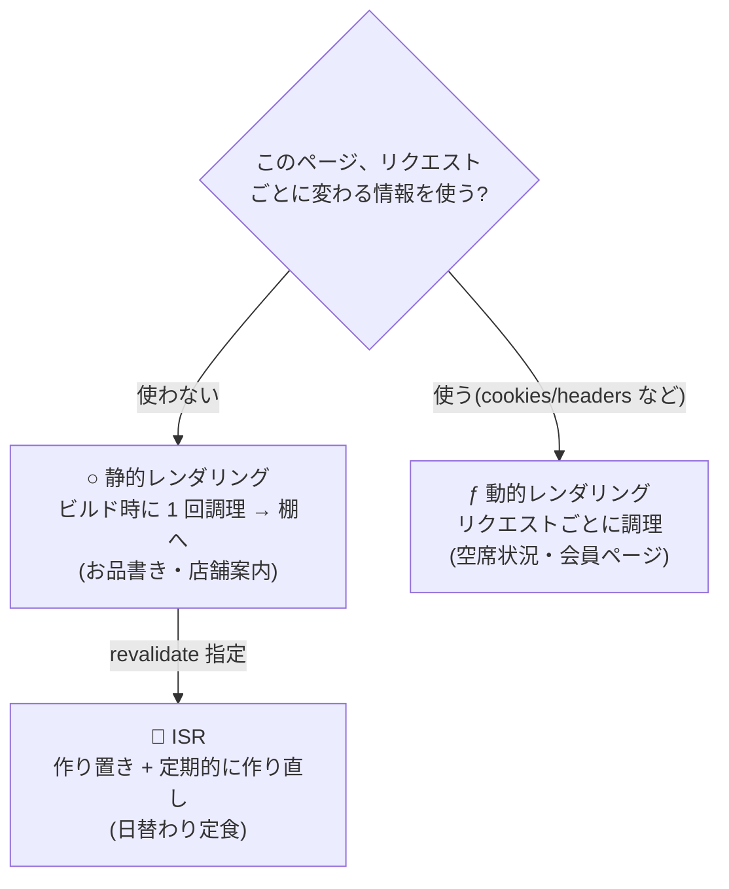

# 第7章 作り置きと注文調理 — レンダリング戦略(静的・動的・ISR)

## 🍽️ 今日のお話

厨房(どこで作るか)と客席(どこで動かすか)を学びました。今日はもう 1 つの軸、
**「いつ作るか」** です。

食堂には 2 種類の料理があります。開店前に仕込んでおける **作り置き**(お品書き、
店舗案内)と、注文を受けてから作る **注文調理**(「いまの空席状況」「あなた宛の
メッセージ」)。Web ページもまったく同じで、Next.js はこの 2 つを
**静的レンダリング** と **動的レンダリング** と呼び、ページごとに自動で使い分けます。

## build が教えてくれる — ○ と ƒ の記号

第 1 章の演習でやった `npm run build` を、今の店でもう一度実行します:

```
Route (app)
┌ ○ /                      ← ○ = Static(作り置き)
├ ○ /about
├ ○ /menu
├ ● /menu/[id]             ← ●(SSG)= 作り置き(個室ぶん量産)※後述
├ ○ /reviews
└ ƒ /table-status          ← ƒ = Dynamic(注文調理)※この章で作る

○  (Static)   prerendered as static content
ƒ  (Dynamic)  server-rendered on demand
```

**Next.js はビルド時に全ページを検査し、「作り置きできるか」を自動判定しています。**

- **○ 静的(Static / SSG)** — リクエスト情報に依存しないページは、**ビルド時に 1 回だけ**
  レンダリングされ、完成した HTML が保存されます。以後の客には保存済みをそのまま配膳
  ——最速で、サーバーの計算もゼロです
- **ƒ 動的(Dynamic / SSR)** — リクエストごとに変わる情報(Cookie、現在時刻での
  空席状況など)を使うページは、**注文(リクエスト)のたびに** 厨房でレンダリングされます

判定は自動です。ページの中で `cookies()` や `headers()`(リクエスト依存の情報)を
使うと動的に、使わなければ静的に倒れます。**既定は常に「できる限り作り置き」**——
Next.js の性能哲学はこの一言に尽きます。



## 動的ページを作る — いまの空席状況

「現在時刻」で内容が変わるページを作って、ƒ を体験します:

```tsx
// app/table-status/page.tsx — 空席状況(注文調理)
export const dynamic = "force-dynamic";   // 今回は明示的に「常に注文調理」を宣言

export default function TableStatusPage() {
  const now = new Date();
  const hour = now.getHours();
  const isOpen = hour >= 11 && hour < 21;
  // 実際は DB を見るところを、時刻ベースの疑似データで代用
  const freeTables = isOpen ? (hour * 7) % 5 : 0;

  return (
    <main>
      <h1>🪑 ただいまの空席状況</h1>
      <p>{now.toLocaleTimeString("ja-JP")} 現在</p>
      {isOpen ? <p>空席 {freeTables} 卓 — お気軽にどうぞ!</p> : <p>本日の営業は終了しました</p>}
    </main>
  );
}
```

`npm run build && npm run start`(本番モード)で確認すると、このページだけ
リロードのたびに時刻が変わります。静的な `/about` は何度リロードしても
ビルド時点の内容のままです。

💡 `export const dynamic = "force-dynamic"` のような **Route Segment Config** は、
ページの調理方針をファイル単位で宣言する仕組みです。通常は自動判定に任せ、
明示したいときだけ書きます。

## generateStaticParams — 個室を全部、作り置きする

第 4 章の動的ルート `/menu/[id]` には問題があります。「id に何が来るか」は
ビルド時には分からないので、そのままでは作り置きできません。しかし料理の一覧は
台帳で分かっています。**「この id たちの個室を、開店前に全部作っておいて」** と
教えるのが `generateStaticParams` です:

```tsx
// app/menu/[id]/page.tsx に追記
import { menuItems } from "../../../data/menu";

export function generateStaticParams() {
  return menuItems.map((item) => ({ id: item.id }));
  // → [{ id: "carbonara" }, { id: "omurice" }, { id: "curry" }]
}
```

ビルドし直すと、`/menu/[id]` の記号が `●(SSG)` になり、出力に
`/menu/carbonara` などが並びます。**動的ルート × 静的レンダリング**——URL は
可変だが中身は作り置き、という組み合わせです。ブログの全記事、EC の全商品ページが
この方式で量産されています。

## ISR — 日替わり定食のための「定期的な作り直し」

作り置き(速い・安い)と注文調理(新しい)の中間が欲しくなります。
**日替わり定食** がまさにそれです: 内容は 1 日単位でしか変わらないのに、
そのために毎リクエスト調理するのは無駄。かといって完全な作り置きでは、
台帳を更新しても **再ビルドするまで** 反映されません。

答えが **ISR(Incremental Static Regeneration/増分静的再生成)** ——
「作り置きしておき、**一定時間が過ぎたら次の機会に作り直す**」です:

```tsx
// app/today/page.tsx — 日替わり定食
import { readFile } from "node:fs/promises";

export const revalidate = 3600;   // この作り置きの賞味期限は 3600 秒(1 時間)

export default async function TodaySpecialPage() {
  const raw = await readFile("data/today.json", "utf-8");
  const special = JSON.parse(raw) as { name: string; price: number };  // 演習で門番に直します

  return (
    <main>
      <h1>🍱 本日の日替わり定食</h1>
      <p>
        {special.name} — {special.price.toLocaleString()} 円
      </p>
      <p><small>このページは最大 1 時間ごとに作り直されます</small></p>
    </main>
  );
}
```

> ⚙️ **厨房の真実 — ISR の「stale-while-revalidate」方式**
>
> 賞味期限(1 時間)が切れた後の最初の客には、**期限切れの作り置きを即座に出しつつ**、
> 裏で新しいものを調理して棚を入れ替えます(次の客から新版)。「期限が切れたら
> 客を待たせて作り直す」のではない、というのがポイントです——**客を絶対に
> 待たせない** ことを優先し、「一瞬だけ古いものが出る」ことを許容する設計です。
> この割り切り(fresh より fast)は Web のキャッシュ設計全般の頻出思想で、
> HTTP の世界でも stale-while-revalidate という同名のヘッダーがあります。

## 3 方式の使い分け早見表

| 方式 | いつ調理 | 向いている料理 | 例 |
|---|---|---|---|
| 静的(SSG) | ビルド時に 1 回 | めったに変わらない | 店舗案内、お品書き、ブログ記事 |
| ISR | 作り置き + 期限で再調理 | たまに変わる・即時性不要 | 日替わり定食、ランキング、在庫数の目安 |
| 動的(SSR) | リクエストごと | 客ごと・毎回変わる | 空席状況、マイページ、検索結果 |

> 📜 **歴史の背景 — 振り子は「全部静的」と「全部動的」の間で**
>
> Web の歴史はこの使い分けの振り子でした。90 年代は全部静的(HTML 手書き)、
> 2000 年代は全部動的(PHP/Rails がリクエストごとに生成)、2010 年代後半には
> 「Jamstack」と呼ばれる全部静的への揺り戻し(Gatsby など)が流行——しかしどちらの
> 極端も苦しく、「ページごとに最適な方式を選べばいい」というハイブリッドに収束します。
> Next.js の勝因の一つは、**1 つのプロジェクト・1 つの書き方の中で、この選択を
> ページ単位(さらには部品単位——第 9 章)でできるようにした** ことでした。
> ISR(2020)は Next.js のオリジナル発明で、その後他フレームワークにも波及しています。

## 📝 今日の仕込み(演習)

1. `npm run build` の出力を読み、自分の全ページの記号(○/●/ƒ)を表にしてください。「なぜその判定になったか」を各 1 行で説明できれば、この章は合格です。
2. `TodaySpecialPage` の `as` を [zod の門番](../../typescript-fable-101/chapters/14_runtime_validation.md)に置き換えてください(第 5 章の ReviewsPage と同じ作法)。
3. 本番モード(`npm run build && npm run start`)で `data/today.json` を書き換え、(a) 直後のリロードでは変わらない、(b) `revalidate` を 10 秒にしてビルドし直すと約 10 秒 + 1 リロード遅れで変わる、を確認してください(stale-while-revalidate の体感)。
4. (考察)`/reviews`(お客さまの声)は 3 方式のどれが適切でしょう?「新しい声が投稿されたら反映したい」という要件が加わったら?——実は「時間ではなく **イベント** で作り直す」第 3 の道があり、それは次章(Server Actions の `revalidatePath`)で手に入ります。予想だけ立てておいてください。

---

次章、ついに客からの **注文** を受け付けます。フォーム送信をそのまま厨房の関数に
届ける Server Actions——「境界を越えられる特別な関数」の正体です。
→ [第8章 注文票が厨房に届く](08_server_actions.md)
