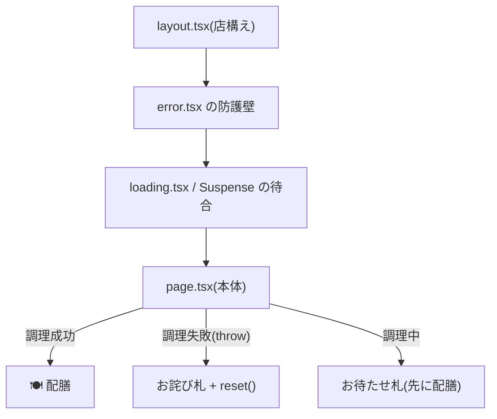

# 第9章 お待たせの作法 — loading・error・Suspense とストリーミング

## 🍽️ 今日のお話

グルメサイトから口コミを取り寄せる「今週の評判」コーナーを作ったところ、先方の
応答が遅く、**ページ全体が数秒白いまま** になってしまいました。せっかくの
サーバーレンダリングが、遅い食材ひとつで台無しです。

食堂の作法はこうです: **できた料理から順に出す。遅い一皿には「ただいまお作りして
います」の札を立てる。失敗したら、店ごと閉めるのではなくその一皿だけお詫びする。**
Next.js はこの作法を、例によってファイル規約で表現します。

## loading.tsx — 部屋単位の「お待たせ札」

まず、遅いデータ取得を再現します:

```tsx
// app/weekly/page.tsx — 今週の評判(遅い外部サイトを想定)
import { setTimeout as sleep } from "node:timers/promises";

async function fetchWeeklyBuzz() {
  await sleep(3000);                       // 遅いグルメサイトの応答を再現
  return [
    { id: 1, site: "グルメ番長", text: "オムライス部門 週間 1 位!" },
    { id: 2, site: "ランチ速報", text: "カルボナーラの追いチーズが話題" },
  ];
}

export default async function WeeklyPage() {
  const buzz = await fetchWeeklyBuzz();
  return (
    <main>
      <h1>📣 今週の評判</h1>
      <ul>
        {buzz.map((b) => (
          <li key={b.id}>【{b.site}】{b.text}</li>
        ))}
      </ul>
    </main>
  );
}
```

このままでは `/weekly` への遷移が 3 秒固まります。同じフォルダに 1 ファイル足します:

```tsx
// app/weekly/loading.tsx — この部屋の「お待たせ札」
export default function WeeklyLoading() {
  return <p>🍳 評判を取り寄せています…しばらくお待ちください</p>;
}
```

これだけで、遷移した瞬間にお待たせ札が表示され、3 秒後に本体へ差し替わります。
[layout](03_layouts.md) や [not-found](02_routing.md) と同じ、**ファイル名に役割を持たせる**
App Router の流儀です。

## Suspense — 「一皿ずつ配膳」の境界を自分で引く

`loading.tsx` は部屋(ルート)単位です。もっと細かく——「ページの骨格とお品書きは
即座に出し、評判コーナー **だけ** 後から届けたい」——ときは、**`<Suspense>`** で
遅い部品を包みます:

```tsx
// app/page.tsx — トップページに評判コーナーを組み込む
import { Suspense } from "react";
import { WeeklyBuzz } from "../components/WeeklyBuzz";   // ↑の fetch 部分を部品化したもの

export default function HomePage() {
  return (
    <main>
      <h1>🍽️ Bistro Next</h1>
      <p>心を込めて、その場で調理してお届けします。</p>   {/* ← 即座に配膳される */}

      <Suspense fallback={<p>🍳 評判を取り寄せ中…</p>}>
        <WeeklyBuzz />                                     {/* ← できたら後から届く */}
      </Suspense>
    </main>
  );
}
```

> ⚙️ **厨房の真実 — ストリーミング: HTML は「一本の流れ」で届く**
>
> このとき HTTP レスポンスは面白い動きをします。サーバーはまず **ページの骨格 +
> fallback(お待たせ札)を含む HTML を送り始め、接続を開けたまま** にします。
> 3 秒後に `WeeklyBuzz` の調理が終わると、**同じレスポンスの続きとして** その HTML 片と
> 「札と差し替えよ」という小さな指示を流し込みます。これが **ストリーミング SSR** です。
>
> 客側の体験: 白い画面ゼロ、骨格は即表示、遅い部分だけ札 → 本体に変わる。
> 「全部できるまで待つ(昔の SSR)」でも「全部客席で作る(CSR)」でもない第三の道で、
> ページ全体の速さが **一番遅い食材に引きずられなくなります**。
>
> なお `loading.tsx` の正体は、**Next.js が page 全体を自動で `<Suspense>` に包み、
> fallback に指定してくれる糖衣** です。仕組みは 1 つ、粒度が違うだけ——と分かれば
> 2 つの道具は 1 つの知識になります。

## React 第 14 章との対応 — 3 局面は消えたのではなく、移設された

[React 教材の劇評コーナー](../../react-fable-101/chapters/14_data_fetching.md)では、
`loading / success / error` の 3 局面を [union 型](../../typescript-fable-101/chapters/05_unions.md) +
switch で **自分の state として** 管理しました。Next.js では:

| React(客席で自前管理) | Next.js(枠組みに移設) |
|---|---|
| `{ status: "loading" }` の分岐 | `loading.tsx` / `<Suspense fallback>` |
| `{ status: "success", data }` の分岐 | コンポーネント本体(await の続き) |
| `{ status: "error", message }` の分岐 | `error.tsx`(次節) |
| ignore 旗・再試行ボタン | ルーターと `reset()` が肩代わり |

**概念は 1 つも消えていません。** あなたが手で書いていた状態機械を、フレームワークが
ファイル配置として引き受けただけです。だからこそ React 教材の第 14 章を先にやった人は、
この 3 ファイルが「何を肩代わりしているか」を正確に言えます——逆順に学ぶと
ここが全部魔法に見えるのです。

## error.tsx — その一皿だけのお詫び

取り寄せが失敗したときにページ全体(店全体)を巻き込まないための規約が
`error.tsx` です:

```tsx
// app/weekly/error.tsx — この部屋専用のお詫び札
"use client";                     // error.tsx は必ず Client Component(再試行の操作があるため)

export default function WeeklyError({
  error,
  reset,
}: {
  error: Error;
  reset: () => void;              // この部屋だけ作り直しを試みる関数
}) {
  return (
    <main>
      <h2>🙇 申し訳ございません</h2>
      <p>評判の取り寄せに失敗しました({error.message})</p>
      <button onClick={reset}>もう一度取り寄せる</button>
    </main>
  );
}
```

`fetchWeeklyBuzz` の中で `throw new Error("グルメサイトが応答しません")` を仕込んで
確認してください。**ヘッダーとナビ(layout)は生きたまま**、weekly の部屋だけが
お詫び札になります。エラーの **爆風半径** をフォルダ構造で制御できるわけです。

💡 `error.tsx` は [React の Error Boundary](https://react.dev/reference/react/Component#catching-rendering-errors-with-an-error-boundary) という
仕組み(部分木のエラーを受け止める防護壁)の自動配置版です。Suspense と Error Boundary
——React が持っていた 2 つの「境界」機構が、App Router ではファイル名として現れている、
という対応関係です。



## ⚔️ 完成コード: 部品化した評判コーナー

```tsx
// components/WeeklyBuzz.tsx(Server Component)
import { setTimeout as sleep } from "node:timers/promises";

interface Buzz {
  id: number;
  site: string;
  text: string;
}

async function fetchWeeklyBuzz(): Promise<Buzz[]> {
  await sleep(3000);
  if (Math.random() < 0.2) {
    throw new Error("グルメサイトが応答しません");   // 2 割で失敗(error.tsx の動作確認用)
  }
  return [
    { id: 1, site: "グルメ番長", text: "オムライス部門 週間 1 位!" },
    { id: 2, site: "ランチ速報", text: "カルボナーラの追いチーズが話題" },
  ];
}

export async function WeeklyBuzz() {
  const buzz = await fetchWeeklyBuzz();
  return (
    <section>
      <h2>📣 今週の評判</h2>
      <ul>
        {buzz.map((b) => (
          <li key={b.id}>【{b.site}】{b.text}</li>
        ))}
      </ul>
    </section>
  );
}
```

トップページ(Suspense 付き)と `/weekly`(loading.tsx + error.tsx 付き)の両方に
組み込み、成功・待機・失敗の 3 局面をひととおり目撃してください。

## 📝 今日の仕込み(演習)

1. `sleep` の時間を 0 / 1000 / 5000 と変えて、体感の違いとお待たせ札の出方を観察してください。
2. トップページの Suspense を外すと、トップ全体の表示が評判コーナーの 3 秒に引きずられることを確認してください(ストリーミングの価値の逆証明)。
3. 遅い部品を 2 つ(評判コーナーと、2 秒かかる「本日の仕入れ情報」)作り、**別々の** Suspense で包んでください。できた順にバラバラと表示される「一皿ずつ配膳」を体感すること。
4. `error.tsx` の `reset` ボタンを連打して、成功するまで再試行できることを確認してください(2 割の失敗率なので数回で成功します)。[React 第 14 章で自作した再試行ボタン](../../react-fable-101/chapters/14_data_fetching.md)と比べ、自分で書かなくてよくなったものを列挙してみましょう。

---

次章、Next.js 最大の難所にして最大の嫌われポイント——**キャッシュ** を正面から
攻略します。「変更したのに画面が変わらない!」の原因は、ほぼすべてここにあります。
棚の中身を全部並べて、怖さを分解しましょう。 → [第10章 棚の中身を知る](10_caching.md)
