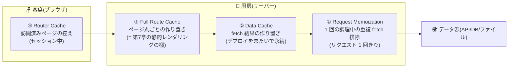

# 第10章 棚の中身を知る — キャッシュの解剖

## 🍽️ 今日のお話

ある朝、あなたは台帳の価格を改定したのに、客の画面では古い価格のまま——という
苦情を受けます。「変更したのに反映されない」。Next.js 開発者が最初にぶつかる壁で、
コミュニティで **最も嫌われている領域** でもあります。

犯人は 1 人ではありません。厨房には **複数の「作り置きの棚」** があり、どの棚に
何がいつまで置かれるかを知らないと、正しい対処ができないのです。今日は棚卸しの日。
新しい機能は作らず、**すでに動いているものの裏側** を解剖します。

## なぜキャッシュだらけなのか — 思想の確認

前提として、これは意地悪ではありません。第 7 章で見たとおり、Next.js の性能哲学は
**「できる限り作り置き(調理済みを再利用)」** です。調理(レンダリング・データ取得)は
高くつくので、同じ結果を二度作らない——その徹底が、複数階層の棚になっています。
問題は棚が **見えない** こと。だから見えるようにするのがこの章です。

## 4 つの棚 — 全体地図



| 棚 | 場所 | 何を置く | 寿命 | 例えるなら |
|---|---|---|---|---|
| ① Request Memoization | 厨房 | 同一リクエスト内の同じ fetch の結果 | その 1 皿の調理中だけ | 「同じ出汁は 1 回だけ取る」 |
| ② Data Cache | 厨房 | fetch の結果 | 永続(revalidate まで) | 食材の仕込みストック |
| ③ Full Route Cache | 厨房 | ページ丸ごとの HTML/RSC | 永続(revalidate まで) | 完成品の作り置き棚 |
| ④ Router Cache | 客席 | 訪問済みページの控え | ブラウザのセッション中 | 客の手元のお盆 |

順に、実感を持てるところだけ深掘りします。

### ① Request Memoization — ありがたい方の棚

1 回のページ調理の中で、**同じ URL への fetch が複数コンポーネントから飛んでも、
実際の取得は 1 回だけ** になります。おかげで「layout でも page でも同じデータが要る」
とき、[props のバケツリレー](../../react-fable-101/chapters/08_lifting_state.md)をせず
**各自が同じ取得関数を呼ぶ** 設計が許されます(RSC 流の「リフトアップ不要」)。
`fetch` 以外(DB アクセスなど)は React の `cache()` で同じ効果を得られます。
これは事故を起こさない棚なので、感謝だけ: しておけば OK です。

### ②③ Data Cache と Full Route Cache — 「変わらない!」の主犯

第 7 章の ○(静的)ページの実体が ③ です。そして `fetch` の結果は ② に入ります。
重要なのは **本番モード(`next build && next start`)での既定値**:

- 静的と判定されたページは、**revalidate を指定しない限り、次のデプロイまで
  作り置きのまま** です。「台帳を書き換えたのに反映されない」の正体は、
  ほぼこれ(③)です
- 対処は第 7〜8 章で学んだ 3 つ: **時間で作り直す**(`revalidate = 3600`)、
  **イベントで作り直す**(`revalidatePath` / `revalidateTag`)、
  **そもそも作り置きしない**(`dynamic = "force-dynamic"` や cookies() の使用で動的化)

💡 **開発モード(`npm run dev`)では ③ は毎回作り直されます**。「dev では動くのに
本番で変わらない!」という定番の混乱は、モードによる棚の挙動差が原因です。
キャッシュの検証は必ず本番モードで行ってください。

### ④ Router Cache — 客の手元のお盆

`<Link>` で行き来したページの控えを **ブラウザ側** が短時間持ちます。おかげで
「戻る」が一瞬になりますが、「サーバーでは作り直されたのに、客のお盆の上が古い」
という現象も起きます。Server Action で `revalidatePath` すると、このお盆も
併せて無効化されます(第 8 章で予約一覧が即座に増えたのは、実はこの連携のおかげです)。

## 実験 — 棚を目で見る

理屈より実験です。時刻を表示するだけのページで棚の挙動を観察します:

```tsx
// app/pantry-check/page.tsx — 棚卸し実験室
export const revalidate = 15;   // ← ここを変えながら実験する

export default function PantryCheckPage() {
  return (
    <main>
      <h1>🕰️ このページが調理された時刻</h1>
      <p>{new Date().toLocaleTimeString("ja-JP")}</p>
    </main>
  );
}
```

```bash
npm run build && npm run start
```

| 設定 | リロードしたときの時刻 | 説明 |
|---|---|---|
| `revalidate = 15` なし(既定) | **ビルドした時刻のまま不変** | ③ に永続の作り置き |
| `export const revalidate = 15;` | 約 15 秒ごとに進む(1 回遅れで) | ISR。[stale-while-revalidate](07_rendering.md) |
| `export const dynamic = "force-dynamic";` | 毎回変わる | 作り置き放棄(ƒ) |

**この 3 行の切り替えを実際にやってください。** キャッシュの怖さの大半は
「見えないこと」なので、一度目で見れば等身大になります。

> 📜 **歴史の背景 — 「キャッシュしすぎ」批判と Next.js 15 の方針転換**
>
> 計算機科学の古い冗談に「難しいことは 2 つだけ: キャッシュの無効化と命名」と
> いうものがあります。Next.js は App Router 導入時(v13〜14)、この難問に
> **「既定で最大限キャッシュする」** 側で賭けました。性能既定値としては合理的でしたが、
> 「fetch したのに古い」「どの層が犯人か分からない」という混乱が殺到し、
> App Router 最大の批判点になりました。
>
> 批判を受けて **Next.js 15(2024)は既定を大きく転換** します——fetch の Data Cache は
> **既定でキャッシュしない**(opt-in 方式)、Router Cache の既定寿命も短縮。
> さらにその先の「Cache Components / `"use cache"`」(明示的にキャッシュ宣言する方式)への
> 移行も進行中です。方向性は一貫して **「暗黙の棚を減らし、明示的な棚にする」**。
> ——フレームワークの既定値は永遠ではありません。だからこの章は「どの版でどれが
> 既定か」の暗記ではなく、**4 つの棚という構造** で教えています。構造さえ頭にあれば、
> バージョンごとの既定値の変更はリリースノートを読むだけで追従できます。

## 迷ったときの調べ方 — 犯人捜しの手順

「変わらない!」に遭遇したら、外側の棚から順に疑います:

1. **ハードリロード**(Cmd/Ctrl+Shift+R)で変わる? → 犯人は ④(客席のお盆)か
   ブラウザ自体のキャッシュ
2. 本番モードで、別ブラウザ(シークレットウィンドウ)でも古い? → 犯人は ③(ページの
   作り置き)。ビルドログの ○/ƒ 記号と revalidate 設定を確認
3. ページは動的なのにデータだけ古い? → 犯人は ②(fetch の棚)。fetch のオプションと
   Next.js のバージョン既定を確認
4. どうしても分からない? → `dynamic = "force-dynamic"` で全棚を迂回して切り分ける
   (直ったらキャッシュ問題と確定。そのまま放置せず、適切な revalidate に戻すこと)

## 📝 今日の仕込み(演習)

1. 上の「実験 — 棚を目で見る」の 3 パターンを実施し、結果を表に記録してください(この教材で最も費用対効果の高い 20 分です)。
2. 開発モード(`npm run dev`)で同じ実験をして、本番モードとの挙動差を確認してください。「キャッシュ検証は本番モードで」を体に刻む実験です。
3. `/menu` は現在、静的(○)です。`data/menu.ts` の価格を変えて本番モードで反映されないことを確認し、(a) revalidate、(b) 管理用 Server Action + `revalidatePath("/menu")`、のどちらかで「価格改定が反映される店」にしてください。
4. (考察)「① の Request Memoization だけは、なぜ事故(古いデータの表示)を起こさないのか」を、棚の寿命の観点から説明してください。

---

次章、店の外に窓口を開けます。スマホアプリや提携サイトなど、**HTML ではなく
生データ(JSON)が欲しい客** のための出前窓口——Route Handlers です。
Server Actions との使い分けも整理します。 → [第11章 出前窓口](11_route_handlers.md)
