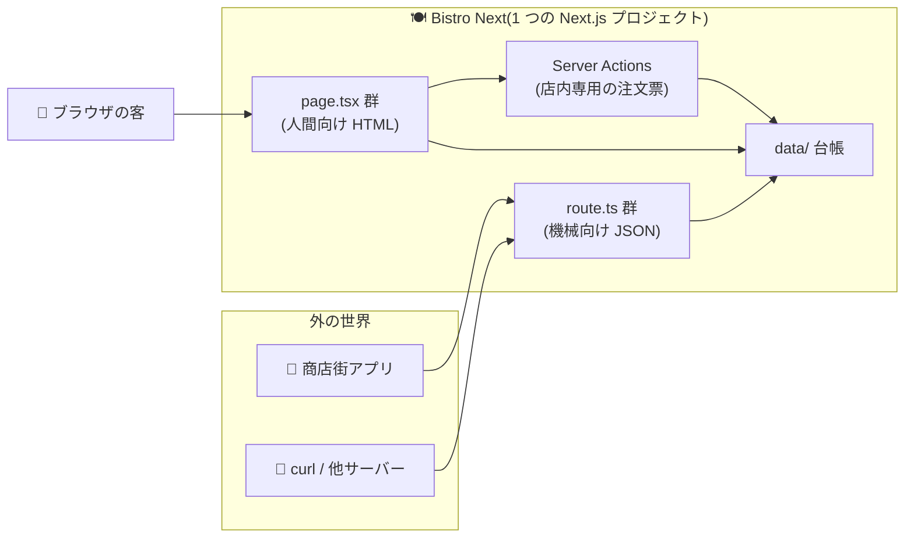

# 第11章 出前窓口 — Route Handlers(API エンドポイント)

## 🍽️ 今日のお話

地元の商店街アプリから連絡が来ました。「Bistro Next のメニューをうちのアプリにも
載せたい。**HTML ではなく JSON でください**」。

これまで作ってきたのは、人間がブラウザで見る **ページ** でした。今日は機械
(他のアプリ・他のサーバー)が読む **API** ——生データの出前窓口を開けます。
Next.js では `route.ts` というファイル規約で、これも同じ `app/` の間取りに収まります。

## route.ts — page.tsx の「JSON 版」

```
app/
├── menu/
│   └── page.tsx          → GET /menu      (人間向け: HTML)
└── api/
    └── menu/
        └── route.ts      → GET /api/menu  (機械向け: JSON)
```

```ts
// app/api/menu/route.ts — 出前窓口
import { NextResponse } from "next/server";
import { menuItems } from "../../../data/menu";

export function GET() {
  return NextResponse.json({
    restaurant: "Bistro Next",
    items: menuItems.map(({ id, name, price, spicy }) => ({ id, name, price, spicy })),
    //     台帳から「外に出してよい項目だけ」を選んで詰める(description や原価は出さない例)
  });
}
```

`curl http://localhost:3000/api/menu` や、ブラウザで直接 URL を開くと JSON が返ります。

規約を整理します:

- ファイル名は **`route.ts`**。置いたフォルダが URL になるのは page.tsx と同じです
  (同じフォルダに page.tsx と route.ts を同居させることはできません——
  1 つの URL の担当は 1 人)
- **HTTP メソッド名の関数を export** します: `GET`、`POST`、`PUT`、`DELETE`…。
  [TS 教材でフクロウ便を await した](../../typescript-fable-101/chapters/12_async_await.md)のと同じ
  Node.js の世界なので、`async` にして DB やファイルを読むのも自由です
- `/api/` プレフィックスは慣習であって必須ではありません(ただし人間向けページと
  見分けやすいので本教材では踏襲します)

## POST — 外から注文を受け付ける

商店街アプリからの注文を受ける窓口も開けましょう。**外から届く body は
[城壁の外](../../typescript-fable-101/chapters/14_runtime_validation.md)** ——門番(zod)は
Server Actions のときと寸分違わぬ作法です:

```ts
// app/api/orders/route.ts
import { NextResponse } from "next/server";
import { z } from "zod";
import { readFile, writeFile } from "node:fs/promises";

const OrderSchema = z.object({
  itemId: z.string(),
  quantity: z.number().int().min(1).max(10),
  note: z.string().max(100).optional(),
});

export async function POST(request: Request) {
  // ① body を取り出す(JSON でない・壊れている可能性もあるので try で)
  let body: unknown;
  try {
    body = await request.json();
  } catch {
    return NextResponse.json({ error: "JSON を送ってください" }, { status: 400 });
  }

  // ② 門番の検問
  const parsed = OrderSchema.safeParse(body);
  if (!parsed.success) {
    return NextResponse.json(
      { error: "注文の様式が不正です", issues: parsed.error.issues },
      { status: 400 }
    );
  }

  // ③ 台帳に記録
  const raw = await readFile("data/orders.json", "utf-8").catch(() => "[]");
  const orders = JSON.parse(raw) as unknown[];
  orders.push({ ...parsed.data, at: new Date().toISOString() });
  await writeFile("data/orders.json", JSON.stringify(orders, null, 2));

  return NextResponse.json({ ok: true, message: "注文を受け付けました" }, { status: 201 });
}
```

```bash
# 動作確認(正しい注文)
curl -X POST http://localhost:3000/api/orders \
  -H "Content-Type: application/json" \
  -d '{"itemId": "omurice", "quantity": 2}'

# 不正な注文(quantity が文字列)→ 400 と issues が返る
curl -X POST http://localhost:3000/api/orders \
  -H "Content-Type: application/json" \
  -d '{"itemId": "omurice", "quantity": "たくさん"}'
```

💡 ステータスコードは HTTP の共通語です: `200`(成功)、`201`(作成した)、
`400`(そちらの注文が不正)、`404`(ない)、`500`(こちらの失敗)。
[Go 教材で HTTP サーバーを書いた人](../../go-fable-101/chapters/14_http_json.md)には
おなじみの世界——**Route Handlers は「Next.js の中に住む小さな Go サーバー」**
みたいなもの、と捉えると立ち位置が掴めます。

## Server Actions との使い分け — 出前と店内注文

前章までの流れで、疑問が湧いているはずです。「書き込みなら第 8 章の Server Actions で
できたのでは? 何が違う?」——重要な整理です:

| | Server Actions(第 8 章) | Route Handlers(本章) |
|---|---|---|
| 呼び出し元 | **自分の Next.js アプリの UI** | **外部**(他アプリ、スマホ、webhook、curl) |
| 呼び出し方 | form action / 関数呼び出しの見た目 | URL + HTTP メソッド |
| 型の恩恵 | 引数・戻り値に型が通る(次章 13 で詳説) | 型は自分で守る(門番必須) |
| UI との連携 | revalidatePath・useActionState と直結 | なし(ただのデータ窓口) |
| 例えるなら | **店内の注文票**(店員しか使わない) | **出前窓口**(誰でも来られる) |

原則: **自分のアプリの UI から使うなら Server Actions。第三者に開くなら
Route Handlers。** 「とりあえず API を作って自分の画面から fetch する」のは
App Router では遠回りです(Server Component なら直接データを読めばよく、
書き込みは Action でよい)。Route Handlers の出番は、本当に「外」があるときです。

> ⚙️ **厨房の真実 — 実は Server Action も「窓口」だった**
>
> [第 8 章の⚙️](08_server_actions.md)を思い出してください。Server Action の実体は
> 「秘密の ID 宛の POST」でした。つまり **どちらも正体は HTTP エンドポイント** です。
> 違いは、Route Handlers が「URL・メソッド・ステータスコードを **あなたが設計する**
> 公開窓口」なのに対し、Server Actions は「配線をフレームワークが生成する **内部用**
> 窓口」だということ。だからこそ第 8 章で「Action にも門番と権限確認を書け」と
> 言ったのです——内部用のつもりの窓口も、HTTP 的には叩けてしまうのですから。



## 📝 今日の仕込み(演習)

1. `GET /api/menu` に **クエリパラメータでの絞り込み** を追加してください: `/api/menu?spicy=true` で辛い料理だけ返す(`request.nextUrl.searchParams.get("spicy")` — クエリも城壁の外なので、`"true"` 以外の値の扱いを決めること)。
2. `GET /api/menu/[id]/route.ts` を作ってください。動的ルート(第 4 章)は route.ts でも同じ仕組みです。台帳にない id には 404 を返すこと。
3. 不正な JSON(`-d '{"itemId":'` など途中で切れたもの)を curl で送り、①の try が守ってくれることを確認してください。try を外すとどうなるかも。
4. (考察)「予約フォーム(第 8 章)を Route Handler + クライアント fetch で作り直すとしたら、増える作業を列挙してください」。列挙し終わると、Server Actions が何を省いてくれていたかの答え合わせになります。

---

次章、店の入口に案内係を立てます。すべてのリクエストが **ページに到達する前に** 通る
関所——Middleware と、常連さんを見分ける Cookie の扱いです。
→ [第12章 入口の案内係](12_middleware.md)
