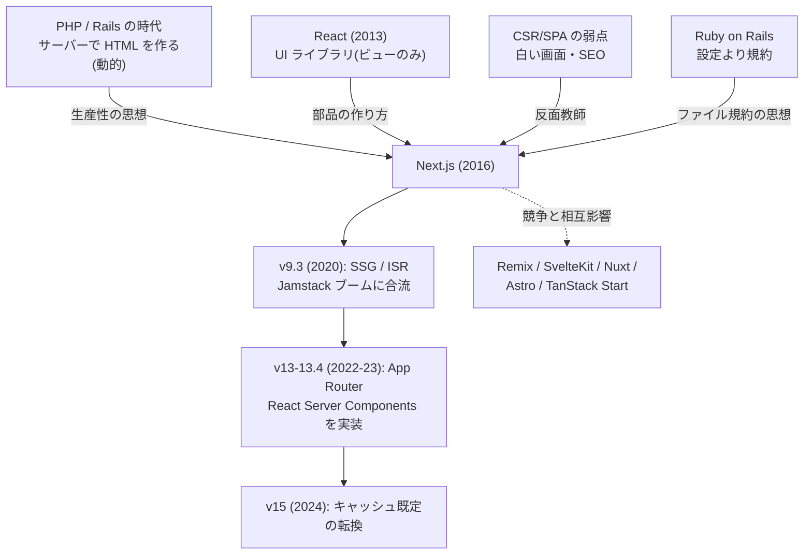
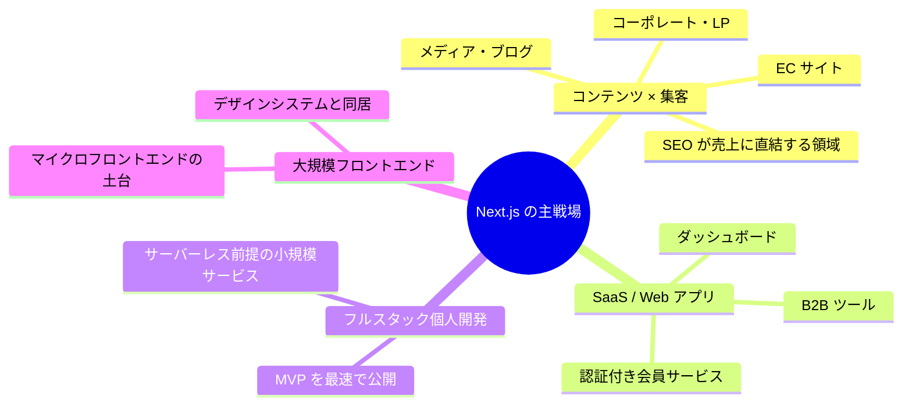

# ▲ Next.js というフレームワーク — 系譜・思想・強み・弱みの全体像

この章は使い方の解説ではなく、**「Next.js とは何で、なぜ React 開発の既定路線になり、どこで嫌われているのか」** を俯瞰するための読み物です。教材本編(chapters)の前後どちらでも読めます。

Next.js は言語でもライブラリでもなく **フレームワーク** です。[TypeScript(言語)](../../typescript-fable-101/language-overview/README.md)の上に [React(UI ライブラリ)](../../react-fable-101/language-overview/README.md)が乗り、その上に Next.js が乗る——本シリーズの言う「3 階建て」の最上階です。ライブラリとフレームワークの違いは **主導権** にあります: ライブラリは「あなたのコードが呼ぶ道具」、フレームワークは「あなたのコードを呼ぶ枠組み」。`page.tsx` という名前のファイルを置けば **呼んでもらえる**——あの規約の世界がフレームワークです。

---

## 1. 生い立ちと系譜

### 前史 — 「React はビューしかない」問題

React(2013)は意図的に「UI の作り方」しか提供しませんでした。ルーティング・データ取得・サーバーレンダリング・ビルド構成は各自で組み立てる必要があり、2015 年頃の React 開発は「アプリを書く前に足場を 1 週間組む」状態でした(俗に *JavaScript fatigue* と呼ばれた時代です)。

さらに当時の React アプリはほぼ全部 CSR(クライアントサイドレンダリング)で、**初期表示の遅さと SEO の弱さ** という構造的な弱点を抱えていました。「サーバーサイドレンダリングを自力で組むのは地獄」というのが共通認識だった 2016 年、**Vercel(当時 ZEIT)の Guillermo Rauch** らが「ゼロ設定で SSR できる React フレームワーク」として Next.js を公開します。

### 歴史の転換点

| 年 | 出来事 | 意味 |
|---|---|---|
| 2016 | Next.js 1.0 | 「ゼロ設定 SSR」。ファイルベースルーティングも当初から |
| 2020 | v9.3 / v9.5 で SSG・ISR | 「全ページ同じ方式」から「ページごとに作り分け」へ。ISR は Next のオリジナル発明 |
| 2021 | Vercel が React コア開発者を続々雇用 | React と Next の開発が事実上合流し始める |
| 2022 | v13 発表(App Router 実験導入) | RSC・レイアウト・ストリーミングの新世界。同時に混乱の始まり |
| 2023 | v13.4 で App Router 安定版 | React 公式が「フレームワーク推奨」を明言。Pages Router との二重時代へ |
| 2024 | v15、React 19 と歩調 | 「キャッシュしすぎ」批判を受けて既定値を大転換 |
| 2025 | CVE-2025-29927(Middleware 脆弱性) | セルフホスト運用と多層防御の重要性が再認識される |

系譜として面白いのは、Next.js が **PHP / Rails への先祖返り** でもあることです。「サーバーでページを作って返す」「規約に従えば動く」——SPA ブームが捨てた古い知恵を、React のコンポーネントモデルと融合させて回収した、と要約できます。

---

## 2. 設計思想 — 「できる限り作り置き、必要なだけ調理」

Next.js の設計判断はほぼすべて、次の 2 原則から導けます。

**原則 1: 既定で最速の配信方式に倒す。**
静的にできるページはビルド時に作り置き(SSG)、できないものだけリクエスト時に調理(SSR)、その中間は期限付き作り置き(ISR)。開発者が何も考えなくても「できる限り速い方式」が選ばれる——[教材第 7 章](../chapters/07_rendering.md)・[第 10 章](../chapters/10_caching.md)で解剖した自動判定とキャッシュ群は、この原則の実装です。

**原則 2: 設定より規約。**
`page.tsx`・`layout.tsx`・`loading.tsx`・`error.tsx`・`route.ts`・`middleware.ts`——ファイル名と置き場所が意味を持ちます。ルート表もビルド設定も書かない。Rails が広めた思想の React 版です。

そして 2023 年以降はこれに第 3 の柱が加わりました:

**原則 3: サーバーとクライアントを 1 つのコンポーネントツリーで書く(RSC)。**
「厨房(サーバー)と客席(ブラウザ)の采配」をフレームワークの中心概念に据える——[教材第 5〜6 章](../chapters/05_server_components.md)の世界です。React チームの 10 年越しの構想(Server Components)に、最初の本格的な実装の場を提供したのが Next.js でした。

---

## 3. 技術としての特徴

- **ハイブリッドレンダリング** — 1 つのアプリの中にSSG・ISR・SSR・CSR を混在できる。「サイト全体でひとつの方式」しか選べなかった時代への回答で、Next.js 最大の発明的貢献(特に ISR)
- **ファイルベースルーティング + 特殊ファイル規約** — フォルダ構造がそのまま情報設計になる。loading/error のような「状態のファイル化」まで規約に含めたのが App Router の特徴
- **Server Components / Server Actions** — データ取得は「ただの await」、フォーム処理は「関数を action に渡すだけ」。API 層の定型コードを大幅に消した([第 8 章](../chapters/08_server_actions.md))
- **フルスタック型安全** — 同一言語・同一プロジェクトゆえ、interface とスキーマがサーバーからブラウザまで通る([第 13 章](../chapters/13_type_safety.md))。[TypeScript の固有の武器](../../typescript-fable-101/language-overview/README.md)を最大化する場所
- **最適化の自動化** — 画像(next/image)、フォント(next/font)、コード分割、prefetch。「全員がやるべきだが誰もやり切れなかった最適化」を既定にした([第 14 章](../chapters/14_optimization.md))

---

## 4. Next.js の特異な点(他の世界から来た人が驚くところ)

| 特異な点 | 説明 |
|---|---|
| **ファイル名が API である** | page/layout/loading/error/route——「何を書くか」の前に「どこに置くか」。Express や Rails のルート定義に慣れていると最初は落ち着かない |
| **同じ .tsx でも実行場所が違う** | 隣り合うファイルの一方はサーバー専用、他方はブラウザ行き。`"use client"` の 1 行が分水嶺([第 6 章](../chapters/06_use_client.md)) |
| **コンポーネントが async にできる** | React 単体には存在しない書き方。サーバー限定の特権 |
| **関数が境界を越える(ように見える)** | Server Actions の実体は自動生成された POST エンドポイント。「関数呼び出しに見える HTTP」 |
| **既定が「キャッシュする」側** | 多くのフレームワークは「毎回実行」が既定。Next は逆(v15 で一部転換)。「変わらない!」は仕様であることが多い |
| **開発モードと本番モードで挙動が違う** | キャッシュ・エラー表示・StrictMode の二重実行。検証は必ず本番モードで([第 10 章](../chapters/10_caching.md)) |
| **フレームワークが React の実験機能を先行搭載** | canary 版 React を同梱して RSC を出荷。「React の新機能を最初に体験する場所」であり、実験台でもある |

---

## 5. どういうシステムでよく使われるか

### 得意な領域

- **SEO と初期表示が勝負のサイト** — EC・メディア・LP。SSG/ISR + 画像最適化は、まさにこの領域のために磨かれてきた
- **「1 人〜少人数でフルスタック」** — DB からUI まで TypeScript 1 本、API 層は Server Actions で省略、デプロイは git push。個人開発・スタートアップの MVP で圧倒的に速い
- **React 資産を持つ組織のフルスタック化** — 既存の React 知識・部品・人材がそのまま活きる

### 不得意な領域

- **リアルタイム双方向通信が主役のアプリ** — WebSocket 常時接続(チャット、ゲーム、共同編集)はサーバーレス前提の設計と相性が悪く、別サーバー([Go](../../go-fable-101/language-overview/README.md) や Node の常駐プロセス)を並べる構成になりがち
- **重い計算・バッチ処理** — フレームワーク以前に [JS ランタイムの不得意分野](../../typescript-fable-101/language-overview/README.md)。ML や集計基盤は [Python](../../python-fable-101/language-overview/README.md) / Go の領分
- **完全に静的な小さいサイト** — Next.js はオーバーキル。Astro や素の HTML で足りる
- **モバイルネイティブ** — そこは React Native / Expo の領分(思想は繋がっているが別物)

---

## 6. 課題と「嫌われている点」

Next.js は「React 界の既定路線」であるがゆえに、批判も具体的で激しいです。

### 6.1 キャッシュの複雑さ(App Router 最大の悪評)

4 層の見えない棚、開発と本番の挙動差、「fetch したのに古い」——[教材第 10 章](../chapters/10_caching.md)を丸ごと使って解剖したこの領域は、**「Next.js を嫌いになった理由」の第 1 位** と言ってよい存在です。v15 での既定値転換(キャッシュ opt-in 化)は事実上の路線修正で、「最初からそうしてくれ」という声とともに受け入れられました。フレームワークが「賢すぎる既定値」を選ぶことの危うさの、教科書的事例です。

### 6.2 破壊的な世代交代 — Pages Router と App Router の分断

2023 年の App Router 移行は、ルーティングもデータ取得も丸ごと別物になる**事実上の別フレームワーク化**でした。数年分の記事・書籍・Stack Overflow・社内資産が「旧世界(Pages Router)」のものになり、[React の「パラダイムの引っ越し」問題](../../react-fable-101/language-overview/README.md)がフレームワーク規模で再演されました。現在も両 Router が共存しており、検索結果と AI の回答に新旧が混在する状態が続いています。

### 6.3 複雑さの総量が増えた

「サーバーか客席か」「静的か動的か」「どの棚か」——RSC 時代の Next.js は、CSR 時代には存在しなかった判断軸を常時 3 つ抱えます。得られる性能と引き換えとはいえ、**「React を学び終えた人がもう一山登らされる」** 学習曲線は公然の課題です(このシリーズが 3 部作構成なのは、まさにこの山を分割するためです)。「小さなアプリには過剰」という指摘は正当で、公式ですら小規模用途には Vite + React を否定しません。

### 6.4 Vercel への利益相反疑念

開発元 Vercel は Next.js のホスティングで収益を得る営利企業です。「セルフホストが面倒になる方向に進化していないか」「新機能が Vercel のインフラ前提ではないか」という疑念は定期的に噴出します(`output: "standalone"` の整備や self-host ドキュメントの充実は、この批判への対応でもあります)。React コア開発者の Vercel 集中と合わせ、**「コミュニティの共有財が一社に握られている」** という統治への不安は、技術的な良し悪しと別次元で残り続けています。

### 6.5 魔法が多い = デバッグが難しい

自動判定(静的/動的)、自動キャッシュ、自動生成されるエンドポイント、開発時だけの挙動——「なぜこうなったのか」をフレームワークの内部知識なしに説明できない場面が多く、**エラーメッセージとドキュメントの間を彷徨う時間** が批判されます。魔法は動いているうちは生産性、壊れた瞬間に負債になります(この教材が各章で⚙️「厨房の真実」を挟んできたのは、この負債への保険です)。

### 6.6 その他よく聞く不満

- **ビルドの遅さ・開発サーバーの重さ** — 大規模化すると顕著(Turbopack への移行で改善中)
- **Middleware の制約と脆弱性の記憶** — エッジランタイムの制限、CVE-2025-29927 の衝撃([第 12 章](../chapters/12_middleware.md))
- **バージョンアップのたびの互換性作業** — React の canary 機能に踏み込んでいる代償
- **「Next.js を学んだ」が「Web を学んだ」にならない懸念** — 規約への習熟がフレームワーク固有知識に留まりがち、という教育的批判(対策は本シリーズの方針そのもの——下の階の原理から積むこと)

---

## 7. まとめ — Next.js はどういう技術か

一言でいえば、**「PHP/Rails 時代のサーバーサイドの知恵を、React のコンポーネントモデルと TypeScript の型で再発明したフルスタックフレームワーク」** です。

- 中核思想は「できる限り作り置き、必要なだけ調理」。ISR とハイブリッドレンダリングという発明で Web 開発の標準語彙を書き換えた
- RSC 時代の Next.js は強力さと引き換えに、**キャッシュ・境界・世代交代という 3 つの複雑さ** を抱えた。愛憎の激しさは、それだけ広く使われていることの裏返し
- 「フレームワークの都合」と「開発元(Vercel)の商売の都合」を見分ける目は、利用者の側に必要
- 学ぶ順序がすべて: **TypeScript(言語の原理)→ React(UI の原理)→ Next.js(配信の采配)** と積んだ人にとって、Next.js の魔法はすべて「下の階の原理の応用」に分解できます。逆順に学ぶと全部が暗記になります

このシリーズ 4 つの overview を貫く結論で締めます。[Python は人間の時間](../../python-fable-101/language-overview/README.md)、[Go はチームと機械の時間](../../go-fable-101/language-overview/README.md)、[TypeScript は JS と共存する現実](../../typescript-fable-101/language-overview/README.md)、[React は UI の状態管理](../../react-fable-101/language-overview/README.md)にそれぞれ最適化された技術でした。Next.js が最適化しているのは **「Web ページが届くまでの時間と、届けるチームの開発速度」** です。すべての技術はトレードオフの結晶であり、系譜と嫌われポイントまで含めて知ることが、「選べる開発者」への最短路です。
