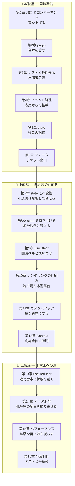

# 🎭 React Fable 101 — 劇場「Reactive Theater」で学ぶ React 基礎から実践まで

ようこそ!この教材では、あなたは老舗劇場 **「Reactive Theater」** の新任舞台監督になります。

最初は幕を上げることしかできませんが、章を進めるごとに React の新しい概念を学び、
それを劇場の運営システム(座席予約・演目管理・観客アンケート)に組み込んでいきます。
最終章では、テスト付きの本格的な劇場管理アプリが完成します。

## 🧭 この教材の方針 — 「書き方」より先に「考え方」

React は API の数こそ少ないのに、**発想の転換** を求めてくる道具です。
「画面を書き換える手順」を書くのではなく、**「この状態のとき画面はこうである」という宣言**
を書く——この一点さえ掴めば、React の機能はすべて素直に見えてきます。

劇場のメタファーはこの発想のためにあります:

| 劇場 | React |
|---|---|
| 役者(演目の出演者) | コンポーネント(画面の部品) |
| 台本(監督が役者に渡す) | props(親から渡す。**役者は書き換えられない**) |
| 役者の記憶 | state(そのコンポーネント自身が持つ状態) |
| 再上演(状態が変わったら幕を上げ直す) | 再レンダリング |
| 稽古場(本番舞台に出す前の通し稽古) | 仮想 DOM と差分検出 |

本文中のコラムは 3 種類あります:

| マーク | 意味 |
|---|---|
| 💡 **ポイント** | 今すぐ役立つ実践的な補足 |
| 📜 **歴史の背景** | 「なぜ React はこうなのか」— 2013 年からの物語 |
| ⚙️ **舞台裏の真実** | その書き方の下で React が実際にやっていること |

## 📖 この教材の読み方

- **前提**: [typescript-fable-101](../typescript-fable-101/README.md) 修了相当の TypeScript の知識。
  特に第 3 章(オブジェクトと参照)・第 4 章(第一級関数)・第 9 章(イミュータビリティ)・
  第 10 章(this)・第 12 章(async/await)は React の土台そのものです。本文でも都度リンクします
- 各章は **前の章のコードを土台に** 進みます。順番に読むのがおすすめです
- コードは実際に手を動かして、ブラウザの画面で確認してください
- 各章の最後に「今日の舞台稽古(演習)」があります
- 図は [Mermaid](https://mermaid.js.org/) 記法で書かれています

## 🗺️ 学習マップ



## 📚 目次

| 章 | タイトル | 学ぶ React の概念 | 劇場に起きること |
|---|---|---|---|
| [第1章](chapters/01_jsx.md) | 幕を上げる | JSX、コンポーネント、宣言的 UI | 劇場の看板が画面に出る |
| [第2章](chapters/02_props.md) | 台本を渡す | props、children、合成 | 役者が台本どおりに演じる |
| [第3章](chapters/03_lists.md) | 出演者名簿 | 条件付き表示、map と key | 演目一覧が並ぶ |
| [第4章](chapters/04_events.md) | 客席からの拍手 | イベントハンドラ | ボタンが反応する |
| [第5章](chapters/05_state.md) | 役者の記憶 | useState、再レンダリング | 拍手カウンタが動く |
| [第6章](chapters/06_forms.md) | チケット窓口 | 制御されたフォーム | 予約フォームが動く |
| [第7章](chapters/07_immutability.md) | 小道具は複製して替える | オブジェクト/配列 state | 予約一覧が増減する |
| [第8章](chapters/08_lifting_state.md) | 舞台監督に預ける | state のリフトアップ | 部品同士が連携する |
| [第9章](chapters/09_effects.md) | 開演ベルと後片付け | useEffect、クリーンアップ | 開演カウントダウンが動く |
| [第10章](chapters/10_rendering.md) | 稽古場と本番舞台 | 仮想 DOM、差分検出 | (仕組みを理解する章) |
| [第11章](chapters/11_custom_hooks.md) | 技を巻物にする | カスタムフック、フックのルール | ロジックが再利用できる |
| [第12章](chapters/12_context.md) | 劇場全体の照明 | Context、prop drilling | ダークモードが入る |
| [第13章](chapters/13_reducer.md) | 進行台本で状態を裁く | useReducer、アクション設計 | 公演の進行が状態機械になる |
| [第14章](chapters/14_data_fetching.md) | 批評家の記事を取り寄せる | fetch、ロード/エラー状態 | 劇評が外部から届く |
| [第15章](chapters/15_performance.md) | 無駄な再上演を減らす | memo、useMemo、useCallback | 大所帯でも軽快に動く |
| [第16章](chapters/16_final.md) | テストと千秋楽 | Testing Library、総仕上げ | テスト付き完成品が納品される |

## 🎯 対象読者

- TypeScript の基礎を学び終えて、はじめて React に触れる人
- 「コピペで動いてはいるが、なぜ動くのか分からない」を解消したい人
- この後 Next.js に進む予定の人(この教材はそのための土台を意識しています)

## 🛠️ 準備

開発サーバー付きのプロジェクトを **Vite**(ヴィート)で作ります。

```bash
# Node.js 22 以上を確認
node --version

# React + TypeScript のプロジェクトを生成
npm create vite@latest reactive-theater -- --template react-ts
cd reactive-theater
npm install
npm run dev   # → 表示された URL(http://localhost:5173)をブラウザで開く
```

ブラウザに Vite + React のロゴが表示されれば準備完了です。
ファイルを保存すると **ブラウザが自動で更新されます**(ホットリロード)。
この教材では主に `src/` フォルダの中を書き換えていきます。

それでは、[第1章](chapters/01_jsx.md) の開演です!🎭
