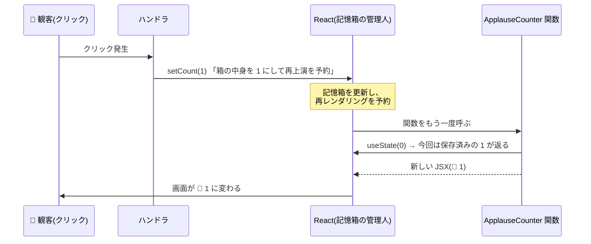

# 第5章 役者の記憶 — useState と再レンダリング

## 🎭 今日のお話

前章の幕切れで、私たちは崖の前に立ちました。ローカル変数では拍手を数えられない——
再上演のたびに記憶が消え、そもそも書き換えても再上演が始まらないからです。

役者に必要なのは、**舞台袖に置ける専用の記憶箱** です。箱の中身は再上演をまたいで
生き残り、中身を入れ替えると **自動的に次の上演が予約される**。
この記憶箱が **state**、それを使う道具が **`useState`** です。React の心臓部に入ります。

## useState — 記憶箱を借りる

```tsx
import { useState } from "react";

function ApplauseCounter() {
  const [count, setCount] = useState(0);
  //     ~~~~~  ~~~~~~~~            ~ 初期値
  //     現在値  更新を予約する関数

  return (
    <button onClick={() => setCount(count + 1)}>
      👏 {count}
    </button>
  );
}
```

動きます。押すたびに画面の数字が増えます。1 行ずつ解剖しましょう。

- `useState(0)` は「初期値 0 の記憶箱を貸してください」という React への申請です。
  戻り値は **[現在の値, 更新関数] のタプル**([TS 第 3 章](../../typescript-fable-101/chapters/03_objects_arrays.md))で、
  分割代入で受けるのが作法です。名前は `[x, setX]` のペアにする慣習です
- 型は初期値から[推論](../../typescript-fable-101/chapters/01_variables.md)されます
  (`count` は `number`)。`useState<Show | null>(null)` のように明示もできます
- **`count` はただの const** です。魔法の変数ではありません。魔法は `setCount` の側にあります

## setState の魔法 — 「書き換え」ではなく「再上演の予約」

`setCount(count + 1)` が実行されると、次のことが起きます:



重要なのは、`setCount` が **変数を書き換える関数ではない** ことです。
「記憶箱の次の中身」を React に届け、**関数の呼び直し(再レンダリング)を予約する** 関数です。
呼び直された関数の中で、`useState` は初期値ではなく **保存されている最新値** を返します。
だから `const` なのに毎回違う値が入っている——**変数が変わるのではなく、
関数がもう一度呼ばれて新しい `count` が生まれている** のです。

> ⚙️ **舞台裏の真実 — state はスナップショットである**
>
> ここが React 学習最大のつまずきポイントです。クイズ:
>
> ```tsx
> function handleClick() {
>   setCount(count + 1);
>   setCount(count + 1);
>   setCount(count + 1);
>   console.log(count);
> }
> ```
>
> `count` が 0 のときクリックすると、画面はいくつになり、ログは何と出るでしょう?
>
> 答え: **画面は 1、ログは 0** です。
>
> 種明かし——いま実行中の `handleClick` が掴んでいる `count` は、**この上演回の台本に
> 印刷された値(スナップショット)** です。[クロージャ](../../typescript-fable-101/chapters/09_array_methods.md)が
> 「関数が生まれた時点の環境」を閉じ込めるのでした。3 回の `setCount(count + 1)` はすべて
> 「0 + 1 = 1 にしてくれ」という同じ予約で、`console.log(count)` も 0 のままです。
> 新しい値を見られるのは **次の上演回の関数** だけ。
>
> 「前の値に基づく更新」を正しく書くには、**更新関数**を渡します:
>
> ```tsx
> setCount((c) => c + 1);   // 「箱のいまの中身に 1 足す」という計算を渡す
> setCount((c) => c + 1);
> setCount((c) => c + 1);   // → 3 回とも効いて 3 になる
> ```
>
> なお、ハンドラ内の複数の setState は **まとめて 1 回の再上演** になります(バッチング)。
> 3 回予約しても幕は 1 回しか上がりません——無駄な上演を避ける React の効率化です。

## 記憶箱は「インスタンスごと」に別

同じコンポーネントを 2 回使うと、記憶箱も 2 つできます。

```tsx
function App() {
  return (
    <main>
      <ApplauseCounter />   {/* この拍手と */}
      <ApplauseCounter />   {/* この拍手は独立している */}
    </main>
  );
}
```

片方を何回押しても、もう片方は動きません。state は「コンポーネントの定義」ではなく
**「画面上のその出演枠」** に紐づきます(この紐づけの正確な仕組み——位置と key——は
第 10 章で明かします)。

## 複数の state と「フックのルール」の予告

記憶箱はいくつでも借りられます:

```tsx
function TicketCounter() {
  const [adult, setAdult] = useState(0);
  const [child, setChild] = useState(0);
  const [note, setNote] = useState("");

  const total = adult * 5500 + child * 2000;   // 👈 これは state にしない!

  return ( ... );
}
```

💡 **導出できる値は state にしない**、が鉄則です。`total` は `adult` と `child` から
計算できるので、記憶箱は不要——レンダリングのたびに計算すれば常に正しい値になります。
「同じ情報を 2 つの箱に持つと、片方の更新を忘れて食い違う」のは
[型の二重管理](../../typescript-fable-101/chapters/13_advanced_types.md)と同じ構図の罠です。
**state は最小限、残りは計算で導く。**

もう 1 つ、`useState` は **関数の最上位でしか呼べません**(if や for の中では呼べない)。
この「フックのルール」の理由は第 11 章で解明します。いまは「記憶箱の貸し出しは
開演前に、毎回同じ順序で」と覚えておいてください。

> 📜 **歴史の背景 — Hooks 革命(2019)**
>
> `useState` のような `use○○` 関数を **フック(Hook)** と呼びます。実は React の
> 最初の 6 年間、state を持てるのは **クラスコンポーネントだけ** でした。
> `this.state`、`this.setState`、そして
> [`this` の束縛問題](../../typescript-fable-101/chapters/10_this.md)との果てしない戦い——
> `this.handleClick = this.handleClick.bind(this)` は全 React 開発者の合言葉でした。
>
> 2019 年、関数コンポーネントに state を持たせる **Hooks** が導入されると、
> コミュニティは数年でクラスを捨てました。`this` が一切登場しない、ロジックを
> 関数として切り出せる(第 11 章のカスタムフック)、型推論が効きやすい——
> TS 第 10 章で予告した「this 疲れが React をクラスから関数へ向かわせた」の帰結が、
> いまあなたが書いているこのコードです。古い記事で `class ... extends React.Component` を
> 見たら「2019 年以前の書き方」と読み替えてください。

## ⚔️ 完成コード: `src/App.tsx`

```tsx
// Reactive Theater — 5 日目: 拍手カウンタとチケット窓口(前半)

import { useState } from "react";

function ApplauseMeter({ showTitle }: { showTitle: string }) {
  const [count, setCount] = useState(0);

  const mood =
    count >= 30 ? "🌟 スタンディングオベーション!" :
    count >= 10 ? "🎉 大盛況" :
    count >= 1 ? "😊 温かい拍手" : "🤫 開演前";

  return (
    <section style={{ border: "1px solid #ccc", padding: "0.5rem", margin: "0.5rem 0" }}>
      <h3>{showTitle}</h3>
      <p>
        {mood}(拍手 {count} 回)
      </p>
      <button onClick={() => setCount((c) => c + 1)}>👏 拍手</button>
      <button onClick={() => setCount((c) => c + 10)}>👏×10 万雷の拍手</button>
      <button onClick={() => setCount(0)}>🔄 リセット</button>
    </section>
  );
}

function App() {
  return (
    <main>
      <h1>🎭 Reactive Theater — 拍手メーター</h1>
      <ApplauseMeter showTitle="ハムレット" />
      <ApplauseMeter showTitle="真夏の夜の夢" />
    </main>
  );
}

export default App;
```

`mood` が state ではなく計算で導かれていること、2 つのメーターが独立していること、
更新関数 `(c) => c + 1` を使っていること——今日の学びが全部入っています。

## 📝 今日の舞台稽古(演習)

1. スナップショットのクイズを実際に作って確認してください: `setCount(count + 1)` を 3 連発する版と `setCount((c) => c + 1)` を 3 連発する版で、ボタン 1 押しの結果がどう違うか。
2. `ApplauseMeter` に「ブーイング(count を 1 減らす、ただし 0 未満にはしない)」ボタンを追加してください(ヒント: `Math.max`)。
3. 「導出できる値は state にしない」の実験: `mood` を `useState` + ハンドラ内更新で管理する **悪い版** に書き換えてみて、リセットボタンで `mood` の更新を忘れるとどう食い違うか観察してください。
4. `const [isOpen, setIsOpen] = useState(false)` で「開演中/準備中」の切り替えボタン(トグル)を作ってください: `setIsOpen((v) => !v)`。

---

次章、チケット窓口を開設します。入力欄・選択肢・送信——フォームと state が結びつき、
「画面とデータが常に一致する」宣言的 UI の真骨頂を見ます。
→ [第6章 チケット窓口](06_forms.md)
