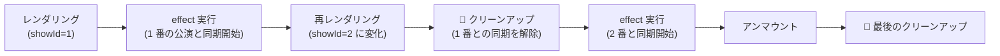

# 第9章 開演ベルと後片付け — useEffect

## 🎭 今日のお話

開演までの **カウントダウン時計** をロビーに設置します。1 秒ごとに減っていく表示——
つまり [`setInterval`](../../typescript-fable-101/chapters/11_event_loop.md) が必要です。

ところが、これまでの道具では書けません。コンポーネントは「props と state から JSX を
返す関数」であり、タイマーの起動のような **外の世界への働きかけ** を置く場所が
ないのです(レンダリング中に起動したら、再上演のたびにタイマーが増殖します!)。

「レンダリングが終わった **後で**、外の世界と同期する」ための道具が **`useEffect`** です。
強力ですが、React でいちばん誤用されている道具でもあります。正しい持ち方から学びましょう。

## 純粋なレンダリングと「外の世界」

React の大前提: レンダリング(コンポーネント関数の実行)は
**[純粋](../../typescript-fable-101/chapters/16_final.md)** であるべし——同じ props/state なら
同じ JSX を返し、**外の世界を変えない**。React は最適化のために関数を何度でも・いつでも
呼び直してよいことになっているからです(開発モードの StrictMode がわざと 2 回呼ぶのは、
不純な処理を炙り出すためです)。

では「外の世界」との用事はどこに書くのか?置き場所は 2 つしかありません:

| 用事のきっかけ | 置き場所 | 例 |
|---|---|---|
| **ユーザーの操作** | イベントハンドラ(第 4 章) | クリックで予約を送信 |
| **画面にそれが表示されていること自体** | `useEffect` | 表示中はタイマーを回す、表示中はサーバーと接続 |

**まずハンドラで書けないか考え、書けないときだけ effect** ——これが正しい優先順位です。

## useEffect — 「上演後の仕事」を予約する

```tsx
import { useState, useEffect } from "react";

function CountdownClock({ minutes }: { minutes: number }) {
  const [secondsLeft, setSecondsLeft] = useState(minutes * 60);

  useEffect(() => {
    // ① レンダリングが画面に反映された「後」に実行される
    const timer = setInterval(() => {
      setSecondsLeft((s) => Math.max(0, s - 1));
    }, 1000);

    // ② クリーンアップ関数を返す: 「後片付けの手順書」
    return () => clearInterval(timer);
  }, []);   // ③ 依存配列: この effect をいつやり直すか

  const mm = Math.floor(secondsLeft / 60);
  const ss = String(secondsLeft % 60).padStart(2, "0");
  return <p>⏰ 開演まで {mm}:{ss}</p>;
}
```

3 つの部品を順に見ます。

### ① 本体 — レンダリング後に走る関数

`useEffect(fn, deps)` の `fn` は、**レンダリング結果が画面に反映された後** に React が
呼びます。レンダリング中ではないので、タイマー起動や DOM 操作などの「外の世界への
働きかけ(副作用)」を安全に置けます。

### ② クリーンアップ — 舞台の原状回復

`fn` が **関数を返すと**、それは「後片付けの手順書」として登録されます。React は
**次に effect をやり直す直前** と **コンポーネントが舞台から降りる(アンマウントされる)とき** に
これを呼びます。

タイマーを止め忘れたら?——コンポーネントが消えた後も `setInterval` は
[イベントループ上で永遠に鳴り続けます](../../typescript-fable-101/chapters/11_event_loop.md)。
タイマー、購読、接続……**始めたものは返す関数で必ず終わらせる**。
[Python の `with`](../../python-fable-101/chapters/12_context_managers.md) や
[Go の `defer`](../../go-fable-101/chapters/03_functions.md) と同じ「後始末の規律」です。

### ③ 依存配列 — いつやり直すか

| 書き方 | 意味 | 用途 |
|---|---|---|
| `useEffect(fn)` | **毎レンダリング後**に片付け→再実行 | ほぼ使わない |
| `useEffect(fn, [])` | 登場時に 1 回だけ(退場時に片付け) | 表示中ずっと有効な同期 |
| `useEffect(fn, [showId])` | `showId` が**変わった**レンダリング後に片付け→再実行 | 対象が切り替わる同期 |



> ⚙️ **舞台裏の真実 — 依存配列の比較も「参照」**
>
> React は前回の依存配列と今回のを `Object.is` で 1 要素ずつ比べ、全部同じなら effect を
> スキップします。[第 7 章の変更検知](07_immutability.md)と同じ参照比較です。だから
> 依存にオブジェクトや配列を渡すと「毎回新品を作っている場合、毎回違う扱い」になり、
> effect が毎回走る事故が起きます(対策は第 15 章)。また依存の**書き漏らし**は
> 「古い値を見続ける」バグ(stale closure — [クロージャ](../../typescript-fable-101/chapters/09_array_methods.md)が
> 古いスナップショットを抱えたまま)になります。**effect 内で使う props/state は
> 正直に全部並べる**。ESLint の React プラグインが自動で指摘してくれるので、
> 警告には素直に従うのが吉です。

## document.title — もう一つの定番

React が管理していない世界(ブラウザの API)との同期の例:

```tsx
function StageTitle({ title }: { title: string }) {
  useEffect(() => {
    document.title = `上演中: ${title} — Reactive Theater`;
    return () => { document.title = "Reactive Theater"; };
  }, [title]);   // 演目が変わったらタイトルも変える

  return <h2>いま舞台の上: {title}</h2>;
}
```

## ⚠️ useEffect を使ってはいけない場所

`useEffect` は「困ったらとりあえず」で乱用され、React 公式が
**「あなたに effect は要らないかもしれない(You Might Not Need an Effect)」** という
文書を出すほどの誤用地帯です。典型的な 2 大誤用:

```tsx
// ❌ 誤用 1: 導出値を effect で同期する
const [total, setTotal] = useState(0);
useEffect(() => {
  setTotal(reservations.reduce((s, r) => s + r.tickets, 0));
}, [reservations]);
// ✅ ただの計算でよい(第 5 章の鉄則)。余計な再上演が 1 回増えるだけ
const total = reservations.reduce((s, r) => s + r.tickets, 0);

// ❌ 誤用 2: ユーザー操作への反応を effect に書く
useEffect(() => {
  if (submitted) sendReservation();   // 「送信されたら送る」を状態経由で遠回し
}, [submitted]);
// ✅ ハンドラに直接書く(操作がきっかけの用事はハンドラの管轄)
function handleSubmit() { sendReservation(); }
```

判定基準は一つ: **「これは『画面に表示されていること』と外部システムの同期か?」**
Yes ならば effect、No ならばハンドラか計算です。

## ⚔️ 完成コード: `src/App.tsx`

```tsx
// Reactive Theater — 9 日目: 開演カウントダウン

import { useState, useEffect } from "react";

function CountdownClock({ onTimeUp }: { onTimeUp: () => void }) {
  const [secondsLeft, setSecondsLeft] = useState(10);   // デモ用に 10 秒

  useEffect(() => {
    const timer = setInterval(() => {
      setSecondsLeft((s) => Math.max(0, s - 1));
    }, 1000);
    return () => clearInterval(timer);
  }, []);

  useEffect(() => {
    if (secondsLeft === 0) onTimeUp();   // 0 になった「後」に親へ通知
  }, [secondsLeft, onTimeUp]);

  const mm = Math.floor(secondsLeft / 60);
  const ss = String(secondsLeft % 60).padStart(2, "0");
  return (
    <p style={{ fontSize: "2rem" }}>
      ⏰ 開演まで {mm}:{ss}
    </p>
  );
}

function App() {
  const [phase, setPhase] = useState<"lobby" | "showtime">("lobby");

  useEffect(() => {
    document.title =
      phase === "lobby" ? "開演前 — Reactive Theater" : "上演中 — Reactive Theater";
  }, [phase]);

  return (
    <main>
      <h1>🎭 Reactive Theater</h1>
      {phase === "lobby" ? (
        <>
          <p>ロビーでお待ちください。</p>
          <CountdownClock onTimeUp={() => setPhase("showtime")} />
        </>
      ) : (
        <p>🔔 開演しました。よい観劇を!(カウントダウン時計は舞台から降り、タイマーは片付けられました)</p>
      )}
    </main>
  );
}

export default App;
```

開演すると `CountdownClock` は画面から消えます(条件付きレンダリング)。このとき
クリーンアップが走り、タイマーが止まる——コンソールに `console.log` を仕込んで
確かめてみてください。

💡 **開発モードでは effect が「実行→即片付け→再実行」と 2 度走ります**(StrictMode)。
バグではなく、「クリーンアップが正しく書けているか」の抜き打ち検査です。
片付けが正しければ 2 度走っても壊れないはず、という理屈です。

## 📝 今日の舞台稽古(演習)

1. `CountdownClock` の `clearInterval` を消して、開演後もタイマーが鳴り続ける(コンソールログで確認)ことを見届けてから、直してください。
2. `StageTitle` を実装し、`select` で演目を切り替えるとブラウザのタブ表示が変わることを確認してください。依存配列 `[title]` を `[]` に変えると何が壊れますか?
3. 「誤用 1」を自分で書いて、React の DevTools(ブラウザ拡張)や `console.log` で再レンダリング回数が 1 回増えることを確認し、計算に直してください。
4. `useEffect(() => { console.log("render 後"); })`(依存配列なし)を置いて、どの操作で何回走るか観察してください。三パターンの違いの体感です。

---

次章はコードを書かない章です。ここまで「再上演」「差分」「参照比較」と断片的に触れてきた
**React の描画の仕組み** を、稽古場(仮想 DOM)から本番舞台(実 DOM)まで一気通貫で
解剖します。第 3 章の key、第 5 章の state の紐づけ、すべての伏線がつながります。
→ [第10章 稽古場と本番舞台](10_rendering.md)
