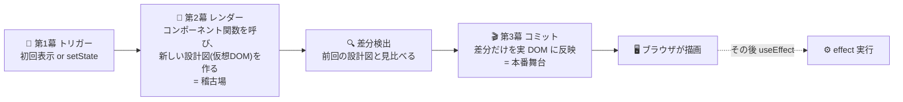

# 第10章 稽古場と本番舞台 — レンダリングの仕組み

## 🎭 今日のお話

今日は幕を上げません。舞台監督として、**劇場の裏側の構造** を検分する日です。

ここまで「setState すると再上演される」「React が差分だけ画面に反映する」と、
仕組みをブラックボックスのまま使ってきました。今日それを開けます。開けておくと、
第 3 章の key の正体、第 5 章の「記憶箱の紐づけ」、第 15 章のパフォーマンス改善——
すべてが一本の理屈でつながります。

## 全体像 — トリガー、レンダー、コミット

React の描画は 3 幕構成です。



### 第 1 幕: トリガー — 幕を上げる合図

再上演の引き金は 2 つだけです: **初回マウント** と **setState**(自分か祖先の)。
props の変化は引き金ではありません——親が setState で再上演された **結果として**
子も呼び直され、新しい props を受け取るのです。

### 第 2 幕: レンダー — 稽古場での通し稽古

React はコンポーネント関数を呼び、返ってきた JSX——**画面の設計図オブジェクトの木**——を
受け取ります。第 1 章で見たとおり、JSX の正体は軽量なオブジェクト
(`{ type: "h1", props: {...} }` のようなもの)です。これがいわゆる **仮想 DOM** です。

大事なのは、この段階では **画面に何も起きていない** こと。稽古場でどれだけ全力で
通し稽古(全コンポーネントの再実行)をしても、本番舞台(実 DOM)は無傷です。
オブジェクトの生成は DOM 操作より桁違いに安いので、「毎回全部作り直す」が現実的に
なります——第 1 章の📜で予告した「暴論が勝てた理由」です。

### 差分検出(reconciliation)— 前回の台本との突き合わせ

新旧 2 つの設計図の木を突き合わせ、「実際に変わった箇所」を割り出します。
突き合わせのルールは驚くほど単純です:

1. **同じ位置に同じ type**(`<p>` → `<p>`、`ShowCard` → `ShowCard`)なら「同一人物」。
   変わった属性だけ更新し、**state は維持**して中へ進む
2. **type が変わったら**(`<p>` → `<div>`、`ShowCard` → `Banner`)その部分木を
   **丸ごと破棄して作り直す。state も消える**
3. **兄弟のリストは key で本人確認する**(第 3 章の伏線回収!)

> ⚙️ **舞台裏の真実 — state は「木の中の位置」に住んでいる**
>
> 第 5 章の疑問「記憶箱は何に紐づくのか」の正確な答えがこれです。state は
> コンポーネント関数の中ではなく、**React が持つ木構造の、その位置** に保存されています
> (関数は毎回呼び捨てられるのだから、関数の中に住めるはずがないのです——
> [ローカル変数が毎回リセットされる](../../typescript-fable-101/chapters/04_functions.md)ことは
> 第 4 章の事件で見ました)。
>
> だから「同じ位置・同じ type」なら state は生き残り、位置か type が変われば消えます。
> 逆に言えば、**key を変えると「別人になった」と宣言でき、state を意図的にリセットできます**:
>
> ```tsx
> <BoxOffice key={showId} />   // 演目が変わったら窓口の入力を白紙に戻したい、が 1 行で済む
> ```

### 第 3 幕: コミット — 本番舞台への最小限の反映

割り出した差分だけを実 DOM に適用します。`<p>` のテキストが変わっただけなら、
実際に触るのはそのテキストノード 1 個。**あなたが「全部作り直す」つもりで書いた
宣言的なコードが、命令的で最小限の DOM 操作に翻訳される**——これが React という
翻訳機の全貌です。ブラウザの描画が終わった後に、第 9 章の effect が走ります。

## よくある誤解を正す

**誤解 1: 「再レンダリング = 画面の再描画」ではない。**
レンダーは稽古場の話です。関数が呼ばれても、差分がなければ DOM には指一本
触れません。「再レンダリングが多い」こと自体は大抵無害で、問題になるのは
稽古(関数実行)そのものが重い場合だけです(第 15 章)。

**誤解 2: 「props が変わった子だけ再レンダリングされる」ではない。**
既定の動作は逆です——**親が再上演されたら、子は props が同じでも全員再上演**(稽古)
されます。React は「props が変わったか」を事前に調べません(調べる方が高くつくから)。
第 8 章の演習 3 で「1 文字打つと全部再実行」を見たのはこれです。スキップさせる道具
(`memo`)は第 15 章で。

**誤解 3: 「仮想 DOM だから速い」ではない。**
手練れが書いた生 DOM 操作より速いことはありません。仮想 DOM の価値は速度ではなく、
**「宣言的に書いても、実用上十分速い」を保証する** ことです。人間が差分管理を
書かなくてよくなったことこそが本体です。

> 📜 **歴史の背景 — Fiber、並行レンダリング、そしてサーバーへ**
>
> 初期の React は、一度レンダーを始めると木全体を同期的に処理しきる設計でした。
> 巨大な木では稽古が長引き、[シングルスレッドの JS](../../typescript-fable-101/chapters/11_event_loop.md) では
> その間ユーザー入力が固まります。2017 年の **Fiber** と呼ばれる内部全面書き換えで、
> レンダーは **中断・再開・破棄できる** 作業になりました(稽古を細切れにして、
> 客対応=ユーザー入力を優先できる)。React 18(2022)の並行レンダリングは
> この基盤の開花です。
>
> さらに現在の React は「稽古場をサーバーに置く」方向へ進化しています——
> **Server Components**(サーバーでだけレンダーされ、JS をブラウザに送らない
> コンポーネント)は、あなたが次に学ぶ Next.js の App Router の中核です。
> 「コンポーネント関数を呼んで設計図を得る」というモデルが変わらないまま、
> 呼ぶ場所だけがブラウザからサーバーへ広がった、と捉えると見通しよく学べます。

## 検分の実験 — 目で確かめる

理屈を目視する 3 つの実験です(手を動かす価値があります):

```tsx
function Inspector({ label }: { label: string }) {
  console.log(`🎬 稽古: ${label}`);        // レンダー(関数実行)の観測
  return <p>{label}</p>;
}
```

1. **稽古と本番は別**: 親に `useState` のカウンタを置き、`Inspector` を子に置く。
   ボタンを押すたびログは出る(稽古はしている)が、`label` が同じなら
   ブラウザの開発者ツールの Elements パネルで DOM はハイライトされない(本番は無風)
2. **位置と state**: `{isVip ? <Counter /> : <Counter />}` を切り替えても
   カウントが**残る**(同じ位置・同じ type = 同一人物扱い)ことを確認。
   片方に `key="vip"` を付けると、切り替えでリセットされるようになる
3. **type が変わると全滅**: `{isVip ? <div><Counter /></div> : <section><Counter /></section>}`
   で切り替えると、カウンタの state が消える(親の type が変わり部分木ごと再生)

## 📝 今日の舞台稽古(演習)

1. 上の実験 1〜3 を実際に組んで、予想 → 実行 → 説明(なぜそうなるか)を書き出してください。
2. 第 3 章で「添字を key にすると危険」と学びました。今日の知識で、**何がどう壊れるのか** を「本人確認」「state の住所」という言葉で説明し直してください。
3. `<BoxOffice key={showId} />` パターンを第 8 章のコードに組み込み、演目切り替えで入力欄がリセットされることを確認してください。
4. (考察)「setState で同じ値を渡したら再レンダリングは起きるか?」を予想し、`setCount(0)` を連打して確かめてください([`Object.is` 比較](07_immutability.md)が答えの鍵です)。

---

次章、道具箱を自作します。「秒針を刻む」「入力を保存する」といったロジックを
**カスタムフック** という巻物に書き写し、どのコンポーネントからも使えるようにします。
「フックはなぜ if の中で呼べないのか」の謎解きも一緒に。
→ [第11章 技を巻物にする](11_custom_hooks.md)
