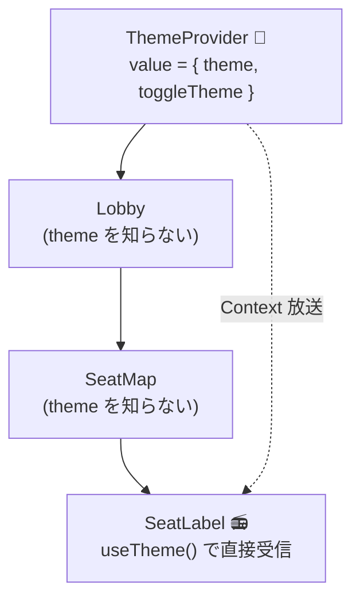

# 第12章 劇場全体の照明 — Context と prop drilling

## 🎭 今日のお話

夜公演に合わせて、劇場全体を **ダークモード** に切り替えられるようにします。
照明設定はあらゆる部品(看板・窓口・掲示板・フッター)の見た目に影響します。

これまでの道具で書くなら、`theme` を App の state にして……**全部品に props で
配り歩く** ことになります。看板の孫の曾孫まで。中間の部品は自分では使いもしない
`theme` を、ただ下へ運ぶだけのために受け取る——この苦行には名前がついています:
**prop drilling(プロップの穴掘り)**。

## prop drilling — バケツリレーの何が問題か

```tsx
// theme を使うのは末端の SeatLabel だけなのに……
<App theme={theme}>
  └ <Lobby theme={theme}>            // 使わない。運ぶだけ
      └ <SeatMap theme={theme}>      // 使わない。運ぶだけ
          └ <SeatLabel theme={theme} />   // ようやく使う
```

段数が浅いうちは我慢できます(そして **我慢できるうちは props が正解** です)。
しかし「ほぼ全部品が使う、めったに変わらない、劇場全体の情報」——テーマ、ログイン中の
ユーザー、言語設定——では、バケツリレーが設計を汚し始めます。中間部品の props の型が
無関係な情報で膨れ、部品の差し替えのたびに運搬経路を繋ぎ直すことになるからです。

こういう情報のために、React は **Context** という「劇場内放送」を用意しています。
**木のどの深さからでも、天井のスピーカーから直接受信できる** 仕組みです。

## Context の 3 点セット — 作る・放送する・受信する

```tsx
// src/ThemeContext.tsx
import { createContext, useContext, useState } from "react";

type Theme = "light" | "dark";

interface ThemeContextValue {
  theme: Theme;
  toggleTheme: () => void;
}

// ① 作る: 放送チャンネルの開設(既定値は null にして、受信側で検査する)
const ThemeContext = createContext<ThemeContextValue | null>(null);

// ② 放送する: Provider で「この木の範囲に放送する」
export function ThemeProvider({ children }: { children: React.ReactNode }) {
  const [theme, setTheme] = useState<Theme>("light");
  const toggleTheme = () => setTheme((t) => (t === "light" ? "dark" : "light"));

  return (
    <ThemeContext.Provider value={{ theme, toggleTheme }}>
      {children}
    </ThemeContext.Provider>
  );
}

// ③ 受信する: カスタムフックに包むのが定番作法(前章の巻物術!)
export function useTheme(): ThemeContextValue {
  const ctx = useContext(ThemeContext);
  if (ctx === null) {
    throw new Error("useTheme は ThemeProvider の中でしか使えません");
  }
  return ctx;   // null 検査済みなので、使う側は non-null で受け取れる
}
```

使う側はどの深さからでも一行です:

```tsx
function SeatLabel({ row, num }: { row: string; num: number }) {
  const { theme } = useTheme();   // 中間部品は何も運んでいないのに、届く
  return (
    <span style={{ color: theme === "dark" ? "#eee" : "#111" }}>
      {row}-{num}
    </span>
  );
}

function App() {
  return (
    <ThemeProvider>          {/* 放送範囲 = この中の木すべて */}
      <Lobby />               {/* theme を運ぶ props は消えた */}
    </ThemeProvider>
  );
}
```



> 💡 **③ をカスタムフックに包む理由**: `useContext(ThemeContext)` を生で使うと、
> Provider の外で呼んだとき `null` が返り、使う場所すべてで
> [null チェック](../../typescript-fable-101/chapters/05_unions.md)を書く羽目になります。
> `useTheme` の中で一度だけ検査して throw すれば、**「Provider の外で使った」という
> 設定ミスが、分かりやすいエラーで即座に発覚**し、利用側の型も `ThemeContextValue`
> (null なし)になります。[エラーは早く・境界で・明確に](../../typescript-fable-101/chapters/14_runtime_validation.md)
> ——門番の心得は React でも同じです。

## Context の落とし穴 — 万能放送ではない

Context は便利ですが、**濫用が最も戒められている道具** でもあります。理由は 2 つ:

**1. 放送が変わると、受信者は全員再上演される。**
Provider の `value` が変わる(参照が変わる — [第 7 章](07_immutability.md))と、
その Context を `useContext` している **すべての** コンポーネントが再レンダリング
されます。「1 秒ごとに変わる時刻」のような高頻度データを Context に乗せると、
劇場全体が毎秒稽古をやり直す羽目になります。

**2. データの流れが見えなくなる。**
props は流れが木の上で目視できますが、Context は「どこかの天井から降ってくる」。
何でも Context に入れると、[単方向データフローの追跡可能性](02_props.md)という
React 最大の美点を自分で手放すことになります。

**使い分けの目安**:

| データ | 適した置き場所 |
|---|---|
| 特定の部品数個で使う状態 | props(基本はこれ。「穴掘り 2〜3 段」は正常です) |
| ほぼ全部品が読む・低頻度で変わる(テーマ、ユーザー、言語) | Context |
| 高頻度で変わる・アプリの中核データ(予約台帳など) | リフトアップした state([第 8 章](08_lifting_state.md))+ props。大規模なら状態管理ライブラリ |

> 📜 **歴史の背景 — Context と状態管理ライブラリの興亡**
>
> Context は長らく「実験的 API」でしたが、2018 年(React 16.3)に正式化されました。
> それ以前の「全体で共有したい state」の答えは **Redux** 一強で、「React やるなら
> Redux 必須」と言われた時代があります(store・action・reducer の三点セット、
> 次章で香りだけ体験します)。
>
> Context の正式化と Hooks の登場で、「テーマやユーザー程度なら Context で足りる」が
> 常識になり、Redux 必須論は崩れました。現在の勢力図は「まず props とリフトアップ →
> 足りなければ Context → アプリが本当に大きいなら Zustand / Redux Toolkit / Jotai など」
> という段階論です。**道具を大きい順に持ち出さない**——この感覚自体が、
> コミュニティが 10 年かけて学んだ教訓です。

## ⚔️ 完成コード: `src/App.tsx`

```tsx
// Reactive Theater — 12 日目: 劇場全体の照明(ThemeContext.tsx は上記の通り)

import { ThemeProvider, useTheme } from "./ThemeContext";

function ThemeSwitch() {
  const { theme, toggleTheme } = useTheme();
  return (
    <button onClick={toggleTheme}>
      {theme === "light" ? "🌙 夜公演モードへ" : "☀️ 昼公演モードへ"}
    </button>
  );
}

function MarqueeSign() {
  const { theme } = useTheme();
  return (
    <h1 style={{ color: theme === "dark" ? "gold" : "darkred" }}>
      🎭 Reactive Theater
    </h1>
  );
}

function Lobby() {
  const { theme } = useTheme();
  return (
    <div
      style={{
        background: theme === "dark" ? "#1a1a2e" : "#fdf6e3",
        color: theme === "dark" ? "#eee" : "#111",
        padding: "1rem",
        minHeight: "60vh",
      }}
    >
      <MarqueeSign />
      <ThemeSwitch />
      <p>ようこそ。本日の演目は 19 時開演です。</p>
    </div>
  );
}

function App() {
  return (
    <ThemeProvider>
      <Lobby />
    </ThemeProvider>
  );
}

export default App;
```

`Lobby` は `MarqueeSign` にも `ThemeSwitch` にも **theme を渡していません**。
それぞれが天井から直接受信しています。props の型からも運搬用の荷物が消えました。

## 📝 今日の舞台稽古(演習)

1. `ThemeSwitch` を `ThemeProvider` の **外** に置いて、`useTheme` の throw メッセージが出ることを確認してください(門番が働く瞬間です)。
2. 前章の `useLocalStorage` と組み合わせて、テーマ選択がリロード後も残るように `ThemeProvider` を改造してください(巻物は Provider の中でも使えます)。
3. `UserContext`(`{ name: string; isMember: boolean }`)を自作し、会員なら窓口に「🎟️ 会員割引適用」と表示してください。Provider の入れ子(`ThemeProvider` の中に `UserProvider`)も体験を。
4. (考察)予約台帳(第 8 章)を Context に移すべきでしょうか?「変更頻度」「使う部品の範囲」の 2 軸で自分の意見を書いてから、上の使い分け表と照らし合わせてください。

---

次章、公演の進行管理が複雑になってきました。「開場 → 開演 → 幕間 → 終演」と遷移し、
操作ごとに複数の state が連動する——`useState` の散弾では捌けない局面です。
[TS 第 5 章の判別可能 union](../../typescript-fable-101/chapters/05_unions.md) が、
**useReducer** として React に帰ってきます。 → [第13章 進行台本で状態を裁く](13_reducer.md)
