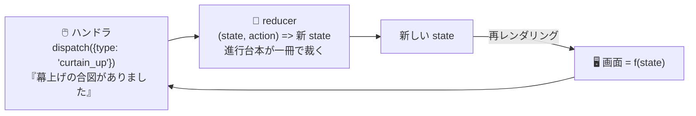

# 第13章 進行台本で状態を裁く — useReducer と状態設計

## 🎭 今日のお話

千秋楽が近づき、公演の進行管理が複雑になってきました。「開場前 → 開場 → 上演中 →
幕間 → 終演」と局面が移り、その途中で予約が入り、キャンセルが出て、緞帳の合図が飛ぶ。

`useState` を 4 つ 5 つ並べ、ハンドラのあちこちで `setPhase`、`setReservations`、
`setCurtainCall`……と散発的に更新していくと、**「この操作のとき、結局何がどう変わるのか」**
が誰にも分からなくなります。舞台の進行がバラバラの付箋で管理されている状態です。

必要なのは **進行台本** ——「起こりうる出来事」を列挙し、「各出来事で状態がどう変わるか」を
一冊に集約した台本です。React でそれを書く道具が **`useReducer`**。そして台本の書き方は、
[TS 第 5 章で学んだ判別可能 union](../../typescript-fable-101/chapters/05_unions.md) そのものです。

## reducer — 「状態 × 出来事 → 次の状態」の純粋関数

発想を転換します。「ハンドラが state を **どう変えるか**」を書くのをやめ、
「**何が起きたか**(アクション)」だけを投書箱(dispatch)に入れる。
変化のさせ方は、**reducer** という一つの関数に全部書く:

```tsx
// ① 状態の形
interface TheaterState {
  phase: "closed" | "open" | "performing" | "intermission" | "finished";
  audience: number;
  applause: number;
}

// ② 出来事(アクション)の列挙 — 判別可能 union!
type TheaterAction =
  | { type: "doors_opened" }
  | { type: "guest_entered"; count: number }
  | { type: "curtain_up" }
  | { type: "applause" }
  | { type: "intermission_started" }
  | { type: "show_ended" };

// ③ 進行台本(reducer): 現在の状態と出来事から、次の状態を計算する純粋関数
function theaterReducer(state: TheaterState, action: TheaterAction): TheaterState {
  switch (action.type) {
    case "doors_opened":
      if (state.phase !== "closed") return state;          // 不正な進行は黙殺(状態を守る)
      return { ...state, phase: "open" };
    case "guest_entered":
      if (state.phase !== "open") return state;
      return { ...state, audience: state.audience + action.count };
    case "curtain_up":
      if (state.phase !== "open" && state.phase !== "intermission") return state;
      return { ...state, phase: "performing" };
    case "applause":
      return { ...state, applause: state.applause + 1 };
    case "intermission_started":
      if (state.phase !== "performing") return state;
      return { ...state, phase: "intermission" };
    case "show_ended":
      if (state.phase !== "performing") return state;
      return { ...state, phase: "finished" };
    default: {
      const exhausted: never = action;                     // 網羅チェック(TS 第 5 章!)
      return exhausted;
    }
  }
}
```

コンポーネント側は「出来事の報告」だけになります:

```tsx
import { useReducer } from "react";

function StageManager() {
  const [state, dispatch] = useReducer(theaterReducer, {
    phase: "closed",
    audience: 0,
    applause: 0,
  });

  return (
    <section>
      <p>局面: {state.phase} / 客数 {state.audience} / 拍手 {state.applause}</p>
      <button onClick={() => dispatch({ type: "doors_opened" })}>開場</button>
      <button onClick={() => dispatch({ type: "guest_entered", count: 2 })}>2 名入場</button>
      <button onClick={() => dispatch({ type: "curtain_up" })}>幕を上げる</button>
      <button onClick={() => dispatch({ type: "applause" })}>👏</button>
      <button onClick={() => dispatch({ type: "show_ended" })}>終演</button>
    </section>
  );
}
```



## 何が良くなったのか

**1. 変更のロジックが一冊に集まった。**
「幕はいつ上がれるのか?」の答えは reducer の `curtain_up` の 5 行を読めば終わりです。
useState 散弾方式では、全ハンドラを横断捜査する必要がありました。

**2. 不正な遷移を一箇所で防げる。**
「閉場中に入場」「上演中に開場」は reducer が黙って拒否します。
[第 5 章のクエスト状態機械](../../typescript-fable-101/chapters/05_unions.md)で関数が守っていた
遷移規則が、React でもそのまま生きています。**UI(ボタン)が何を発しても、
台本が通さない限り状態は壊れない**——守りが UI 層から状態層に移りました。

**3. reducer は純粋関数なので、React なしでテストできる。**

```tsx
// theaterReducer.test.ts — コンポーネントを描画せずロジックだけ検証
expect(
  theaterReducer({ phase: "closed", audience: 0, applause: 0 }, { type: "curtain_up" })
).toEqual({ phase: "closed", audience: 0, applause: 0 });   // 閉場中は幕が上がらない
```

**4. TypeScript が全面支援してくれる。**
アクションは判別可能 union なので、`case "guest_entered"` の中では `action.count` に
安全に触れ、typo したアクション名は dispatch の時点でコンパイルエラー、
新しいアクションを追加すれば `never` の網羅チェックが「台本の書き漏らし」を教えます。

> ⚙️ **舞台裏の真実 — useReducer は useState の親戚**
>
> `useReducer` に神秘はありません。`useState` は内部的には
> 「`(state, newValue) => newValue` という最小の reducer を使う useReducer」と
> 等価です。dispatch も setState と同じく「再上演の予約」であり、
> [スナップショットとバッチングの規則](05_state.md)もすべて同じ。
> reducer が返すのが **新しいオブジェクトでなければならない**
> ([参照比較](07_immutability.md)!)のも同じです——`switch` の各枝でスプレッドを
> 使っているのはそのためで、`state.audience += 1` と書いたら第 7 章の事件が再演されます。

## useState と useReducer の使い分け

| 状況 | 道具 |
|---|---|
| 独立した単純な値(入力中の文字、開閉フラグ) | `useState` |
| 複数の値が **同じ出来事で連動して** 変わる | `useReducer` |
| 「許される遷移」を守りたい(局面・フェーズがある) | `useReducer` |
| 更新ロジックを単体テストしたい | `useReducer` |

迷ったら useState で始めて、「ハンドラ間で更新ロジックが重複してきた」
「不正な組み合わせの state が作れてしまう」と感じた時が useReducer への
乗り換えどきです。**道具は小さい順に**(前章の教訓)。

> 📜 **歴史の背景 — Redux から輸入された考え方**
>
> 「状態 × アクション → 次の状態」というパターンは、React 本体の発明ではありません。
> 2015 年の **Redux**(前章の📜参照)が広めた設計で、さらに遡れば Elm という
> 関数型言語のアーキテクチャ、そして関数型プログラミングの `reduce`
> ([TS 第 9 章](../../typescript-fable-101/chapters/09_array_methods.md)——「積み重なった
> 出来事を畳み込んで一つの状態を得る」、名前が同じなのは偶然ではありません)に
> 行き着きます。
>
> Redux の中核 10 行分の価値が本体に取り込まれたのが `useReducer`(2019、Hooks と同時)です。
> 「全アプリの状態を一つの store で」という Redux の全体主義は重すぎましたが、
> 「変更を出来事として記述する」という中核の知恵は、こうして標準装備になりました。

## ⚔️ 完成コード: `src/App.tsx`

上の `TheaterState` / `TheaterAction` / `theaterReducer` / `StageManager` を組み上げ、
表示を仕上げます:

```tsx
// Reactive Theater — 13 日目: 公演進行盤(型と reducer は上記の通り)

const PHASE_LABEL: Record<TheaterState["phase"], string> = {
  closed: "🚪 開場前",
  open: "🏮 開場中",
  performing: "🎭 上演中",
  intermission: "☕ 幕間",
  finished: "🌸 終演",
};

function StageManager() {
  const [state, dispatch] = useReducer(theaterReducer, {
    phase: "closed",
    audience: 0,
    applause: 0,
  });

  return (
    <main>
      <h1>🎭 Reactive Theater — 公演進行盤</h1>
      <h2>{PHASE_LABEL[state.phase]}</h2>
      <p>ご来場 {state.audience} 名 / 拍手 {state.applause} 回</p>

      <button onClick={() => dispatch({ type: "doors_opened" })} disabled={state.phase !== "closed"}>
        開場する
      </button>
      <button onClick={() => dispatch({ type: "guest_entered", count: 1 })} disabled={state.phase !== "open"}>
        1 名ご案内
      </button>
      <button
        onClick={() => dispatch({ type: "curtain_up" })}
        disabled={state.phase !== "open" && state.phase !== "intermission"}
      >
        幕を上げる
      </button>
      <button onClick={() => dispatch({ type: "applause" })}>👏</button>
      <button onClick={() => dispatch({ type: "intermission_started" })} disabled={state.phase !== "performing"}>
        幕間へ
      </button>
      <button onClick={() => dispatch({ type: "show_ended" })} disabled={state.phase !== "performing"}>
        終演
      </button>
    </main>
  );
}

export default StageManager;
```

💡 `disabled={...}` は UI 上の親切(押せないと分かる)、reducer のガードは **最後の砦**
です。二重に見えますが役割が違います——UI は騙せても(DevTools でボタンを有効化できます)、
台本は騙せません。[城壁と門番](../../typescript-fable-101/chapters/14_runtime_validation.md)の
発想と同じ多層防御です。

## 📝 今日の舞台稽古(演習)

1. アクション `{ type: "guest_left"; count: number }` を追加してください。`never` 網羅チェックがコンパイルエラーで「台本の書き漏らし」を教えてくれる手順を体験すること。客数が 0 未満にならないガードも。
2. `theaterReducer` の単体テストを 3 本書いてください(正規遷移 1 本、不正遷移の黙殺 2 本)。テストランナーがまだなくても、`console.assert` で構いません(本格的なテストは第 16 章で)。
3. 第 7 章の予約台帳を `useReducer` に書き換えてください。アクションは `reserve` / `add_ticket` / `cancel` の 3 つです。
4. (考察)`applause` はどの局面でも受け付けています。「上演中と終演後だけ拍手できる」仕様に変えるなら、reducer とボタンのどちらを(あるいは両方を)直すべきか、「最後の砦」の考え方で説明してください。

---

次章、劇場に **外の世界** がやってきます。批評家の劇評をサーバーから取り寄せる——
読み込み中・成功・失敗という「通信の 3 局面」を union で設計し、
[TS 第 12 章の async/await](../../typescript-fable-101/chapters/12_async_await.md) と
[第 14 章の門番](../../typescript-fable-101/chapters/14_runtime_validation.md)を React に接続します。
→ [第14章 批評家の記事を取り寄せる](14_data_fetching.md)
