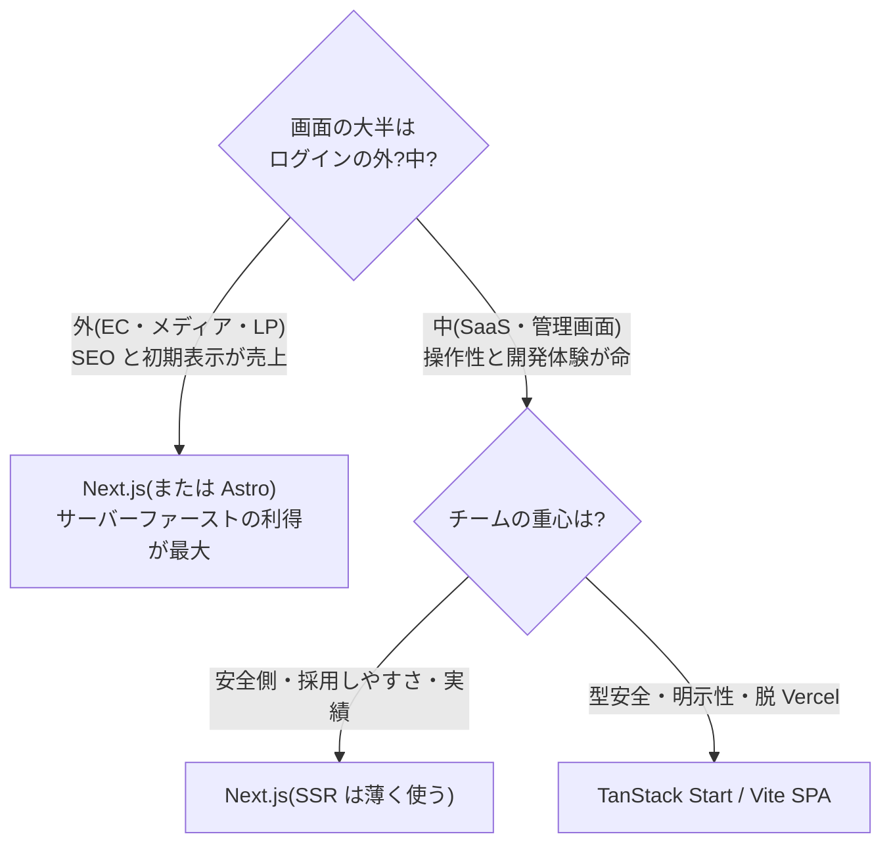

# 02. フロントエンド — React 一強の実態と、その内側の分裂

フロントエンドは 2010 年代の「フレームワーク戦国時代」が終わり、
**外側の戦争(React vs 他)はほぼ決着、内側の戦争(React をどう使うか)が本番**
という構図になりました。

---

## 1. UI ライブラリ — 外側の戦争の決着

### 勢力図(2026)

| ライブラリ | 位置づけ | 一言 |
|---|---|---|
| **React** | デファクト。求人数・エコシステム・人材プールで圧倒 | 「好きかどうか」と無関係に、選ばれ続ける |
| **Vue** | 第 2 極。中国・アジア圏と受託開発で強い | Vite の故郷。Evan You の VoidZero が周辺ツールを再武装中 |
| **Svelte** | 満足度サーベイの常連首位級。v5 の runes でシグナルに合流 | 「書いていて楽しい」代表。採用市場は小さい |
| **Solid** | ファイングレインド反応性(シグナル)の思想的震源地 | シェアは小さいが、**思想は全フレームワークに輸出された** |
| **Angular** | 大企業圏で静かに復権(シグナル導入・DX 改善) | 「フルセットで規律が欲しい」組織の選択肢 |
| **htmx / Web 標準派** | 「そもそも SPA が要らない」原理主義 | サーバーサイド HTML + 部分更新。Go 界隈と相性がよい([03 章](03_backend.md)) |

重要なのは、**シェア(React)と満足度(Svelte/Solid)が乖離している**ことです。
React は State of JS 系サーベイで満足度が下がり続けながら、利用率は下がりません。
これは「技術の優劣」ではなく「**エコシステムのロックイン**」の現象で、
[01 章](01_principles.md)の指標序列(求人 > サーベイ)を思い出すと読み解けます。

> 📜 **水面下の思想戦争: VDOM vs シグナル**
> Solid が示した「仮想 DOM を使わず、変わった箇所だけをピンポイント更新する」方式
> (ファイングレインド反応性)は、Vue(vapor mode)、Svelte(runes)、Angular
> (signals)、Preact と、**React 以外のほぼ全員が採用**しました。
> React だけは「再レンダリングモデルは変えず、**コンパイラで最適化する**」
> (React Compiler)という別解を選びました。`useMemo` / `memo` を手書きする時代は
> 終わりつつあります([react-fable-101](../react-fable-101/language-overview/README.md)
> の世界観のアップデート)。

**選定の結論**: 職業的な選択なら React。異論の余地がほぼないのが 2026 年の現実です。
Vue/Svelte は「チームが小さく固定的で、全員がそれを好む」場合の greenfield 向け。

---

## 2. React フレームワーク — 内側の主戦線

2026 年フロントエンド最大の宗教戦争がここです。React 公式が
「フレームワークを使え」と言うようになった結果、「どの React か」が争点になりました。

### 勢力図

| フレームワーク | 思想 | 2026 の状態 |
|---|---|---|
| **Next.js**(App Router) | サーバーファースト。RSC を既定に、静的化・キャッシュで速度を稼ぐ | 現職デファクト。v16 で Turbopack 既定化。採用プール最大 |
| **TanStack Start** | クライアントファースト。型安全 100%・明示的・デプロイ自由 | v1 到達、急成長中。挑戦者の筆頭 |
| **React Router v7**(旧 Remix) | Web 標準準拠(FormData / Response)。SPA↔SSR を段階的に | Remix ブランドと合流。移行資産(既存 RR アプリ)が強み |
| **Vite SPA(フレームワークなし)** | 「うちの管理画面に SSR は要らない」 | **依然として完全に合法**。むしろ再評価の流れ |
| **Astro** | コンテンツサイト特化。JS を「必要な島」だけに | ブログ・LP・ドキュメントサイトの実質デファクト |

### 対立の本当の争点 — RSC は福音か複雑性か

[nextjs-fable-101](../nextjs-fable-101/language-overview/README.md) で見たとおり、
Next.js は React Server Components(RSC)に全賭けしました。対立点を整理すると:

**Next.js(サーバーファースト)派の言い分**
- データ取得は「ただの await」になり、API 層の定型コードが消える
- 送る JS が減る。コンテンツサイトの初期表示と SEO では構造的に有利
- React コアチームの公式路線に乗っている(はしごを外されない)

**TanStack / クライアントファースト派の言い分**
- サーバー/クライアント境界(`"use client"`)、多層キャッシュ、開発/本番の挙動差——
  **複雑性の総量が増えた**。しかもその複雑性は暗黙的(規約とマジック)
- ログイン後の SaaS 画面(ダッシュボード等)には RSC の利得がほぼない
- Vercel という一企業がプラットフォームとフレームワークを両方握る構図への不信
  (「Next.js のフルパワーは Vercel でしか出ない」問題)
- こちらは全部**明示的・型安全**にやる。ルーティングもサーバー関数も型が通る

> 💡 **ポイント**: この対立は[01 章](01_principles.md)の「前提の違い」の典型例です。
> 「Next.js は複雑すぎる」と言う人はたいてい SaaS の内側を、「Next.js 最高」と言う人は
> コンテンツ配信を作っています。**どちらも自分の前提では正しい**。
> あなたの転職先が Next.js を使っているなら、まず「どっちのタイプの画面が主戦場か」を
> 確認するのが最初の一歩です([06 章](06_playbook.md))。

---

## 3. 状態管理 — 戦争は「分割」で終わった

2010 年代の「Redux 一元管理」時代は終わり、2026 年の共通見解は
**状態を出自で分けて、それぞれ専用の道具に任せる**です。

| 状態の種類 | 2026 のデファクト | 補足 |
|---|---|---|
| **サーバー状態**(API から来るデータ) | **TanStack Query** | キャッシュ・再取得・楽観更新まで面倒を見る。ほぼ無風のデファクト |
| **クライアント状態**(UI の都合) | **Zustand**(軽量派筆頭) | Jotai(アトム派)、Redux Toolkit(既存大規模)も健在 |
| **URL 状態**(検索条件・タブ等) | ルーターに置く(nuqs 等) | 「それ、URL に置くべきでは?」が 2026 の合言葉 |
| **フォーム状態** | React Hook Form + Zod | Server Actions + `useActionState` の新流派が浸食中 |

そして RSC 時代の Next.js では、そもそも**サーバー状態をクライアントに持ち込まない**
(サーバーコンポーネントで取得して HTML にしてしまう)ため、
「状態管理ライブラリの出番自体が減る」のが新しい潮流です。
Redux が要らなくなったのではなく、**Redux が解いていた問題を分割統治した**、が正確な総括です。

---

## 4. CSS — 珍しく決着のついた戦線

- **勝者: Tailwind CSS**(v4 で設定も CSS ファーストに刷新)。
  ユーティリティファーストへの美学的批判は続いていますが、実務の趨勢は決しました
- **象徴的な敗北**: styled-components が 2025 年にメンテナンスモード宣言。
  **ランタイム CSS-in-JS は RSC と根本的に相性が悪く**(サーバーで実行できない)、
  世代ごと退場しつつあります
- **生き残り組**: CSS Modules(Vite で堅実)、ゼロランタイム CSS-in-JS
  (vanilla-extract、Panda CSS——型は欲しいがランタイムは嫌、という折衷派)

この戦線でもうひとつ重要なのが **shadcn/ui 現象**です。「npm ライブラリとして
インストールする」のではなく「**コンポーネントのソースコードを自分のリポジトリに
コピーして所有する**」という配布モデル(中身は Radix UI + Tailwind)が
デファクト化しました。カスタマイズ自由・依存更新地獄なし・**AI がコードを直接読めて
編集できる**——[01 章](01_principles.md)の AI 基準とも噛み合った、2020 年代後半を
象徴する発明です。対抗は MUI / Chakra / Mantine(従来型フルセット。速度優先の
社内ツールでは依然合理的)。

---

## 5. この章の選定サマリー

| 決めること | 迷ったらこれ | それを覆す条件 |
|---|---|---|
| UI ライブラリ | React | チーム全員が Vue/Svelte を強く好み、採用計画もそれで立つ |
| フレームワーク | Next.js | ログイン内 SaaS 専業で型安全に全振りしたい → TanStack Start / コンテンツ静的サイト → Astro |
| サーバー状態 | TanStack Query | Next.js で RSC に寄せ切る場合は出番が減る |
| クライアント状態 | Zustand(小さく始める) | 既存 Redux 資産が大きい → Redux Toolkit 継続 |
| CSS | Tailwind + shadcn/ui | デザインシステム部門が既にある → その標準に従う |
| フォーム | React Hook Form + Zod | Next.js Server Actions 中心なら useActionState 併用 |

---

[← 01. 原則](01_principles.md) | [目次](README.md) | [03. バックエンド →](03_backend.md)
