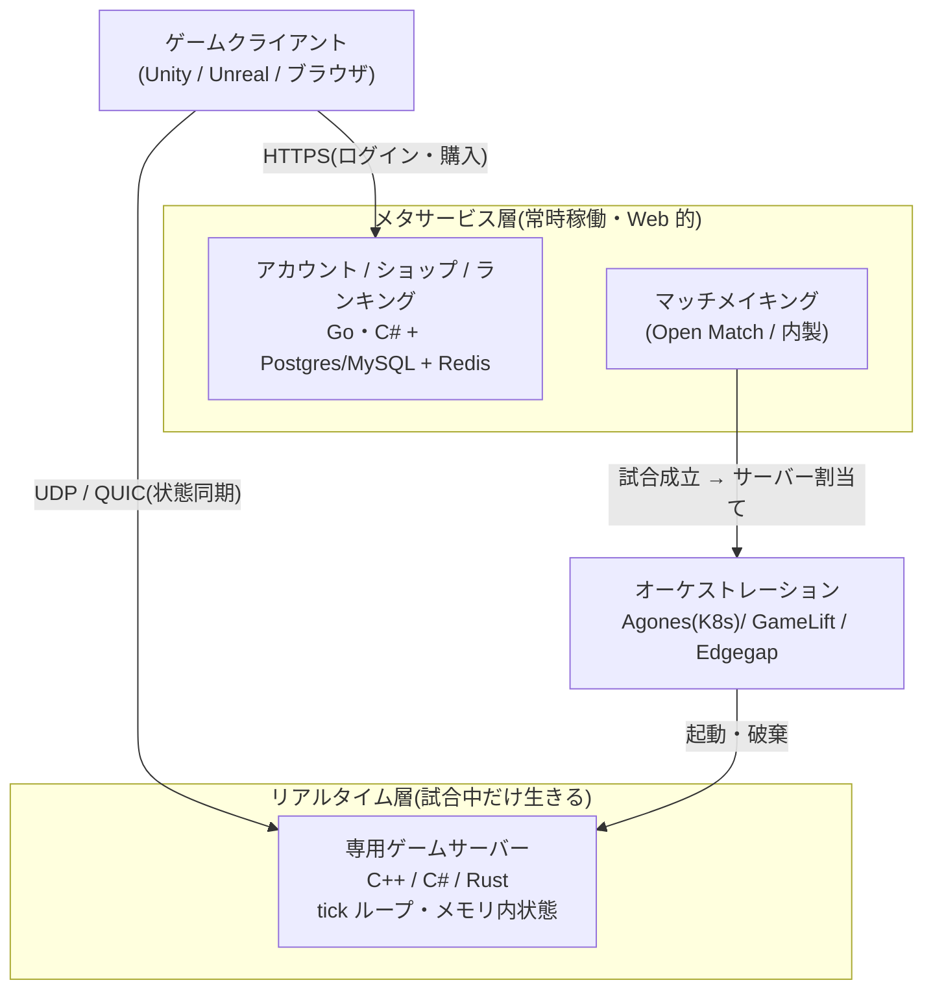
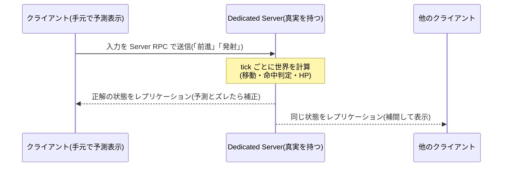

# 07. 番外編: オンラインゲームのバックエンド — Web と似て非なる世界

ここまでの章は Web サービスの地図でした。この番外編では、隣の大陸——
**オンラインゲームのバックエンド**——を歩きます。Web の常識(ステートレス、HTTP、
サーバーレス)がことごとく通用しない一方で、メタサービス層では
**Go と「とりあえず Postgres」がそのまま主戦力**という、対比で学ぶのに最適な領域です。

---

## 1. 大前提: 「オンラインゲーム」は 1 つのスタックではない

ジャンルによってバックエンドは別物になります。まずこの地図を持ってください。

| 世界 | 例 | バックエンドの実態 |
|---|---|---|
| **リアルタイム同期型** | FPS、バトロワ、格闘、アクション | **専用ゲームサーバー**(常駐プロセス、毎秒 20〜60 回の tick ループ、UDP 系プロトコル)。Web とは別世界 |
| **非同期 API 型** | ソシャゲ/ガチャ、パズル、カードの大半 | **実はほぼ Web バックエンド**(HTTP API + RDB + Redis)。日本のモバイルゲームの大半 |
| **永続世界(MMO)** | MMORPG、メタバース系 | 最難関。ワールドのシャーディング、独自プロトコル、内製文化 |

そしてどのジャンルにも共通で、アカウント・マッチメイキング・ランキング・ショップ・
チャット・フレンドといった **メタサービス層** があり、ここは Web 的スタックで作られます。



> 💡 **ポイント**: 「ゲームバックエンド = リアルタイム層 + Web 的なメタ層」の
> 二層構造。転職・学習の観点では、メタ層は [03 章](03_backend.md)の知識が
> ほぼそのまま通用し、リアルタイム層だけが別のスキルツリーです。

---

## 2. Web バックエンドとの根本的な違い

| | Web サービス | リアルタイムゲーム |
|---|---|---|
| 状態 | ステートレス(状態は DB へ) | **ステートフル**(試合状態はメモリ上) |
| 駆動 | リクエスト駆動 | **tick ループ駆動**(20〜60 Hz で世界を更新し配信) |
| プロトコル | HTTP/HTTPS | UDP 系(reliable UDP 独自実装 → **QUIC / WebTransport** が新潮流) |
| スケール | 水平に無限 | **試合単位**でしか分割できない(1 試合は 1 プロセスに閉じる) |
| サーバーレス | 主力 | ほぼ無力(例外: Cloudflare Durable Objects 系) |
| K8s | 「必要になるまで使うな」([05 章](05_infra.md)) | **本気で正当化される**(試合ごとの起動・破棄 = Agones の主戦場) |
| コストの主犯 | コンピュート | **egress(帯域)**——請求の 4〜6 割に達することも |
| 脅威モデル | 不正入力・インジェクション | **クライアントそのものが敵**(チート)← 本章の主題 |

---

## 3. サーバー権威 vs クライアント権威 — この世界の憲法論争

ゲームバックエンド最大の設計対立であり、**アーキテクチャ・コスト・チート耐性・
操作感のすべてを一度に規定する**のがこの選択です。厚めに解剖します。

### 3.1 問題の本質: 「真実」はどこにあるか

マルチプレイヤーゲームとは、複数のプレイヤーが**同じ世界の状態**(誰がどこにいて、
HP はいくつで、弾はどこを飛んでいるか)を共有する仕組みです。ネットワークには
遅延があるので、全員の手元の世界は必ず少しずつズレます。そこで問わなければ
ならないのが——**ズレたとき、誰の言い分を「真実」とするか?**

- **サーバー権威(server-authoritative)**: 真実はサーバーだけが持つ。
  クライアントは「入力(キー操作)」を送るだけで、結果(移動後の座標、命中判定)は
  すべてサーバーが計算して配る
- **クライアント権威(client-authoritative)**: クライアントが「結果」
  (「私はここに移動した」「当てた」)を報告し、サーバー(またはリレー)は
  それを中継・保存する

一見、クライアント権威のほうが素直に見えます。計算はプレイヤーの手元の機械が
タダでやってくれるし、自分の操作は遅延ゼロで反映される。実際、初期の
マルチプレイヤーゲームや P2P 時代はこちらが主流でした。

### 3.2 なぜ「クライアントを信用するな」が鉄則になったか

**クライアントはプレイヤーの手の中にある = 改造できる**からです。
クライアント権威の世界では、メモリ書き換えや改造クライアントで送る報告を偽装すれば:

- 「私は瞬間移動した」(スピードハック・テレポート)
- 「全弾ヘッドショットした」(エイムボット以前に、命中判定そのものの偽装)
- 「私の HP は減らなかった」(ゴッドモード)

がすべて**プロトコル上は正当な報告**として通ってしまいます。これは実装のバグではなく
**信頼モデルの設計ミス**であり、後からアンチチートを貼っても直りません。
Web 開発の「クライアントサイドバリデーションはUX のため、本当の検証はサーバーで」
([TS 教材の実行時検証](../typescript-fable-101/language-overview/README.md)と同じ原理)の、
賭け金を 100 倍にした版だと思ってください。**対戦の公平性が商品価値そのもの**である
競技的なゲームでは、サーバー権威は事実上の憲法です。

### 3.3 ただしサーバー権威は「遅延」という代金を要求する

サーバー権威を素朴に実装すると、致命的な問題が起きます。
**自分の操作すら、サーバーを往復するまで画面に反映されない**のです。

```
キーを押す → 入力をサーバーへ(片道 30ms)→ サーバーが計算
→ 結果が返る(片道 30ms)→ やっと画面のキャラが動く
```

往復 60ms + tick 待ち。人間は 100ms を超える操作遅延を「もっさり」と知覚します。
これを隠蔽するために発明されたのが、ゲームネットワーキングの古典三点セットです
(源流は 1996 年の Quake と、それを改良した QuakeWorld・Half-Life 系列の系譜)。

| 技法 | 内容 | 例えるなら |
|---|---|---|
| **クライアント予測**(client-side prediction) | 自分の入力の結果を**手元で先に計算して表示**し、あとでサーバーの正解と突き合わせる | 会計が終わる前に商品を袋に入れて歩き出す |
| **サーバー照合と巻き戻し**(reconciliation) | サーバーの正解と手元の予測がズレていたら、**過去に遡って正解から再計算**し、静かに補正する | レシートを見て差額があったら黙って精算し直す |
| **エンティティ補間**(interpolation) | 他プレイヤーは最新位置でなく**少し過去(約 100ms)の状態を滑らかに再生**して表示する | 生放送を数秒遅延で流して映像を安定させる |

さらに FPS では **ラグ補償(lag compensation)** が加わります。「撃った」という入力を
受け取ったサーバーが、**その弾が撃たれた瞬間の世界(数十 ms 過去)を復元して**命中判定を
行う仕組みです。撃つ側は「狙ったとおり当たる」快感を得ますが、撃たれた側には
「壁に隠れたのに死んだ(peeker's advantage)」という理不尽が発生します。
**遅延という物理的事実を消すことはできず、どちらのプレイヤーに理不尽を配るかを
設計で選んでいるだけ**——これがこの分野でもっとも重要な洞察です。

> 📜 **歴史の背景**: この「入力だけ送る/予測する/巻き戻す」の語彙は、
> Valve(Half-Life / Counter-Strike)の Source Engine のネットワーキング文書と、
> Gaffer On Games のエッセイ群でほぼ標準化されました。25 年前の設計が
> 2026 年の最新 FPS でも現役です——ゲームネットワーキングは「退屈な技術」
> ([01 章](01_principles.md))が異常に強い分野です。

### 3.4 中間派と別解 — 対立は 4 派に分かれる

実務の選択肢は白黒二択ではありません。2026 年の勢力図:

| 流派 | 仕組み | 採用例・向き先 | 弱点 |
|---|---|---|---|
| **完全サーバー権威** | 物理・判定・状態のすべてをサーバーで計算 | 競技 FPS、バトロワ、MMO。Unreal Dedicated Server、Unity Netcode for Entities | サーバー費用が最大(物理演算を全試合ぶん回す)。遅延隠蔽の実装が重い |
| **クライアント権威 + リレー** | 計算は各クライアント、サーバーは中継(+保存)のみ | カジュアル協力ゲーム、友人間マルチ。Photon Fusion(Shared Mode)、Mirror/Fish-Net の host モード | チートに弱い。「フレンド間なら許容」という割り切り |
| **決定論的ロックステップ / ロールバック** | 全員が**同じ入力列から同じ結果を再現**できる決定論的シミュレーションを共有。サーバーは入力の交換だけ | 格闘ゲーム(ロールバック=GGPO 系)、RTS(ロックステップの伝統)、Photon Quantum | ゲームロジック全体を決定論的に書く縛り(浮動小数点の差異まで管理)。人数が増えると破綻しやすい |
| **信頼スコア + 事後検証** | 基本はクライアント報告を受け入れ、**統計・リプレイ解析で異常を事後検出** | ソシャゲの非同期対戦、ランキング不正検出 | リアルタイムの公平性は守れない。BAN 対応の運用が必要 |

> ⚖️ **対立の本当の争点**([01 章](01_principles.md)の型で読む):
> - **チートの被害者は誰か** — 見知らぬ他人との競技(被害甚大)か、友人との協力(自浄作用あり)か
> - **サーバー費用を誰が払えるか** — 完全権威は「全試合の物理演算を自社が払う」宣言。F2P の薄利ゲームでは死活問題
> - **ゲームロジックの性質** — 決定論的に書ける(格闘・RTS)なら入力交換だけで済む天国がある
> - つまり「サーバー権威にすべきか」という問いは、実は
>   **「このゲームの公平性は商品か、コストか」という事業判断**です

### 3.5 アンチチートとの関係 — 権威モデルは万能ではない

サーバー権威は「不可能な行動」(壁抜き、瞬間移動、連射速度超過)を**構造的に**封じますが、
**「可能だが人間離れした行動」は封じられません**。エイムボットは「正確すぎる正当な入力」を
送ってくるからです。そのため実務は多層防御になります:

1. **サーバー権威**(土台。不可能な報告を却下)
2. **サーバー側の妥当性検証**(移動速度・発射レートの上限チェック、統計的異常検知)
3. **クライアント側アンチチート**(EAC、BattlEye、Vanguard 等——カーネルレベル常駐の
   是非という、それ自体が炎上続きの別戦線)
4. **運用**(リプレイ解析、通報、BAN ウェーブ)

Web 開発から来た人への翻訳: これは「入力バリデーション + WAF + 監査ログ + インシデント
対応」の関係とちょうど同型です。[03 章](03_backend.md)で見た
「認可は入口でなくデータの近くで」という多層防御の原則が、ここでは
「判定は画面でなくサーバーで」として現れます。

### 3.6 エンジン標準のサーバー権威機能 — 中身を覗く

ここまでの理屈(予測・巻き戻し・ラグ補償)を、現場では**ゼロから自作しません**。
二大ゲームエンジンが「サーバー権威のマルチプレイヤー機能」を標準装備しており、
**エンジンを選んだ時点でネットコードの土台もセットで決まる**のが実務の姿です。
Web に翻訳すると「Next.js を選べば SSR・ルーティングが付いてくる」のと同じ関係です。

**Unreal Engine — Dedicated Server + レプリケーション**

Unreal(C++。Fortnite の Epic Games 製)は、**同じゲームコードから複数のビルドを
出力**できます。プレイヤーに配るクライアント版のほかに、
**描画・音・入力を全部そぎ落とした「画面を持たないヘッドレス版」**をビルドできる——
これが Dedicated Server です。GPU なしのサーバーで動き、
[第 2 節](#2-web-バックエンドとの根本的な違い)の tick ループで世界を回します。

サーバー権威を支える中核機能は 2 つ:

| 機能 | 何をするか | 例えるなら |
|---|---|---|
| **レプリケーション** | サーバー上の状態(位置・HP など)に `Replicated` の印を付けると、**サーバー → 全クライアントへ自動同期**される | サーバーが「公式の場内アナウンス」を流し続け、各客席はそれを聞いて舞台を再現する |
| **RPC** | 関数に「サーバーで実行」「全クライアントで実行」と**実行場所の方向**を指定して呼べる | クライアントの「撃ちたい」は**申請書**としてサーバーに送られ、判定はサーバーだけが行う |



つまり「クライアントは申請、サーバーが決裁、結果は自動放送」という
[3.1 節](#31-問題の本質-真実はどこにあるか)のサーバー権威モデルそのものが、
エンジンの型として最初から敷かれています。

**Unity — Netcode for GameObjects / Netcode for Entities**

Unity(C#)の公式ネットコードは **2 系統**あり、名前が似ていて混乱しやすい:

| 名前 | 土台 | 向き先 |
|---|---|---|
| **Netcode for GameObjects(NGO)** | Unity の普通の書き方(GameObject) | 一般的なマルチプレイヤー。とっつきやすい主流派 |
| **Netcode for Entities** | **ECS / DOTS**(データ指向の高性能アーキテクチャ) | 大人数・高頻度・競技レベル(FPS・バトロワ) |

「Entities」は **ECS(Entity Component System)** のこと。オブジェクトを
「データ」と「処理」に分離してメモリ上に整然と並べ、CPU キャッシュ効率を極限まで
高める設計手法で、**数百〜数千のエンティティが毎 tick 動く世界を捌く**ための路線です。

そして Netcode for Entities の見どころは、[3.3 節](#33-ただしサーバー権威は遅延という代金を要求する)の
古典三点セット——**クライアント予測・サーバー照合(巻き戻し)・ラグ補償**——を
**エンジンの組み込み機能として提供している**ことです。Quake 以来 25 年かけて
標準化された遅延隠蔽の技法が、2026 年には「フレームワークに付いてくる機能」に
なっている——これが「ゲームサーバーはエンジン標準を使う」と
[選定サマリー](#5-この章の選定サマリー)で言い切れる理由です。

> 💡 **ポイント**: 自作が要らなくなった代わりに、選定の重心は
> 「どのエンジン(= どのネットコード)を選ぶか」と
> 「レプリケーションする状態の設計(何を・誰に・どの頻度で同期するか。帯域 =
> [第 2 節](#2-web-バックエンドとの根本的な違い)の egress 費用に直結)」に移りました。
> なお第 3 の道としてミドルウェア(Photon Fusion / Quantum)を「買う」選択肢も
> あります——[3.4 節](#34-中間派と別解--対立は-4-派に分かれる)のクライアント権威+リレーや
> 決定論的ロールバックを製品化したものが Photon 系だ、と対応づけて読めます。

---

## 4. 構成要素ごとのデファクト(2026)

| レイヤー | デファクト・有力どころ |
|---|---|
| ゲームサーバー本体 | エンジン付属が基本: **Unreal Dedicated Server**(C++)、**Unity**(Netcode for GameObjects/Entities、OSS 派は Mirror / Fish-Net)——中身は [3.6 節](#36-エンジン標準のサーバー権威機能--中身を覗く)。ミドルウェアは **Photon**(Fusion / Quantum) |
| オーケストレーション | OSS 自前派: **Agones**(K8s 拡張、Go 製)。マネージド派: AWS GameLift、Unity Multiplay、Edgegap、Gameye |
| メタサービス(BaaS) | OSS: **Nakama**(Go 製、自前ホスト可)。マネージド: PlayFab(Azure)、AccelByte、Pragma |
| マッチメイキング | **Open Match**(Go 製 OSS)か内製 |
| プロトコル | UDP + 独自 reliable 層の伝統 → **QUIC / WebTransport** へ世代交代中(ブラウザでも不確実配送が可能に。WebSocket 世代を置換中) |
| 状態と DB | 試合中: **メモリ + Redis**。メタ層: **Postgres/MySQL**([05 章](05_infra.md)と同じ)。テレメトリ: ClickHouse 系。超大規模チャット: Discord の ScyllaDB が有名例 |
| 言語 | 本体: **C++ / C#**(+ Rust が増加中)。メタ層・インフラ: **Go が主役**(Nakama・Agones・Open Match すべて Go 製)。ソフトリアルタイム(チャット・プレゼンス): **Elixir/Erlang**(Discord)。アクターモデル派: **Orleans**(C#、Halo 系譜) |

> 💡 **Go 学習者への朗報**: ゲームバックエンドのインフラ・メタ層 OSS は
> ことごとく Go 製です。[go-fable-101](../go-fable-101/README.md) で学んだ
> goroutine・チャネル・単一バイナリ運用は、この世界への入場券としてそのまま使えます。
> 一方、ゲームサーバー本体(C++/C#)はゲームエンジン側のスキルツリーで、別大陸です。

---

## 5. この章の選定サマリー

| 決めること | 迷ったらこれ | それを覆す条件 |
|---|---|---|
| 権威モデル | 見知らぬ他人と競技する要素があるなら**サーバー権威一択** | 友人間協力のみ → クライアント権威 + リレーで大幅コスト減も合理的 / 格闘・RTS で決定論的に書ける → ロールバック・ロックステップ |
| ゲームサーバー | エンジン標準(Unreal DS / Unity Netcode) | 小規模・カジュアル → Photon で「買う」 |
| ホスティング | マネージド(GameLift / Edgegap 等)から始める | K8s 運用チームがある + 帯域費を最適化したい → Agones 自前 |
| メタサービス | **買うか借りる**(Nakama / PlayFab)。差別化はゲームプレイに集中 | プラットフォーム自体が事業 → 内製 |
| メタ層の技術 | Go + Postgres + Redis([03](03_backend.md)・[05 章](05_infra.md)がそのまま通用) | — |
| ソシャゲ型(非同期) | ほぼ Web スタック。設計の主題は**イベント時のスパイク耐性** | — |

## 🔗 参考情報源

- [Gameye: The Game Server Shake-up of 2026](https://gameye.com/blog/game-server-shake-up-2026/) /
  [Game Server Orchestration: Managed vs Agones vs DIY](https://gameye.com/blog/what-is-game-server-orchestration/) /
  [What Is Agones?](https://gameye.com/glossary/agones/)
- [Nakama: Self-Hosted vs Managed 2026](https://gsb.supercraft.host/blog/nakama-open-source-vs-managed-backend/)
- [Best Real-Time Game Backends 2026](https://namazustudios.com/best-real-time-game-backends/)
- [Are we game yet? — Rust のゲームネットワーキング生態系](https://arewegameyet.rs/ecosystem/networking/)
- [requiem — Elixir 製 WebTransport フレームワーク](https://github.com/xflagstudio/requiem)
- 古典(必読): Valve Developer Wiki「Source Multiplayer Networking」、
  Gaffer On Games のネットワーキング連載、GGPO(ロールバックネットコード)の解説記事

---

[← 06. 選定プレイブック](06_playbook.md) | [目次](README.md)
