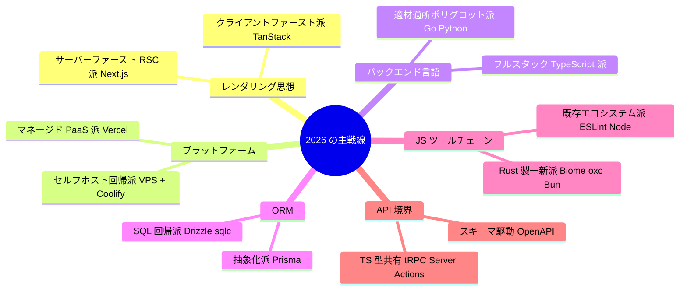

# 🧭 tech-stack-2026 — 2026年版・技術スタック選定の地図

fable-101 シリーズの各教材が「1 つの技術を深く」学ぶものだとすると、このフォルダは
**技術と技術のあいだ**を扱います。2026 年半ば時点で、

- 何が **デファクトスタンダード**(事実上の標準)なのか
- どこで **流派が分かれて対立している** のか、その対立の**本当の争点**は何か
- 自分が技術選定する立場になったとき、**何を基準にどう決めればいいのか**

を俯瞰するための読み物です。コードは(ほぼ)出てきません。教材本編の前後どちらで
読んでも構いませんが、[各教材の language-overview](../README.md) を読んだあとだと
解像度が数段上がります。

> ⚠️ **鮮度についての注意**: この文書は **2026 年 7 月時点** のスナップショットです。
> 技術選定の「地図」は 1〜2 年で書き換わりますが、「**地図の読み方**」
> ([第 1 章](01_principles.md))は 10 年単位で有効です。年号が古くなったら、
> 各論より先に第 1 章と[第 6 章](06_playbook.md)を信じてください。

---

## 🗂️ 目次

| 章 | 内容 | こんな人に |
|---|---|---|
| [01 技術選定の原則](01_principles.md) | 対立の読み方・退屈な技術・可逆性・AI 時代の新基準 | **全員(最初に読む)** |
| [02 フロントエンド](02_frontend.md) | React 一強の実態、Next.js vs TanStack Start、状態管理・CSS の決着 | React / Next.js を使う人 |
| [03 バックエンド](03_backend.md) | 言語選定(Go / TS / Python)、API 境界、ORM 戦争、認証 | Go / API 設計をする人 |
| [04 ツールチェーン](04_toolchain.md) | ランタイム・パッケージマネージャ・リンタ・ビルド・テストの勢力図 | 開発環境を整備する人 |
| [05 インフラとデータ](05_infra.md) | デプロイ先の宗派、「とりあえず Postgres」、エッジの現在地 | デプロイ・運用に関わる人 |
| [06 選定プレイブック](06_playbook.md) | シナリオ別の推奨構成、**Go + Next.js 職場の歩き方**、質問リスト | 転職先で戦う人(あなた) |
| [07 番外編: ゲームバックエンド](07_game_backend.md) | Web と別大陸の力学、**サーバー権威 vs クライアント権威**の解剖 | Web との対比で学びたい人 |

---

## ⚡ 2026 年デファクト早見表

「迷ったらこれを選べば説明責任を果たせる」ライン。各章で理由と対抗馬を解説します。

| レイヤー | デファクト | 有力な対抗・流派 |
|---|---|---|
| UI ライブラリ | **React** | Vue(アジア圏で強い)、Svelte(満足度首位級) |
| React フレームワーク | **Next.js**(App Router) | TanStack Start、React Router v7、Vite SPA |
| クライアント状態管理 | **Zustand** | Jotai、Redux Toolkit(大規模既存)、そもそも減らす派 |
| サーバー状態管理 | **TanStack Query** | RSC + Server Actions(Next 内部) |
| CSS | **Tailwind CSS v4** + shadcn/ui | CSS Modules、ゼロランタイム CSS-in-JS |
| フォーム | **React Hook Form + Zod** | Server Actions + useActionState |
| バックエンド言語 | **TypeScript / Go / Python**(用途別) | Rust(性能・ツール)、Java/Kotlin/C#(大企業) |
| Go の HTTP | **stdlib(net/http)+ chi** | Gin(利用率首位)、Echo |
| TS サーバー | **Hono** | Fastify、Express(レガシー圏)、NestJS(大規模) |
| API 境界 | **REST + OpenAPI(スキーマ駆動)** | tRPC(TS モノレポ限定)、GraphQL(退潮)、gRPC/Connect(サービス間) |
| バリデーション | **Zod(v4)** | Valibot、ArkType(Standard Schema で相互運用可) |
| TS の ORM | **Drizzle**(新規)/ **Prisma**(実績) | Kysely、生 SQL 回帰派 |
| Go の DB アクセス | **pgx + sqlc** | GORM(批判も多い)、sqlx |
| 認証 | **Better Auth**(TS)/ 自前(Go) | Clerk(SaaS 派)、Keycloak/Ory(大組織) |
| JS ランタイム | **Node.js(LTS)** | Bun(急伸・開発ツールでは既に主流級)、Deno(ニッチ) |
| パッケージマネージャ | **pnpm** | bun install(最速)、npm(無難) |
| リンタ/フォーマッタ | **ESLint + Prettier**(現職)→ **Biome**(新興) | oxlint/oxfmt(VoidZero 陣営) |
| ビルド | **Vite**(→ Rolldown 移行中) | Turbopack(Next 専用)、Rspack(webpack 互換) |
| テスト | **Vitest + Playwright** | Jest(レガシー圏)、Cypress(退潮) |
| モノレポ | **pnpm workspace + Turborepo** | Nx(高機能)、単一リポジトリで十分派 |
| DB | **PostgreSQL**(圧倒的) | SQLite(単一サーバー派)、MySQL(既存資産) |
| デプロイ | **Vercel**(front)/ コンテナ PaaS(back) | セルフホスト回帰派(VPS + Coolify)、AWS/GCP(大規模) |
| CI | **GitHub Actions** | — (ほぼ無風) |
| 可観測性 | **OpenTelemetry** + 各種バックエンド | — (計装の標準化は決着) |

---

## ⚔️ 対立マップ総覧 — 2026 年の「戦線」はどこか

流派の対立には 2 種類あります。**すでに決着した戦争**(勝者に乗ればよい)と、
**現在進行形の戦争**(前提条件によって正解が変わる)です。これを混同すると、
終わった戦争を蒸し返したり、進行中の戦争で「唯一の正解」を信じたりします。

### ✅ 2026 年までに(ほぼ)決着した戦争

| 戦争 | 勝者 | 敗者・撤退組 |
|---|---|---|
| JS の型 | TypeScript | Flow、JSDoc のみ運用 |
| CSS 設計 | Tailwind(ユーティリティ) | ランタイム CSS-in-JS(styled-components はメンテナンスモード) |
| SPA ビルド | Vite | webpack(新規)、CRA(公式に引退) |
| テストランナー | Vitest / Playwright | Jest(新規)、Cypress、Selenium |
| Python のパッケージ管理 | uv | pip+venv 手動運用、Poetry、Pipenv |
| Python のリンタ | Ruff | flake8 + isort + black の寄せ集め |
| マイクロサービス万能論 | モジュラーモノリスへ揺り戻し | 「最初からマイクロサービス」 |
| NoSQL 万能論 | 「とりあえず Postgres」 | 「とりあえず MongoDB」 |

### 🔥 現在進行形の主戦線(前提によって正解が変わる)

それぞれの戦線の「本当の争点」は各章で解剖します。先にひとつだけ言っておくと——
**ほとんどの対立は「どちらが優れているか」ではなく「どんな前提を置いているか」の違い**です。
チーム規模、変更頻度、SEO の重要性、運用体制。前提を特定すれば、対立は選定基準に変わります。
これがこのフォルダ全体の主題です。

---

## 📖 読み方

1. **必ず [01 章](01_principles.md)から。** 各論の賞味期限は短く、原則の賞味期限は長い
2. 興味のあるレイヤーの章(02〜05)を拾い読み
3. 最後に [06 章](06_playbook.md)で「自分の状況」に当てはめる
4. 各教材の language-overview([TS](../typescript-fable-101/language-overview/README.md) /
   [React](../react-fable-101/language-overview/README.md) /
   [Next.js](../nextjs-fable-101/language-overview/README.md) /
   [Go](../go-fable-101/language-overview/README.md) /
   [Python](../python-fable-101/language-overview/README.md))と往復すると、
   「なぜその技術がその戦線に立っているか」が繋がります

## 🔗 主な参考情報源(2026 年 7 月時点で確認)

- [TanStack Start vs Next.js(公式比較)](https://tanstack.com/start/latest/docs/framework/react/start-vs-nextjs) / [2026 年の実務比較](https://makerkit.dev/blog/tutorials/tanstack-start-vs-nextjs)
- [Biome vs ESLint vs Oxlint 2026 比較](https://pikvue.com/biome-vs-eslint-vs-oxlint-2026-which-javascript-linter-should-you-pick/) / [Biome 公式](https://github.com/biomejs/biome)
- [TypeScript ネイティブコンパイラ(tsgo)の状況](https://nerdleveltech.com/typescript-7-native-compiler-tsgo)
- [Prisma vs Drizzle vs ZenStack 2026](https://zenstack.dev/blog/orm-2026) / [Drizzle vs Prisma 実務比較](https://makerkit.dev/blog/tutorials/drizzle-vs-prisma)
- [JetBrains: Go エコシステム動向](https://blog.jetbrains.com/go/2025/11/10/go-language-trends-ecosystem-2025/) / [Go Web フレームワーク実践ガイド](https://blog.jetbrains.com/go/2026/04/28/popular-golang-web-frameworks/)
- [Next.js デプロイ完全ガイド 2026(Vercel vs セルフホスト)](https://dev.to/zahg_81752b307f5df5d56035/the-complete-guide-to-deploying-nextjs-apps-in-2026-vercel-self-hosted-and-everything-in-between-48ia)
- [pnpm 公式](https://pnpm.io/) / [TanStack Query 公式](https://tanstack.com/query/latest)

---

それでは、地図を広げましょう。🗺️
