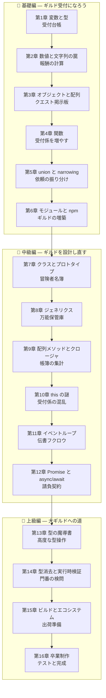

# ⚔️ TypeScript Fable 101 — 冒険者ギルドで学ぶ TypeScript と JavaScript の心

ようこそ!この教材では、あなたは冒険者ギルド酒場 **「Typed Tavern」** の新米ギルド受付になります。

最初は台帳に名前を書くことしかできませんが、章を進めるごとに TypeScript の新しい概念を学び、
それをギルドの業務システムに組み込んでいきます。最終章では、テスト付き・実行時検証付きの
本格的なギルド管理システムが完成します。

## 🧭 この教材の方針 — 「TS で書き、JS で理解する」

TypeScript は JavaScript の上位互換(スーパーセット)です。つまり **TypeScript を学ぶことは
JavaScript を学ぶこと** でもあります。ただし TypeScript の型は実行前に消えてしまうため、
「実際にコンピュータの上で何が起きているか」は JavaScript の世界の話です。

そこでこの教材は、**コードはすべて TypeScript で書きながら、実行時の挙動と歴史的背景は
JavaScript として解説する** という二段構えで進みます。本文中のコラムは 3 種類あります:

| マーク | 意味 |
|---|---|
| 💡 **ポイント** | 今すぐ役立つ実践的な補足 |
| 📜 **歴史の背景** | 「なぜこんな仕様なのか」— 1995 年から続く物語 |
| ⚙️ **ランタイムの真実** | 型の下で JavaScript が実際にやっていること |

JavaScript は 1995 年に **わずか 10 日間で設計され**、しかも「Web を壊せない」ために
一度入れた仕様をほぼ削除できないまま 30 年育った、世界で最も広く使われる言語です。
奇妙な挙動の多くには「歴史的な理由」があります。それを知ると、暗記が理解に変わります。

## 📖 この教材の読み方

- 各章は **前の章のコードを土台に** 進みます。順番に読むのがおすすめです。
- コードは実際に手を動かして実行してください(Node.js 22 以上を推奨)。
- 各章の最後に「今日の受付業務(演習)」があります。
- 図は [Mermaid](https://mermaid.js.org/) 記法で書かれています。VS Code の Markdown プレビュー
  (拡張機能 *Markdown Preview Mermaid Support*)や GitHub 上でそのまま表示できます。
- 姉妹教材 [python-fable-101](../python-fable-101/README.md) /
  [go-fable-101](../go-fable-101/README.md) と概念がつながる場所ではリンクで比較します。

## 🗺️ 学習マップ



## 📚 目次

| 章 | タイトル | 学ぶ TS/JS の概念 | ギルドに起きること |
|---|---|---|---|
| [第1章](chapters/01_variables.md) | 受付台帳 | const/let、型注釈、型推論、型消去 | 開業!台帳と金庫の管理 |
| [第2章](chapters/02_numbers_strings.md) | 報酬の計算 | number の正体、`===`、truthy/falsy | 報酬と手数料を正しく計算 |
| [第3章](chapters/03_objects_arrays.md) | クエスト掲示板 | interface、配列、参照、JSON | 依頼が掲示板に並ぶ |
| [第4章](chapters/04_functions.md) | 受付係を増やす | 関数 3 記法、引数、第一級関数 | 受付業務が自動化される |
| [第5章](chapters/05_unions.md) | 依頼の振り分け | union、narrowing、null 安全 | 依頼の状態管理が堅牢になる |
| [第6章](chapters/06_modules.md) | ギルドの増築 | ESM、npm、tsconfig | コードがファイルに整理される |
| [第7章](chapters/07_classes.md) | 冒険者名簿 | class、プロトタイプの正体 | 冒険者がオブジェクトになる |
| [第8章](chapters/08_generics.md) | 万能保管庫 | ジェネリクス、Map/Set | どんな型でも安全に保管できる |
| [第9章](chapters/09_array_methods.md) | 帳簿の集計 | map/filter/reduce、クロージャ | 売上集計とランキングが動く |
| [第10章](chapters/10_this.md) | 受付係の混乱 | this の 4 ルール、bind、arrow | 壊れた呼び鈴を修理する |
| [第11章](chapters/11_event_loop.md) | 伝書フクロウ | シングルスレッド、イベントループ | 待たずに複数の依頼が進む |
| [第12章](chapters/12_async_await.md) | 請負契約 | Promise、async/await、並行実行 | 冒険者たちが同時に働き出す |
| [第13章](chapters/13_advanced_types.md) | 型の魔導書 | keyof、Utility Types、unknown | 型がコードを自動追従する |
| [第14章](chapters/14_runtime_validation.md) | 門番の検問 | 型消去の帰結、実行時検証、zod | 外部データから城壁を守る |
| [第15章](chapters/15_build_ecosystem.md) | 出荷準備 | tsc、package.json、ツール地図 | プロジェクトが配布可能になる |
| [第16章](chapters/16_final.md) | 卒業制作 | Vitest、プロジェクト構成 | テスト付き完成品が納品される |

## 🎯 対象読者

- プログラミング未経験〜他言語経験者で、TypeScript(と JavaScript)を体系的に学びたい人
- 「なんとなく動くけど、なぜそう書くのか分からない」を解消したい人
- この後 React / Next.js に進む予定の人(この教材はそのための土台を意識しています)

## 🛠️ 準備

```bash
# Node.js 22 以上を確認(なければ https://nodejs.org/ から LTS をインストール)
node --version

# 教材用の作業ディレクトリを作り、プロジェクトを初期化
mkdir ts-guild && cd ts-guild
npm init -y
npm install -D typescript tsx

# 動作確認(バージョンが表示されれば OK)
npx tsc --version
```

- **`typescript`** … 型チェッカー兼コンパイラ(`tsc`)本体
- **`tsx`** … TypeScript ファイルを 1 コマンドで実行してくれる開発用ツール
- この教材ではコードを `guild/` フォルダ以下に育てていきます
- `npm` や `tsconfig.json` の意味は第 6 章でちゃんと説明します。それまでは「おまじない」で OK です

それでは、[第1章](chapters/01_variables.md) から受付台帳を開きましょう!⚔️
