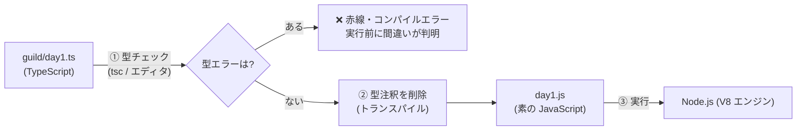

# 第1章 受付台帳 — 変数と型

## 🍺 今日のお話

あなたは今日から冒険者ギルド酒場「Typed Tavern」のギルド受付です。
まずやることは 2 つ。**看板を掲げる** ことと、**金庫にいくら入っているか台帳に記録する** ことです。

プログラムの世界では、こうした「名前を付けて値を覚えておく」仕組みを **変数** と呼びます。

## 変数 — `const` と `let`

```typescript
const guildName = "Typed Tavern";  // ギルドの名前(再代入しない)
let gold = 100;                    // 金庫の中身(増えたり減ったりする)
let isOpen = true;                 // 営業中かどうか

console.log(guildName);  // Typed Tavern
console.log(gold);       // 100
```

- **`const`** … 一度名前を付けたら **別の値を再代入できない**
- **`let`** … 再代入できる

使い分けの原則はシンプルです: **まず `const` で書く。再代入が必要になったときだけ `let` にする。**
「この名前の指す値は変わらない」と読み手に約束できるので、コードを追うのが楽になります。

```typescript
const guildName = "Typed Tavern";
guildName = "Untyped Tavern";  // ❌ コンパイルエラー: Cannot assign to 'guildName'
```

> 📜 **歴史の背景 — 3 つ目の書き方 `var` はなぜ使わないのか**
>
> JavaScript は 1995 年、Netscape 社の **ブレンダン・アイク** が **わずか 10 日間で** 設計しました。
> 当時のブラウザ戦争の中「Java が流行っているから似た名前にしよう」と JavaScript と
> 名付けられましたが、Java とは別物です。
>
> その 10 日間で作られた変数宣言が `var` です。`var` には「宣言より前の行で使えてしまう
> (巻き上げ)」「ブロック `{}` を無視してはみ出す」という設計ミスがありました。
> しかし JavaScript には **「Web を壊せない」という宿命** があります。仕様を修正すると、
> 世界中の既存ページが動かなくなるのです。
>
> そこで 2015 年の大改訂(ES2015)で、`var` を直す代わりに **正しく動く `let` / `const` を
> 追加** しました。JavaScript は「間違いを削除できないので、新しい正解を横に足す」形で
> 進化する言語です。古い教材で `var` を見たら「2015 年以前の書き方だ」と読み替えてください。
> 新しく書くコードで `var` を使う理由は一切ありません。

## 型注釈と型推論

TypeScript では、変数に **型注釈** を書けます。

```typescript
const guildName: string = "Typed Tavern";  // : string が型注釈
let gold: number = 100;
let isOpen: boolean = true;
```

しかし実は、上の型注釈は **書かなくても同じ意味** になります。TypeScript は右辺の値を見て
型を自動的に判断するからです。これを **型推論** と呼びます。

```typescript
let gold = 100;        // gold は number だと推論される
gold = 250;            // ✅ OK
gold = "たくさん";     // ❌ コンパイルエラー: Type 'string' is not assignable to type 'number'
```

💡 **ポイント**: 実務では「推論できるところは書かない」のが主流ですが、学習中は
「自分の理解と推論が一致しているか」を確かめるために書いてみるのも良い練習です。

> 💡 **Python との比較**: [Python](../../python-fable-101/chapters/01_variables.md) では
> `gold = "たくさん"` と書き直せてしまい、実行するまでエラーが出ません(動的型付け)。
> TypeScript は **実行する前に** この間違いを見つけてくれます。これが静的型検査の価値です。

## ⚙️ ランタイムの真実 — 型は実行前に「消える」

ここがこの教材で最初の、そして最重要のポイントです。

**Node.js やブラウザが実行しているのは JavaScript であって、TypeScript ではありません。**
TypeScript のコードは実行前に「型の部分を剥がされて」JavaScript になります。



つまり `: number` という注釈は、**実行時にはこの世に存在しません**。型は
「書いている間・コンパイルする瞬間」だけあなたを守る魔法陣です。この事実の重大な帰結
(外部から来たデータは型注釈では守れない)は第 14 章で扱います。

この教材で使う `tsx` コマンドは「型を剥がして即実行」を 1 発でやってくれる開発用ツールです。

## 基本のデータ型

JavaScript の値の種類(プリミティブ型)のうち、日常で使うのはこの 5 つです。

| 型 | 例 | ギルドでの用途 |
|---|---|---|
| `string` | `"回復薬"`, `'剣'` | 名前、依頼文 |
| `number` | `100`, `-5`, `0.1` | 報酬、在庫数(整数も小数もこれ 1 つ。詳細は第 2 章) |
| `boolean` | `true`, `false` | 営業中フラグ |
| `undefined` | `undefined` | 「まだ値が入っていない」 |
| `null` | `null` | 「意図的に空にしてある」 |

> 📜 **歴史の背景 — 「無」が 2 つある理由**
>
> 多くの言語で「値がない」は 1 種類(Python の `None`、Go の `nil`)ですが、JavaScript には
> `undefined` と `null` の 2 つがあります。これも 10 日間の設計の産物です。
>
> - `undefined` … 「言語側が返す無」。宣言しただけの変数、存在しないプロパティの値。
> - `null` … 「プログラマが意図的に置く無」。Java 風に見せるために入れたと言われます。
>
> さらに有名なバグとして `typeof null` は `"object"` を返します。1995 年当時の実装の
> 都合によるバグですが、**直すと Web が壊れるので 30 年間そのまま** です。
> 「後方互換の呪い」の代表例として語り継がれています。
> 実務の使い分けは荒れがちですが、この教材では「自分で空を表すときは `undefined` 側に
> 寄せ、`null` は外部データ(JSON など)から来るもの」という方針で進めます。

## テンプレートリテラル — 看板を作る

文字列は `"` でも `'` でも作れますが、強力なのが **テンプレートリテラル**(バッククォート
`` ` ``)です。`${}` の中に変数や式を埋め込めます。Python の f-string に相当します。

```typescript
const guildName = "Typed Tavern";
const gold = 100;
const questReward = 50;

const sign = `
==============================
  ようこそ ${guildName} へ!
  本日の依頼報酬: ${questReward} ゴールド
  (ギルド税込みで ${questReward * 1.1} ゴールド)
==============================
`;
console.log(sign);
```

- `${questReward * 1.1}` のように **式** も書けます
- バッククォート文字列は途中で改行できます(通常の `"` は 1 行のみ)

## ⚔️ 完成コード: `guild/day1.ts`

今日の成果をまとめましょう。

```typescript
// Typed Tavern — 開業 1 日目

const guildName = "Typed Tavern";
let gold = 100;              // 開業資金
const questReward = 50;      // 標準的な依頼の報酬
const guildTaxRate = 0.1;    // ギルド税

console.log(`⚔️ ${guildName} 開業!`);
console.log(`金庫の中身: ${gold} ゴールド`);

// 最初の依頼が完了し、依頼主から報酬+税が支払われた
const income = questReward * (1 + guildTaxRate);
gold += income;

console.log(`依頼完了!${income} ゴールドを受け取りました`);
console.log(`金庫の中身: ${gold} ゴールド`);
```

実行してみましょう:

```bash
npx tsx guild/day1.ts
```

型チェックだけを走らせることもできます(エラーがなければ何も表示されません):

```bash
npx tsc --noEmit guild/day1.ts
```

💡 実は VS Code は、ファイルを開いているだけで常にこの型チェックを裏で実行しています。
赤い波線の正体は `tsc` と同じエンジンです。エディタこそ TypeScript 最大の恩恵です。

## 📝 今日の受付業務(演習)

1. `potionPrice = 80` を `const` で追加し、「回復薬 2 本と依頼報酬の合計」を看板に表示してください。
2. `gold = "たくさん"` と書いてみて、エディタと `npx tsc --noEmit` がどんなエラーを出すか観察してください。エラー文は最初は長く感じますが、**最後の 1 文から読む**と意味が取りやすいです。
3. `let rank;` と型注釈なし・初期値なしで宣言すると、`rank` の型はどうなるでしょう?エディタで変数にマウスを乗せて確認してみてください(ヒント: `any` という「型チェック放棄」の型が現れます。これが危険な理由は第 13 章で学びます)。

---

次章、最初のお客がやってきます。ところが報酬の計算で `0.1 + 0.2` が `0.3` にならない…?
JavaScript の数値と比較の「落とし穴地帯」を安全に通り抜けましょう。
→ [第2章 報酬の計算](02_numbers_strings.md)
