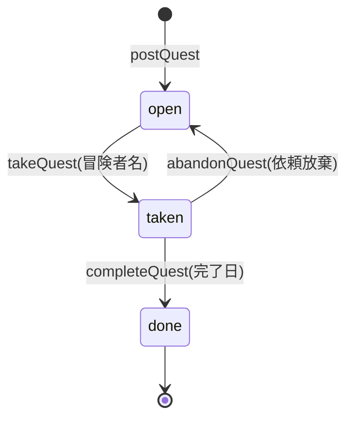

# 第5章 依頼の振り分け — union 型と narrowing

## 🍺 今日のお話

事件です。掲示板の「ドラゴン退治」に、受注した冒険者の名前がないまま「完了」印が
押されていました。誰が完了したのか分からず、報酬が支払えません。

原因は台帳の様式にあります。今の `Quest` は `done: boolean` しかなく、「誰が受注中か」を
書く欄がいつでも空欄にできてしまう。**「ありえない状態を、そもそも書けない様式にする」**
——今日は TypeScript の最も TypeScript らしい魔法、union 型を学びます。

## リテラル型と union — 「この値しか許さない」

TypeScript では、**値そのもの** を型にできます(リテラル型)。そして `|` で
「いずれか」を表せます(union 型)。

```typescript
type Difficulty = "easy" | "normal" | "hard";
//   「"easy" か "normal" か "hard" の 3 つの文字列だけが許される型」

let d: Difficulty = "normal";   // ✅
d = "hard";                     // ✅
d = "extreme";                  // ❌ コンパイルエラー!typo も新種の混入も防げる
```

ただの `string` では「何でも書ける台帳」ですが、union なら「選択肢に丸を付ける台帳」に
なります。エディタの補完も効きます(`d = "` と打つと候補が 3 つ出ます)。

> 📜 **歴史の背景 — enum のある言語、union で行く言語**
>
> 多くの言語は選択肢を **列挙型(enum)** で表します([Go は `iota` による擬似 enum](../../go-fable-101/chapters/01_variables.md)、
> Python には `Enum` クラス)。実は TypeScript にも `enum` 構文がありますが、
> **現代の TypeScript では文字列リテラル union が主流** で、`enum` は避けられる傾向にあります。
>
> 理由は第 1 章の大原則に関わります。TypeScript の型は「消える」はずなのに、`enum` だけは
> **実行時に JavaScript のコードを生成してしまう** 例外的な機能だからです。「TS は JS に
> 型を足すだけで、実行時の動きを発明しない」という設計思想からのはみ出し者であり、
> 近年の公式ツール(Node.js の TS サポートなど)も enum を敬遠しています。
> `"easy" | "normal" | "hard"` はゼロコスト(実行時はただの文字列)で同じ目的を果たします。

## narrowing — 型を「絞り込む」

union 型の値は、そのままでは共通の操作しかできません。**条件分岐で型を絞り込む** ことで、
それぞれの型専用の操作が解禁されます。これを **narrowing(絞り込み)** と呼びます。

```typescript
function describeReward(reward: number | string): string {
  // ここでは reward は number | string。toFixed は number 専用なので呼べない
  if (typeof reward === "number") {
    return `${reward.toFixed(0)} ゴールド`;   // ✅ このブロック内では number 確定
  }
  return `報酬: ${reward.toUpperCase()}`;      // ✅ ここに来たら string しか残っていない
}
```

TypeScript は `if` や `return` の流れを追いかけて、「この行に来た時点で型は何でありうるか」
を常に計算しています(制御フロー解析)。**普通の JavaScript の if 文を書くだけで型が絞れる**
——実行時に消える型と、実行時に動く JS のコードが、ここで美しく噛み合います。

## null 安全 — 10 億ドルの過ちへの返答

「値がないかもしれない」も union で表します。TypeScript(`strict` 設定時)では、
`null` / `undefined` の可能性がある値をそのまま使うとコンパイルエラーです。

```typescript
function findQuest(id: number): Quest | undefined {
  return quests.find((q) => q.id === id);   // 見つからなければ undefined
}

const q = findQuest(99);
console.log(q.title);        // ❌ エラー: 'q' is possibly 'undefined'

if (q !== undefined) {
  console.log(q.title);      // ✅ narrowing で undefined が除外された
}

// 短く書く道具たち
console.log(q?.title);              // オプショナルチェーン: q が無なら undefined を返すだけ
console.log(q?.title ?? "該当なし"); // ?? : 左が null/undefined のときだけ右を使う
```

> 📜 **歴史の背景 — 「10 億ドルの過ち」**
>
> null 参照の発明者トニー・ホーアは、2009 年にこう謝罪しました。「これを私は 10 億ドルの
> 過ちと呼ぶ。null 参照は実装が簡単だったから入れてしまったが、以来 40 年間、無数の
> エラーと脆弱性とクラッシュを引き起こしてきた」。
>
> 実行時に突然現れる `null` はあらゆる言語の悩みです。[Go は今も nil パニックと共に生きて
> います](../../go-fable-101/language-overview/README.md)。2010 年代の言語(Swift, Kotlin, Rust)は
> 「無いかもしれない値を型で区別する」解決策を選び、TypeScript も同じ道を取りました——
> `T | undefined` と書かせ、チェックするまで使わせない。JavaScript に「無」が 2 つもある
> (第 1 章)という混沌の上に、型で秩序をかぶせたのです。
>
> ⚠️ この守りは `tsconfig.json` の `strict`(に含まれる `strictNullChecks`)が有効なときだけ
> 働きます。**strict は「後から締める」のが大変なので、最初から必ず有効に**(第 6 章)。

## 判別可能 union — ありえない状態を型で消す

いよいよ冒頭の事件を解決します。依頼の状態を「共通のタグを持つオブジェクトの union」で
表します。これが **判別可能 union(discriminated union)**、TypeScript 設計の花形です。

```typescript
type QuestStatus =
  | { state: "open" }                                    // 受付中: 追加情報なし
  | { state: "taken"; by: string }                       // 受注中: 冒険者名が必須
  | { state: "done"; by: string; completedOn: string };  // 完了: 名前と完了日が必須

interface Quest {
  id: number;
  title: string;
  reward: number;
  status: QuestStatus;
}
```

この様式では「受注者のいない完了」は **そもそも書けません**。`state: "done"` を名乗るなら
`by` を持たないとコンパイルが通らないからです。バグをテストで見つけるのではなく、
**バグという文章を文法エラーにする** ——これが「ありえない状態を表現不可能にする」設計です。

タグ(`state`)で分岐すれば、TypeScript が各ブランチで型を自動的に絞り込みます:

```typescript
function describeStatus(q: Quest): string {
  switch (q.status.state) {
    case "open":
      return "🆕 冒険者募集中";
    case "taken":
      return `⚔️ ${q.status.by} が挑戦中`;          // ここでは by が使える
    case "done":
      return `✅ ${q.status.by} が ${q.status.completedOn} に完了`;
    default: {
      const exhausted: never = q.status;             // 網羅チェック(下記)
      return exhausted;
    }
  }
}
```

💡 **`never` による網羅チェック**: `never` は「ありえない」を表す型です。すべての `case` を
書き切っていれば、`default` に到達する型は残っておらず(= `never`)、代入が通ります。
将来 `QuestStatus` に `"cancelled"` を追加すると、**この `default` がコンパイルエラーになり、
書き忘れた分岐を全部教えてくれます**。[Go の擬似 enum に欠けている網羅性検査](../../go-fable-101/language-overview/README.md)を、TS は型システムで実現しているわけです。

## 状態遷移を関数で守る



```typescript
function takeQuest(q: Quest, adventurer: string): void {
  if (q.status.state !== "open") {
    console.log(`⚠️ 「${q.title}」は受付中ではありません(現在: ${q.status.state})`);
    return;
  }
  q.status = { state: "taken", by: adventurer };
}

function completeQuest(q: Quest, completedOn: string): void {
  if (q.status.state !== "taken") {
    console.log(`⚠️ 「${q.title}」は受注されていません`);
    return;
  }
  q.status = { state: "done", by: q.status.by, completedOn };
}
```

## ⚔️ 完成コード: `guild/day5.ts`

```typescript
// Typed Tavern — 5 日目: 依頼の状態管理

type QuestStatus =
  | { state: "open" }
  | { state: "taken"; by: string }
  | { state: "done"; by: string; completedOn: string };

interface Quest {
  id: number;
  title: string;
  reward: number;
  status: QuestStatus;
}

const quests: Quest[] = [
  { id: 1, title: "薬草採取", reward: 30, status: { state: "open" } },
  { id: 2, title: "ゴブリン退治", reward: 80, status: { state: "open" } },
];

function describeStatus(q: Quest): string {
  switch (q.status.state) {
    case "open":
      return "🆕 冒険者募集中";
    case "taken":
      return `⚔️ ${q.status.by} が挑戦中`;
    case "done":
      return `✅ ${q.status.by} が ${q.status.completedOn} に完了`;
    default: {
      const exhausted: never = q.status;
      return exhausted;
    }
  }
}

function takeQuest(q: Quest, adventurer: string): void {
  if (q.status.state !== "open") {
    console.log(`⚠️ 「${q.title}」は受付中ではありません`);
    return;
  }
  q.status = { state: "taken", by: adventurer };
}

function completeQuest(q: Quest, completedOn: string): void {
  if (q.status.state !== "taken") {
    console.log(`⚠️ 「${q.title}」は受注されていません`);
    return;
  }
  q.status = { state: "done", by: q.status.by, completedOn };
}

function showBoard(): void {
  console.log("📌 ===== クエスト掲示板 =====");
  for (const q of quests) {
    console.log(`[${q.id}] ${q.title} (${q.reward}G) — ${describeStatus(q)}`);
  }
  console.log();
}

showBoard();
completeQuest(quests[0], "6月1日");      // ⚠️ 受注前の完了は関数が拒否
takeQuest(quests[0], "剣士カイ");
takeQuest(quests[0], "魔法使いリタ");     // ⚠️ 二重受注も拒否
showBoard();
completeQuest(quests[0], "6月1日");      // 今度は正規の手順なので通る
showBoard();
```

```bash
npx tsx guild/day5.ts
```

## 📝 今日の受付業務(演習)

1. `QuestStatus` に `{ state: "cancelled"; reason: string }` を追加してください。`describeStatus` の `default` がエラーになること、`case "cancelled"` を書くと直ることを確認してください(never チェックの体験)。
2. `abandonQuest(q: Quest): void`(受注中 → 受付中に戻す)を状態遷移図どおりに実装してください。
3. `findQuest(id: number): Quest | undefined` を作り、呼び出し側で `?.` と `??` を使って「見つからなければ『該当なし』」と表示してください。
4. `type Difficulty = "easy" | "normal" | "hard"` を `Quest` に追加し、難易度ごとに報酬を 1 倍 / 1.5 倍 / 2 倍にする `payout(q: Quest): number` を `switch` + never チェックで書いてください。

---

次章、`day1.ts` 〜 `day5.ts` と散らかってきたファイルを整理します。`npm` と `tsconfig.json`
という「おまじない」の正体を知り、ギルドを複数の棟に増築しましょう。
→ [第6章 ギルドの増築](06_modules.md)
