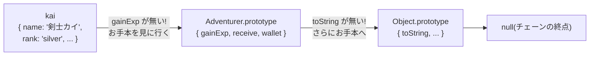

# 第7章 冒険者名簿 — クラスとプロトタイプの正体

## 🍺 今日のお話

ギルドに冒険者が登録に来るようになりました。名前、ランク、所持金、経験値——そして
「経験値を積むとランクが上がる」という **振る舞い** も付いてきます。

データと振る舞いをひとまとめにした「設計図」から冒険者を量産する仕組み、それが
**クラス** です。そして今日は、class 構文の足元で 30 年間動き続けている JavaScript 最古の
仕組み——**プロトタイプ** の正体も見に行きます。

## class — 冒険者の設計図

```typescript
class Adventurer {
  name: string;                    // プロパティ宣言(型付き)
  rank: "bronze" | "silver" | "gold" = "bronze";   // 初期値付き
  #gold = 0;                       // # 付き = 外から見えない(後述)
  private exp = 0;                 // TS 流の非公開(後述)

  constructor(name: string) {      // new されたときに走る初期化処理
    this.name = name;
  }

  gainExp(amount: number): void {  // メソッド(この設計図から作った全員が使える)
    this.exp += amount;
    if (this.exp >= 100 && this.rank === "bronze") {
      this.rank = "silver";
      console.log(`🎉 ${this.name} は silver に昇格した!`);
    }
  }

  receive(gold: number): void {
    this.#gold += gold;
  }

  get wallet(): number {           // getter: メソッドをプロパティのように読ませる
    return this.#gold;
  }
}

const kai = new Adventurer("剣士カイ");    // 設計図からインスタンスを生成
const rita = new Adventurer("魔法使いリタ");

kai.gainExp(120);                 // 🎉 剣士カイは silver に昇格した!
kai.receive(80);
console.log(kai.wallet);          // 80 (get のおかげで () 不要)
console.log(rita.rank);           // "bronze" (リタは別インスタンス。状態は独立)
```

- `this` は「このインスタンス自身」を指します(第 10 章で `this` の闇に踏み込みますが、
  **クラスのメソッド内の `this` は素直** なので今日は安心して使ってください)
- `kai` と `rita` は同じ設計図から作られた **別々の実体** で、状態は独立しています

## 非公開プロパティ — `#` と `private` の二重体制

外から触られたくないデータを隠す方法が **2 つ** あります。歴史の合流点です。

| 書き方 | 出自 | 破られるか |
|---|---|---|
| `private exp` | TypeScript(2012〜) | **型検査の上だけの禁止**。型を消せば実行時には普通に触れる |
| `#gold` | JavaScript 本体(ES2022) | **実行時にも本当に**アクセス不能 |

> ⚙️ **ランタイムの真実**: `private` は第 1 章の「型は消える」原則どおり、コンパイル時の
> 検査だけです。`(kai as any).exp = 9999` と書けば突破できてしまいます。一方 `#gold` は
> JavaScript 言語そのものの機能なので、実行時にも守られます。
> TypeScript が先に `private` を発明し、**あとから JavaScript 本体に本物が追加された**
> という歴史の産物で、現在は両方が使えます。新規コードでは `#` が原理的には堅牢ですが、
> `private` も広く使われており、この教材ではどちらも登場させます。

## 📜 歴史の背景 — class は「あとから被せた化粧」である

ここが今日の核心です。**JavaScript には 2015 年まで class がありませんでした。**
それでもオブジェクトは作れていました。どうやって? **プロトタイプ** です。

10 日間の設計のとき、アイクは「クラスをちゃんと作る時間はない。オブジェクトが別の
オブジェクトを『お手本(プロトタイプ)』として参照する仕組みだけ入れよう」と、
研究言語 Self 由来のプロトタイプ方式を採用しました。ルールはたった 1 つです:

> **オブジェクトにないプロパティが読まれたら、そのプロトタイプ(お手本)へ探しに行く。
> なければさらにそのプロトタイプへ…(プロトタイプチェーン)**



`class` 構文が実行時にやっているのは、実はこれだけです:

- メソッドを `Adventurer.prototype` というオブジェクトに置く(**全インスタンスで共有**)
- `new` されたら空のオブジェクトを作り、プロトタイプを繋ぎ、`constructor` を実行する

つまり `kai.gainExp(...)` が動くのは「kai 自身は gainExp を持っていないが、チェーンを
遡って設計図のメソッドを見つけるから」。メソッドが 1 つしか存在しないので、
インスタンスを 1 万人作ってもメモリを浪費しません。

この仕組みは組み込み型でも常に動いています:

```typescript
"abc".toUpperCase()   // 文字列自身にはメソッドがない → String.prototype で発見
[1, 2, 3].push(4)     // 配列も同じ → Array.prototype.push
```

💡 **なぜこれを知る必要が?** class 構文だけ知っていれば日常は困りません。しかし
(1) エラーメッセージやドキュメントに `Array.prototype.map` のような表記が頻出する、
(2) 2015 年以前のコードや解説記事はプロトタイプ直書きで書かれている、
(3) 「JS の class は Java のそれとは別物」と知らないと第 10 章の `this` で確実に迷子になる
——ためです。**class は新しい発明ではなく、プロトタイプに被せた読みやすい構文**です。

## クラスと構造的型付け

第 3 章の「形が合えば OK」はクラスにも適用されます。ここは Java や C# 経験者ほど驚く
ポイントです。

```typescript
interface HasWallet {
  wallet: number;
}

function tax(target: HasWallet): number {
  return Math.round(target.wallet * 0.1);
}

tax(kai);                    // ✅ Adventurer は HasWallet を名乗っていないが、形が合うので通る
tax({ wallet: 500 });        // ✅ ただのオブジェクトでも形が合えば通る
```

意図を明示したいときは `implements` で「この interface を満たすつもりです」と宣言できます。
満たせていなければクラス定義の時点でエラーにしてくれます(宣言は任意、検査は厳格)。

```typescript
class Merchant implements HasWallet {
  wallet = 1000;
}
```

💡 **継承(extends)について**: `class SilverAdventurer extends Adventurer` のような継承も
書けますが、現代の JS/TS では **深い継承ツリーは好まれません**。「共通の形は interface で、
共通の機能は関数や合成で」が主流です([Go が継承自体を持たない](../../go-fable-101/chapters/08_methods.md)のと同じ時代精神です)。
この教材でも継承は使わず、次章のジェネリクスと合成で進みます。

## ⚔️ 完成コード: `guild/src/adventurers.ts`

```typescript
// Typed Tavern — 7 日目: 冒険者名簿棟

export type Rank = "bronze" | "silver" | "gold";

const RANK_UP: Record<Rank, number> = { bronze: 100, silver: 300, gold: Infinity };
const NEXT_RANK: Record<Rank, Rank> = { bronze: "silver", silver: "gold", gold: "gold" };

export class Adventurer {
  readonly name: string;
  rank: Rank = "bronze";
  #gold = 0;
  #exp = 0;

  constructor(name: string) {
    this.name = name;
  }

  gainExp(amount: number): void {
    this.#exp += amount;
    while (this.#exp >= RANK_UP[this.rank]) {
      this.rank = NEXT_RANK[this.rank];
      console.log(`🎉 ${this.name} は ${this.rank} に昇格した!`);
    }
  }

  receive(gold: number): void {
    this.#gold += gold;
  }

  get wallet(): number {
    return this.#gold;
  }

  profile(): string {
    return `${this.name} [${this.rank}] 💰${this.#gold}G / exp ${this.#exp}`;
  }
}
```

```typescript
// guild/src/main.ts に追記して動作確認

import { Adventurer } from "./adventurers.js";

const roster: Adventurer[] = [new Adventurer("剣士カイ"), new Adventurer("魔法使いリタ")];

roster[0].gainExp(120);
roster[0].receive(80);
roster[1].gainExp(450);   // 一気に gold まで昇格するはず

console.log("📖 ===== 冒険者名簿 =====");
for (const a of roster) {
  console.log(a.profile());
}
```

(`Record<Rank, number>` は「Rank の各値をキーに持つオブジェクト」の型です。第 13 章で
正体を学びますが、ここでは「昇格テーブルを型安全に書ける便利道具」として使っています。)

## 📝 今日の受付業務(演習)

1. `kai.#gold` に外からアクセスするとどんなエラーになるか、`private` と `#` の両方で試してください。
2. `Adventurer` に `spend(amount: number): boolean` を追加してください(所持金不足なら `false`。第 6 章の金庫と同じパターンです)。
3. `console.log(Object.getPrototypeOf(kai) === Adventurer.prototype)` を実行して、プロトタイプチェーンの図を自分の目で確認してください。
4. `profile` メソッドを持つ別のクラス `Staff` を作り、`(Adventurer | Staff)[]` の配列を for...of で回して全員の `profile()` を表示してください。共通の形があれば union でまとめて扱える——次章への布石です。

---

次章、ギルドの地下に「保管庫」を作ります。クエストも冒険者も金貨も入れたい。でも
「何でも入る箱」は型の守りを失う。**型を引数として受け取る** ジェネリクスの出番です。
→ [第8章 万能保管庫](08_generics.md)
