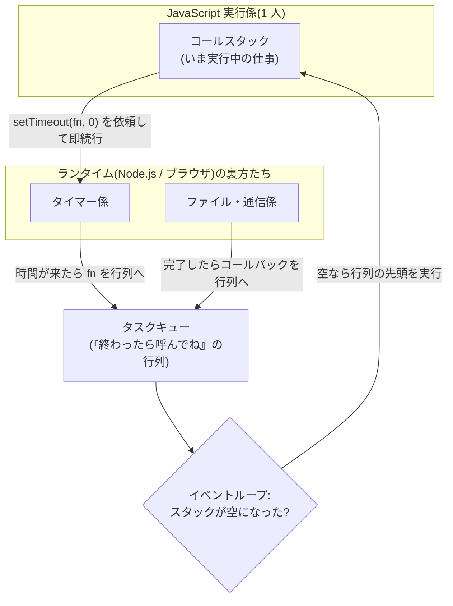

# 第11章 伝書フクロウ — シングルスレッドとイベントループ

## 🍺 今日のお話

Typed Tavern は遠方の依頼主と伝書フクロウで文通しています。フクロウの往復には時間が
かかりますが、受付係は **返事を待たずに次の客の応対を始めます**。返事が届いたら、
手が空いたときに読む——この「待たない仕事術」こそ、JavaScript の心臓部です。

前章の最後の疑問——`setTimeout` で「待っている」あいだ何が起きているのか——に、
今日ついに答えます。

## 衝撃の事実 — JavaScript は「一人」しかいない

まず大前提から。**JavaScript のコードを実行する担当者(スレッド)は、原則 1 人だけです。**

[Go が goroutine で何万人もの働き手を同時に走らせる](../../go-fable-101/chapters/12_goroutines.md)
のとは対照的に、JavaScript は受付係 1 人ですべてを回します。2 つの関数が同時に実行される
ことは決してありません。

> 📜 **歴史の背景 — なぜ一人なのか、そしてなぜそれで勝てたのか**
>
> JavaScript はブラウザの中で、**画面(DOM)を操作するため** に生まれました。もし複数の
> スレッドが同時に同じ画面を書き換えたら、悪名高い競合状態(race condition)地獄になります。
> 10 日間で作る言語に複雑なスレッド同期など入れられるはずもなく、「実行係は 1 人。
> その代わり **待ち仕事は抱え込まずに手放す**」という設計になりました。
>
> 2009 年、**ライアン・ダール** がこの仕組みをブラウザの外に持ち出しました——それが
> **Node.js** です。彼の着眼はこうです。「サーバーの仕事のほとんどは計算ではなく **待ち**
> (ディスク、DB、ネットワーク)だ。スレッドを 1 万本立てて 9,999 本を待たせるより、
> 1 人が待ち仕事を全部手放して回した方が効率的では?」——当時「C10K 問題」と呼ばれた
> 大量同時接続の課題への、エレガントな回答でした。JavaScript が「待たない設計」を
> 最初から強制されていたことが、サーバーサイドで思わぬ強みに化けたのです。

## 実験 — 実行順クイズ

```typescript
console.log("① 開店");

setTimeout(() => {
  console.log("② フクロウが帰ってきた");
}, 0);                              // 0 ミリ秒後!

console.log("③ 次の客の応対");
```

`0 ミリ秒` なのだから ① ② ③ の順…と思いきや、出力は **① ③ ②** です。
なぜか。舞台裏を見ましょう。

## イベントループ — 受付係の仕事術



登場人物は 3 つです。

1. **コールスタック** — 実行係が「いまやっている仕事」の積み重ね。
2. **ランタイムの裏方** — タイマーや通信などの「待ち仕事」は、JS 実行係ではなく
   ランタイム(Node.js やブラウザ)が **別の場所で** 面倒を見ます。
3. **タスクキューとイベントループ** — 待ち仕事が終わると、渡しておいたコールバック関数が
   行列に並びます。実行係は **手持ちの仕事が全部終わる(スタックが空になる)たび** に
   行列の先頭を取って実行します。この巡回がイベントループです。

クイズの種明かし:

- `setTimeout(fn, 0)` は「fn を **0 ミリ秒後に行列へ並べて**」という依頼です。すぐ実行される
  わけではありません。
- 実行係はまず今のコード(① と ③)を最後まで実行します。
- スタックが空になって初めて、行列の ② が実行されます。だから **① ③ ②**。

💡 つまり `setTimeout` の「待ち時間」の間、**誰も待っていません**。タイマーは裏方が
見ており、JS 実行係は別の仕事をしています。前章の鐘が 1 秒おきに鳴る間もプログラムが
固まらなかったのは、このおかげです。

## ブロッキング — 一人しかいない者の弱点

この仕組みには裏面があります。実行係は 1 人なので、**誰かが長い仕事を抱え込むと全てが
止まります**。

```typescript
console.log("① 開店");

setTimeout(() => console.log("② 鐘の時間です!"), 100);

// 重い計算で 3 秒間スタックを占拠してみる(悪い例)
const start = Date.now();
while (Date.now() - start < 3000) { /* ぐるぐる */ }

console.log("③ 計算終了");
// 出力: ①(3 秒沈黙)③ ② — 100ms のはずの鐘が 3 秒遅れた!
```

行列にどれだけ仕事が溜まっても、スタックが空かない限り実行されません。ブラウザなら
**画面が 3 秒フリーズ** します。だから JavaScript の世界には鉄の掟があります:

> **実行係を長時間占拠するな(Don't block the event loop)。**
> 待ち仕事は裏方に手放せ。重い計算は分割するか、別の働き手(Worker)に出せ。

## コールバック地獄 — 手放し方の副作用

「待たずに手放す」ための最初の道具が、第 4 章で学んだ **コールバック関数** でした。
しかし「フクロウの返事が来たら → 依頼書を書いて → 送ったら → 確認が来たら…」と
続き仕事を書くと、こうなります。

```typescript
sendOwl("依頼主A", (reply1) => {
  writeContract(reply1, (contract) => {
    sendOwl("冒険者カイ", (reply2) => {
      finalize(contract, reply2, (result) => {
        console.log("ようやく契約成立…");   // 👈 右へ右へ沈んでいく
      });
    });
  });
});
```

ネストは深まり、エラー処理は各段に散らばり、順番の変更は大手術になる——
2010 年代前半の JavaScript を苦しめた **コールバック地獄(callback hell)** です。
この地獄からの脱出こそが次章の主役、**Promise と async/await** です。

## ⚔️ 完成コード: `guild/src/owl.ts`

コールバック版のフクロウ便を実装して、地獄を身をもって体験しておきましょう
(次章でこのコードを美しく書き直します)。

```typescript
// Typed Tavern — 11 日目: 伝書フクロウ(コールバック版)

type Callback = (reply: string) => void;

export function sendOwl(to: string, message: string, onReply: Callback): void {
  const flightTime = 500 + Math.random() * 1000;   // 往復 0.5〜1.5 秒
  console.log(`🦉 ${to} へ発送: 「${message}」`);
  setTimeout(() => {
    onReply(`${to} より: 「${message}」の件、承知した`);
  }, flightTime);
}
```

```typescript
// guild/src/main.ts に追記

import { sendOwl } from "./owl.js";

console.log("--- 朝の便 ---");

sendOwl("薬師ミラ", "薬草の納期確認", (reply1) => {
  console.log(`📨 ${reply1}`);
  sendOwl("剣士カイ", "護衛の依頼", (reply2) => {
    console.log(`📨 ${reply2}`);
    console.log("両者の合意が取れました(でもネストが深い…)");
  });
});

sendOwl("村長", "ゴブリン退治の完了報告", (reply) => {
  console.log(`📨 ${reply}`);
});

console.log("--- フクロウを見送り、店内業務に戻る ---");
```

実行して観察してください: 「見送り」のログが **どの返事よりも先に** 出ます。
そして 2 羽のフクロウ(ミラ宛と村長宛)は **同時に飛んでいます** — 待ち時間が重なるので、
順番に送るより早く終わります。実行係は一人でも、フクロウ(裏方の待ち仕事)は
何羽でも同時に飛べる。これがシングルスレッド JavaScript の並行性です。

## 📝 今日の受付業務(演習)

1. 実行順クイズ: `console.log("A"); setTimeout(() => console.log("B"), 0); console.log("C"); setTimeout(() => console.log("D"), 0);` の出力順を予想してから実行してください。
2. `setInterval(fn, 1000)`(繰り返しタイマー)で 1 秒ごとに時報を打ち、5 回鳴ったら `clearInterval` で止める時計を書いてください(ヒント: クロージャでカウント)。
3. 上のブロッキング実験(while で 3 秒)を実際に動かし、タイマーが遅れることを確認してください。
4. `sendOwl` を 3 連続でネストさせて「3 段のコールバック地獄」を自分の手で書いてください。次章でどれだけ楽になるかを味わうための伏線です。

---

次章、ギルドは「後で必ず結果を渡す」という**契約書**の仕組みを導入します。
コールバック地獄は `async/await` によって、まるで同期コードのような読みやすさに
生まれ変わります。 → [第12章 請負契約](12_async_await.md)
