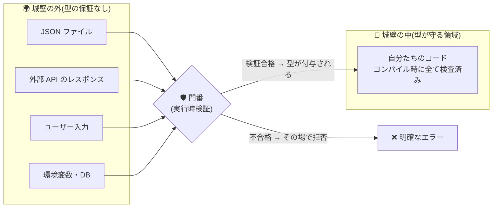

# 第14章 門番の検問 — 型消去と実行時検証

## 🍺 今日のお話

深夜、ギルドのシステムが停止しました。原因を調べると、提携ギルドから届いた依頼書
ファイル `imported_quests.json` にありました。

```json
[
  { "id": 1, "title": "薬草採取", "reward": 30 },
  { "id": 2, "title": "ゴブリン退治", "reward": "応相談" }
]
```

`reward` が **文字列** です。読み込みコードはこう書かれていました:

```typescript
const quests = JSON.parse(text) as Quest[];   // 「Quest[] ということにする」
const total = quests.reduce((s, q) => s + q.reward, 0);
console.log(total.toFixed(2));                 // 💥 実行時エラー、あるいはもっと悪い"30応相談"
```

**コンパイルは通っていました。** なのに落ちた。今日はこの事件を完全に理解し、
二度と起こさない防衛線を築きます。この章は本教材の思想——「TS で書き、JS で理解する」
——が最も凝縮された章です。

## ⚙️ ランタイムの真実 — 型は城壁の「中」にしかない

第 1 章から繰り返してきた原則を、いよいよ正面から使います。

> **TypeScript の型は、コンパイル時に消える。実行時の世界に型は存在しない。**

`as Quest[]` は検査でも変換でもなく「**そういうことにしてくれ**」という宣言でした
(第 13 章)。`JSON.parse` は実行時に動く JavaScript の関数であり、型注釈のことなど
何も知りません。中身がどうであれ、パースできたものをそのまま返します。

つまりプログラムには **2 種類の領域** があります:



- **城壁の中**: 自分たちが書いたコード同士の受け渡し。コンパイラが全経路を検査済みなので、
  実行時に型を確かめる必要は **ない**(これが静的型付けの配当です)
- **城壁の外**: ファイル、ネットワーク、ユーザー入力、環境変数。**型注釈は何も保証しない**。
  ここから入るデータは、門番が **実行時に** 検分しなければならない

事件の敗因は「外から来たデータを、検問なしで `as` によって城内に入れた」ことです。

> 💡 **言語比較で見る「型の在処」**: [Go](../../go-fable-101/chapters/14_http_json.md) や Java は
> 実行時にも型情報を持ち、JSON の変換時に型が合わなければエラーになります。
> [Python の型ヒント](../../python-fable-101/chapters/13_typing.md)は TS と同じく実行時には
> 無力です(同じ「あとから型を足した言語」の宿命)。TypeScript が型を消すのは設計思想
> です——「TS は JS に **一切の実行時コードを足さない**。だから既存の JS と 100% 共存でき、
> いつでも段階的に導入・撤去できる」。第 5 章で enum が嫌われる理由も同じ思想でした。
> 型消去は欠陥ではなく取引条件なのです。ただしその代金は、**境界での検問を自分で行う**
> ことで支払います。

## 防衛術その 1 — unknown で受け、型ガードで通す

第一歩は、`JSON.parse` の結果に **`as` ではなく `unknown`** を付けることです
(第 13 章:「不明」の正しい型)。そして **型ガード関数** で検分します。

```typescript
function isQuest(value: unknown): value is Quest {
  //                            ~~~~~~~~~~~~~~~~ 型述語: true なら value を Quest とみなしてよい
  if (typeof value !== "object" || value === null) return false;
  const v = value as Record<string, unknown>;   // 「キーを持つ何か」としてだけ扱う
  return (
    typeof v.id === "number" &&
    typeof v.title === "string" &&
    typeof v.reward === "number"
  );
}

const parsed: unknown = JSON.parse(text);

if (Array.isArray(parsed) && parsed.every(isQuest)) {
  // このブロック内では parsed は Quest[] — 検問を通ったので型が付いた
  const total = parsed.reduce((s, q) => s + q.reward, 0);
} else {
  console.log("⚠️ 依頼書の様式が不正です。受け入れを拒否しました");
}
```

戻り値型の `value is Quest` は **型述語** といい、「この関数が true を返したら、
呼び出し側で value を Quest に絞り込んでよい」とコンパイラに伝えます。
第 5 章の narrowing を **自作関数に拡張する** 仕組みです。

これで事件の JSON は門前で弾かれ、深夜のクラッシュは「受け入れ拒否ログ 1 行」に
変わりました。**エラーは早く・境界で・明確に** ——これが門番の心得です。

## 防衛術その 2 — スキーマライブラリ(zod)

型ガードの手書きは、プロパティが増えると **interface と検査コードの二重管理** になります
(直し忘れの温床——第 13 章で撲滅したはずの構図の再来です)。実務ではこれを
**スキーマライブラリ** で一元化します。デファクトは **zod** です。

```bash
npm install zod
```

```typescript
import { z } from "zod";

// 「検査ルール(スキーマ)」を値として定義する
const QuestSchema = z.object({
  id: z.number().int().positive(),
  title: z.string().min(1),
  reward: z.number().nonnegative(),
  danger: z.string().optional(),
});

// 型はスキーマから「導出」する — 二重管理の消滅!
type Quest = z.infer<typeof QuestSchema>;

// 検問
const result = QuestSchema.safeParse(JSON.parse(text));
if (result.success) {
  console.log(result.data.title);    // result.data は Quest 型
} else {
  console.log(result.error.issues);  // どのフィールドがなぜ駄目か、詳細な報告書
}
```

発想の逆転に注目してください。これまでは「型(コンパイル時)が主、検査(実行時)は
手書き」でした。zod では「**実行時の検査ルールが主、型はそこから自動導出**」です。
型消去の世界で唯一消えないもの——**値としてのコード**——に検査ルールを持たせ、
型はその影として付いてくる。型消去との最も美しい和解です。

💡 `safeParse` の戻り値は `{ success: true; data: T } | { success: false; error: ZodError }`
——第 5 章の判別可能 union です。この教材で学んだ道具は、エコシステムの隅々で再会します。

## ⚔️ 完成コード: `guild/src/gatekeeper.ts`

```typescript
// Typed Tavern — 14 日目: 城門の検問所

import { readFile } from "node:fs/promises";   // Node 標準のファイル読み込み(Promise 版)
import { z } from "zod";

const ImportedQuestSchema = z.object({
  id: z.number().int().positive(),
  title: z.string().min(1),
  reward: z.number().nonnegative(),
  danger: z.string().optional(),
});

const ImportFileSchema = z.array(ImportedQuestSchema);

export type ImportedQuest = z.infer<typeof ImportedQuestSchema>;

export async function importQuests(path: string): Promise<ImportedQuest[]> {
  const text = await readFile(path, "utf-8");        // 城壁の外からデータが届く
  const parsed: unknown = JSON.parse(text);          // まだ正体不明(unknown)

  const result = ImportFileSchema.safeParse(parsed); // 🛡️ 検問
  if (!result.success) {
    const issues = result.error.issues
      .map((i) => `  - ${i.path.join(".")}: ${i.message}`)
      .join("\n");
    throw new Error(`依頼書の様式が不正です:\n${issues}`);
  }
  return result.data;                                // ここから先は型の守りの中
}
```

```typescript
// guild/src/main.ts に追記

import { importQuests } from "./gatekeeper.js";

try {
  const imported = await importQuests("imported_quests.json");
  console.log(`📥 ${imported.length} 件の依頼を受け入れました`);
} catch (err) {
  console.log(`🛡️ 門番より: ${err instanceof Error ? err.message : err}`);
}
```

冒頭の事故 JSON(`"reward": "応相談"`)を `imported_quests.json` として保存して実行すると、
深夜のクラッシュの代わりに、門番の報告が返ります:

```
🛡️ 門番より: 依頼書の様式が不正です:
  - 1.reward: Invalid input: expected number, received string
```

💡 `catch (err)` の `err` が `unknown` 型であることに気づきましたか(strict 設定時)。
JavaScript は throw で何でも投げられる(文字列すら!)ため、TypeScript は catch した
ものを「正体不明」として扱います。`err instanceof Error` はまさに実行時の narrowing です。
——例外の世界にも、城壁の外と同じ規律が要るのです。

## 📝 今日の受付業務(演習)

1. 冒頭の事故コード(`as Quest[]` 版)を実際に書いて、事故 JSON で実行してください。エラーになる場合と「黙って変な値が流れ続ける」場合(`s + q.reward` の結果を確認)の両方を観察してください。後者の方が怖い理由を考えてみましょう。
2. `isQuest` 型ガード版でも同じ JSON を処理し、拒否されることを確認してください。
3. `ImportedQuestSchema` に `difficulty: z.enum(["easy", "normal", "hard"]).default("normal")` を追加し、(a) difficulty 無しの JSON、(b) `"extreme"` を持つ JSON でそれぞれどうなるか試してください。
4. 環境変数も城壁の外です。`process.env.GUILD_NAME` の型をエディタで確認し(`string | undefined` のはず)、「未設定なら既定値、空文字なら起動拒否」という門番関数 `loadConfig()` を書いてください。

---

次章、完成が近づいてきたギルドシステムを **出荷** する準備をします。tsc は普段
「検査官」として使ってきましたが、本来の顔は「翻訳官」。ビルドとは何か、
なぜ JS の世界には道具がこんなに多いのか——エコシステムの全体地図を手に入れます。
→ [第15章 出荷準備](15_build_ecosystem.md)
