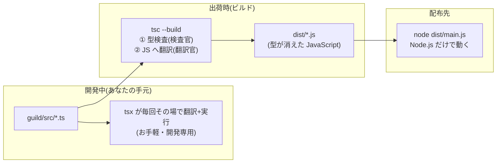

# 第15章 出荷準備 — ビルドとエコシステムの地図

## 🍺 今日のお話

隣町のギルドから「Typed Tavern の管理システムを譲ってほしい」と依頼が来ました。
しかし相手の環境には `tsx` がありません。**TypeScript のまま渡しても、向こうでは動かない**
——ここで初めて「ビルド」という工程が必要になります。

今日はコードをほとんど書かず、これまで「おまじない」と `tsx` に任せてきた足元の仕組みと、
JavaScript エコシステムの全体地図を手に入れます。React / Next.js に進む前の、
最後の装備調達です。

## なぜ「ビルド」が存在するのか

第 1 章の図を思い出してください。**ブラウザも Node.js も、実行できるのは JavaScript**
です(正確には近年の Node は TS の型を自力で剥がせるようになりつつありますが、
それも「実行前に剥がす」ことに変わりはありません)。

つまり TypeScript プロジェクトを配るには、どこかで必ず **TS → JS の翻訳** が要ります。



`tsc` には 2 つの顔があります。

- **検査官**: 型の矛盾を探す(私たちが `--noEmit` で使ってきた顔)
- **翻訳官**: 型注釈を剥がし、`target` 世代の JavaScript を出力する(今日使う顔)

## tsc でビルドする

`tsconfig.json` を出荷仕様に更新します(`noEmit` をやめ、出力先を指定):

```json
{
  "compilerOptions": {
    "target": "es2022",
    "module": "nodenext",
    "moduleResolution": "nodenext",
    "strict": true,
    "outDir": "dist",
    "sourceMap": true,
    "skipLibCheck": true
  },
  "include": ["guild/src"]
}
```

```bash
npx tsc              # guild/src/*.ts → dist/*.js に翻訳される
node dist/main.js    # TypeScript も tsx も無い環境で動く!
```

生成された `dist/main.js` を開いてみてください。interface はまるごと消え、
型注釈が剥がれた、**あなたのコードそのままの JavaScript** が入っています。
第 1 章から言い続けた「型は消える」を、ついに自分の目で確認できます。

💡 `sourceMap: true` は「翻訳後の JS の何行目が、元の TS の何行目か」の対応表
(`.js.map`)を出します。実行時エラーのスタックトレースを TS の行番号で読むための
命綱なので、基本は常に有効にします。

## package.json を出荷仕様に整える

```json
{
  "name": "ts-guild",
  "version": "1.0.0",
  "type": "module",
  "scripts": {
    "dev": "tsx watch guild/src/main.ts",
    "check": "tsc --noEmit",
    "build": "tsc",
    "start": "node dist/main.js"
  },
  "dependencies": {
    "zod": "^3.23.0"
  },
  "devDependencies": {
    "typescript": "^5.5.0",
    "tsx": "^4.16.0"
  }
}
```

第 6 章の内容に加えて、押さえるべき点が 2 つ:

- **dependencies と devDependencies の境界線が出荷で意味を持つ**: 配布先で
  `npm install --omit=dev` すると devDependencies は入りません。`zod` は実行時に
  動く本物の依存なので dependencies、`typescript` と `tsx` は翻訳が済めば用済みなので
  devDependencies。「**実行時に要るか?**」が仕分けの問いです
- **`^3.23.0` の `^` はバージョン範囲**(セマンティックバージョニング)。
  `メジャー.マイナー.パッチ` のうち「メジャーが同じなら更新可」という意味です。
  実際に何が入ったかを固定するのが `package-lock.json` でした(第 6 章)

## 🗺️ エコシステムの全体地図

ここまでの旅で、あなたは知らぬ間に「役割ごとに道具を選ぶ」文化を歩いてきました。
JS/TS 界の道具を役割で整理すると、こう見通せます:

| 役割 | この教材で使ったもの | 他の有名どころ |
|---|---|---|
| 実行環境 | **Node.js** | ブラウザ、Deno、Bun |
| パッケージ管理 | **npm** | pnpm、yarn |
| 型検査 | **tsc** | (事実上一択) |
| 開発時実行 | **tsx** | Node 本体の TS サポート、ts-node |
| 出荷用翻訳 | **tsc** | esbuild、swc(高速翻訳専門。型検査はしない) |
| バンドラ | (未使用) | **Vite**、webpack、Rollup、esbuild |
| リンタ | (未使用) | **ESLint**、Biome |
| フォーマッタ | (未使用) | **Prettier**、Biome |
| テスト | 次章! | **Vitest**、Jest、Node 標準の node:test |

未登場の 3 役だけ簡単に:

- **バンドラ**: 多数のモジュールを少数のファイルに束ねる道具。ブラウザ向け配布では
  ほぼ必須で、React を学ぶとき **Vite** として再会します(サーバー用途の本教材では不要でした)
- **リンタ**: 型検査が捕まえない「怪しい書き方」(未使用変数、`==` の使用など)を指摘
- **フォーマッタ**: インデントや改行を機械的に統一。スタイル論争を消す道具

> 📜 **歴史の背景 — なぜ道具がこんなに多いのか**
>
> [Go](../../go-fable-101/language-overview/README.md) は言語公式が fmt も test も一式提供し、
> [Python はパッケージ管理の乱立に苦しみ](../../python-fable-101/README.md)ました。JS は
> その中間とも違う独特の生態系です。理由は 3 つ:
>
> 1. **言語に「公式ツール」を作る主体がいなかった** — JavaScript の仕様(ECMAScript)は
>    委員会が決めますが、ツールを配る「本家」が存在しません。空白はすべて民間が埋めました
> 2. **標準化が常に後追い** — モジュール(第 6 章)も Promise(第 12 章)も、民間の発明が
>    実戦で淘汰されてから標準に昇格しました。ツールも同じ競争の中にいます
> 3. **実行環境を選べない** — ブラウザという「バージョンも種類もバラバラな環境」に届ける
>    には、翻訳・変換・束ねの工程がどうしても要る。この工程が道具の主戦場になりました
>
> 欠点は明白で、初学者には「設定ファイルの山」に見えます。利点は競争の速さです——
> esbuild の登場でビルドは 100 倍速くなり、Vite が開発体験を塗り替え、Biome が
> リンタ+フォーマッタ統合を仕掛けています。**「役割」で理解しておけば、道具の名前が
> 入れ替わっても地図は崩れません**。これがこの章で名前より役割を覚えてほしい理由です。

## ⚔️ 出荷チェックリスト

隣町へ送る前の最終確認です:

```bash
npm run check    # ① 型検査が通る
npm run build    # ② dist/ が生成される
npm run start    # ③ ビルド産物だけで動く
```

配布物は `guild/src/`(ソース)、`package.json`、`package-lock.json`、`tsconfig.json`、
README です。`node_modules/` と `dist/` は送りません(受け取った側が
`npm install && npm run build` で再現します)。`.gitignore` にもこの 2 つを入れておきます:

```gitignore
node_modules/
dist/
```

## 📝 今日の受付業務(演習)

1. `npx tsc` を実行し、`dist/quests.js` を開いて元の `quests.ts` と見比べてください。interface・型注釈・`import type` がどうなったか、逆に **そのまま残っているもの** は何かを確認してください。
2. わざと型エラーを 1 つ仕込んで `npm run build` すると、`dist/` はどうなるでしょう?(翻訳官は検査に落ちたとき出荷を止めるのか、観察してください。`noEmitOnError` というオプションも調べてみましょう)
3. `target` を `es5`(2009 年の JS)に変えてビルドし、アロー関数やテンプレートリテラルが何に翻訳されるか見てください。「新しい構文を古い環境向けに書き下す」——これがトランスパイルの原義です。
4. `npm install --omit=dev` を(別フォルダにコピーして)試し、`node_modules` から `typescript` が消えて `zod` が残ることを確認してください。

---

いよいよ最終章です。出荷したシステムが隣町で壊れないように、**テスト** で品質を保証し、
ギルドシステムを完成させます。卒業制作の時間です。 → [第16章 卒業制作](16_final.md)
